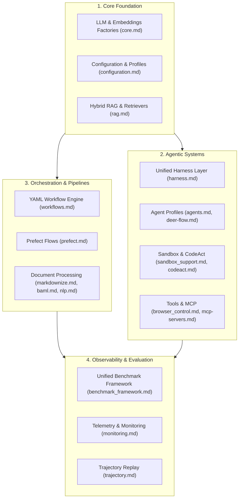

# GenAI Toolkit (genai-tk) Documentation Index

Welcome to the **GenAI Toolkit** documentation. This index maps all core concepts, developer guides, design specifications, and research studies across the toolkit.

---

## 🗺️ Architectural Pillars

---

## 1. Core Framework & Models

| Guide | Description | Key Topics |
|---|---|---|
| [core.md](core.md) | **Core Engine** | `LlmFactory`, `EmbeddingsFactory`, `EmbeddingsStore`, `LlmCache`, `ChainRegistry` |
| [configuration.md](configuration.md) | **Configuration Management** | OmegaConf YAML hierarchy, env substitution (`${oc.env:...}`), profile overlays |
| [llm-selection.md](llm-selection.md) | **LLM Provider Guide** | Provider aliases, context windows, cost/speed trade-offs |
| [rag.md](rag.md) | **RAG Deep-Dive** | `RetrieverFactory`, hybrid search (dense + BM25), rerankers, Chroma/PgVector |

---

## 2. Autonomous Agents & Tooling

| Guide | Description | Key Topics |
|---|---|---|
| [agents.md](agents.md) | **Agent Architecture** | LangChain & DeerFlow agent configuration, agent profiles, ReAct / Deep planning |
| [harness.md](harness.md) | **Harness Abstraction** | Unified `BaseHarness`, shared event streaming, cross-harness middleware |
| [deer-flow.md](deer-flow.md) | **DeerFlow Integration** | Pro-mode planning, native Python execution, interactive chat commands |
| [sandbox_support.md](sandbox_support.md) | **Sandbox Infrastructure** | OpenSandbox Docker container, file isolation, safe command execution |
| [codeact.md](codeact.md) | **Python CodeAct** | Stateful sandboxed Python execution for guaranteed mathematical accuracy |
| [browser_control.md](browser_control.md) | **Browser Automation** | Playwright tools, headless browsing, secure credential autofill |
| [mcp-servers.md](mcp-servers.md) | **MCP Protocol** | Model Context Protocol integration, server configurations, stdio/SSE |
| [middleware-pii-and-routing.md](middleware-pii-and-routing.md) | **Middleware & Privacy** | Presidio anonymization, sensitivity-based model routing, auditing |

---

## 3. Workflows, Ingestion & Structured Processing

| Guide | Description | Key Topics |
|---|---|---|
| [workflows.md](workflows.md) | **Workflow Engine** | YAML-driven task orchestration, step dependencies (`needs:`), CLI integration |
| [prefect.md](prefect.md) | **Prefect Integration** | Writing Prefect flows, ephemeral vs server modes, background workers |
| [markdownize.md](markdownize.md) | **Document Conversion** | PDF/Office conversion ladder: Mistral OCR → Docling → MarkItDown |
| [baml.md](baml.md) | **Structured Extraction** | BAML schema-based LLM extraction, type safety, low latency |
| [nlp.md](nlp.md) | **NLP Subsystem** | spaCy integration, entity recognition, French language pipelines |

---

## 4. Observability, Benchmarking & Deployment

| Guide | Description | Key Topics |
|---|---|---|
| [benchmark_framework.md](benchmark_framework.md) | **Benchmark Engine** | 6-stage evaluation pipeline, metric aggregation, Mafin 2.5 judge rules |
| [monitoring.md](monitoring.md) | **Monitoring & Tracing** | LangFuse, LangSmith, and OpenTelemetry instrumentation |
| [trajectory.md](trajectory.md) | **Agent Trajectories** | NeMo Relay trajectory recording, replay, and post-run analysis |
| [webapp.md](webapp.md) | **Streamlit Web Application** | Multi-page webapp, agent playground, workflow runner, navigation |
| [docker.md](docker.md) | **Docker Deployment** | Multi-stage Dockerfile, just recipes, volume mounts |
| [scaffolding.md](scaffolding.md) | **Scaffolding (`cli init`)** | Bootstrapping new AI apps, configuration presets, Copilot integration |
| [TESTING_GUIDE.md](TESTING_GUIDE.md) | **Testing Guide** | Pytest conventions, fake providers (`parrot_local@fake`), async test patterns |

---

## 5. Studies, Design & Skills

| Guide | Description | Key Topics |
|---|---|---|
| [studies/README.md](studies/README.md) | **Empirical Studies & Reports** | DeerFlow vs DeepAgents benchmark report, cloud agent architectures, security studies |
| [design/README.md](design/README.md) | **Design Specifications** | Active proposals and implemented architectural designs |
| [SKILLS.md](SKILLS.md) | **Skills Guide** | 4-tier skills architecture (`runtime`, `development`, `governance`, `vendor`) |

---

## 🚀 Interactive Notebooks

Check out the interactive Jupyter demos in `notebooks/`:
- [harness_quickstart.ipynb](../notebooks/harness_quickstart.ipynb) — Building LangChain & DeerFlow agents with BaseHarness.
- [harness_middleware_demo.ipynb](../notebooks/harness_middleware_demo.ipynb) — PII anonymization and dynamic model routing middleware.
- [sandbox_and_python_executor_demo.ipynb](../notebooks/sandbox_and_python_executor_demo.ipynb) — Stateful Python execution and Docker sandboxing.
- See: [notebooks/README.md](../notebooks/README.md) for setup and execution instructions.
