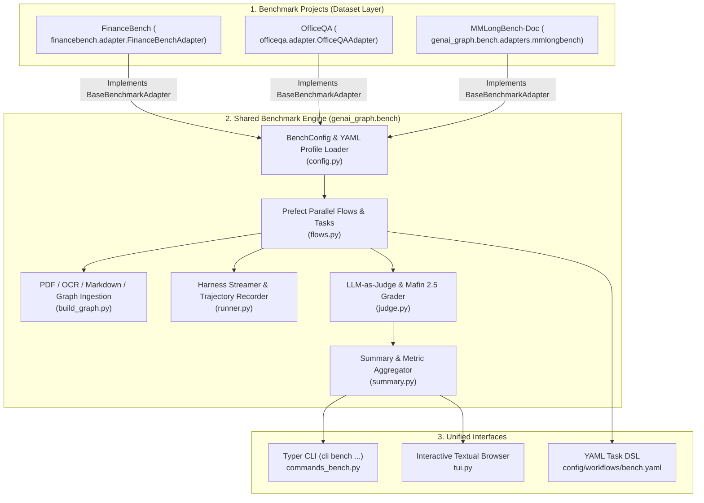
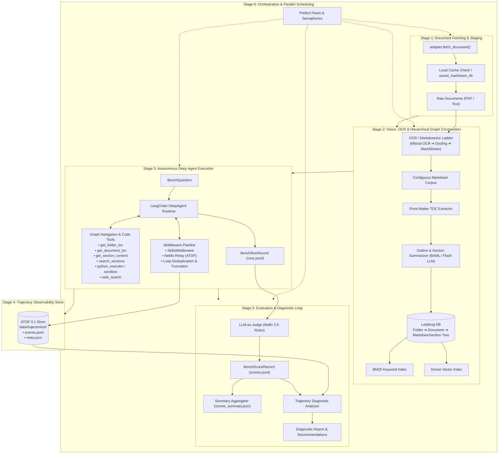
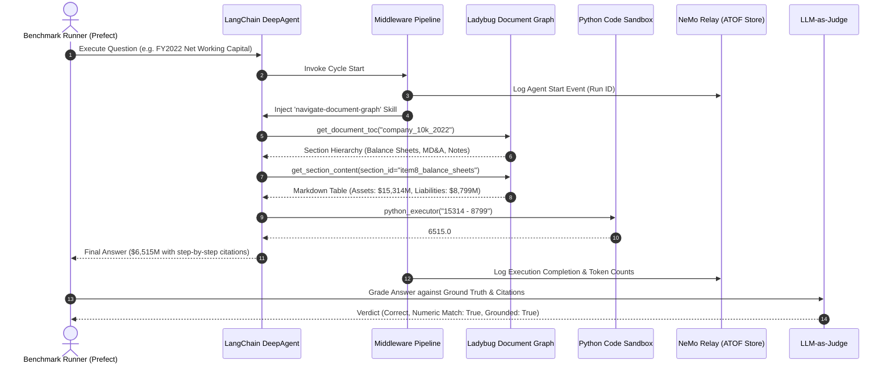
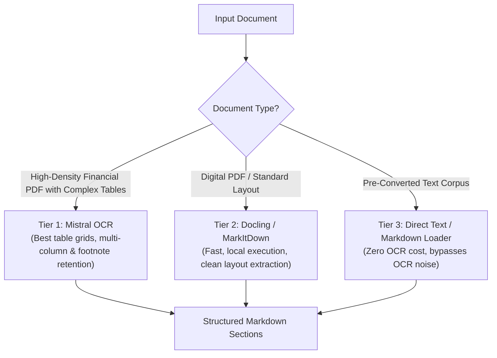

# Unified Benchmark Framework (`genai_graph.bench`)

This document provides a comprehensive technical guide to the shared, multi-dataset benchmark infrastructure implemented in **GenAI Graph (`genai-graph`)** and **GenAI Toolkit (`genai-tk`)**.

The framework mutualizes dataset loading, document conversion, hierarchical graph ingestion, autonomous agent execution, LLM-as-judge evaluation, diagnostic reporting, and interactive TUI exploration across multiple benchmark suites (such as **FinanceBench**, **OfficeQA**, and **MMLongBench-Doc**).

---

## 1. Architectural Motivation & Invariants

Prior to mutualization, benchmark projects maintained duplicated pipelines, CLI commands, and grading logic (~2,800 lines of code per repository). The unified benchmark framework in `genai_graph.bench` consolidates all common orchestration, execution, and evaluation routines while allowing each benchmark project to encapsulate only its domain-specific dataset formats, document fetchers, and grading rubrics.



### Core Architecture Invariants
1. **Config-Driven Dynamism**: The benchmark profile in `config/bench.yaml` specifies the adapter class (e.g. `adapter: financebench.adapter.FinanceBenchAdapter`) dynamically resolved via Python reflection.
2. **Backward Compatibility**: Preserves all legacy JSONL schema keys (`financebench_id`, `officeqa_id`, `question_id`, `question`, `gold_answer`, `evidence`, `tool_calls`, `tool_results`).
3. **Pydantic v2 Models**: All internal entities (`BenchQuestion`, `BenchRunRecord`, `JudgeVerdict`, `BenchScoreRecord`, `BenchSummary`) use Pydantic v2 models.
4. **Resilient Prefect Orchestration**: Parallelized task execution with automatic retry backoffs and thread semaphores to protect single-writer database locks (e.g. Ladybug DB).
5. **Decoupled Engine & Adapters**: The core evaluation runner is completely dataset-agnostic; all dataset specificities (URLs, schemas, grading prompts) live inside adapter classes.

---

## 2. Unified Data Models

Defined in `genai_graph.bench.models`:

| Model | Description | Key Fields |
|---|---|---|
| `BenchQuestion` | Standardized input question definition loaded from any dataset. | `id`, `doc_name`, `doc_names`, `question`, `gold_answer`, `justification`, `evidence`, `metadata` |
| `BenchRunRecord` | Complete execution trace of an agent attempt on a question. | `id`, `doc_name`, `question`, `gold_answer`, `agent_answer`, `agent_thinking`, `tool_calls`, `tool_results`, `n_tool_calls`, `input_tokens`, `output_tokens`, `error`, `llm`, `started_at` |
| `JudgeVerdict` | Structured judgment outcome emitted by the LLM-as-judge. | `correctness` (`correct`, `partial`, `incorrect`), `numeric_match` (bool), `groundedness` (`grounded`, `partial`, `ungrounded`), `error_category`, `rationale` |
| `BenchScoreRecord` | Joined record pairing the execution run with its judge verdict. | `run: BenchRunRecord`, `verdict: JudgeVerdict`, `judge_llm`, `scored_at` |
| `BenchSummary` | Aggregated metrics report for an entire evaluation run profile. | `profile`, `total_questions` (alias `n`), `correct`, `partial`, `incorrect`, `accuracy`, `partial_accuracy`, `ocr_adjusted_accuracy`, `numeric_match_rate`, `grounded_rate`, `error_breakdown`, `total_tool_calls`, `avg_tool_calls`, `total_input_tokens`, `total_output_tokens` |

---

## 3. Dynamic Adapter Architecture

Each dataset implements the `BaseBenchmarkAdapter` abstract base class defined in `genai_graph.bench.adapters.base`:

```python
class BaseBenchmarkAdapter(ABC):
    """Base adapter defining contracts for dataset loading, fetching, and judge rubrics."""

    @abstractmethod
    def load_dataset(self, split: str | None = None, cache_dir: Path | None = None) -> list[BenchQuestion]:
        """Load questions from the dataset converted to standard BenchQuestion models."""

    @abstractmethod
    def fetch_document(self, doc_name: str, output_dir: Path) -> Path:
        """Download or fetch a single raw document (PDF or text) to output_dir."""

    @abstractmethod
    def get_judge_rubric(self) -> str:
        """Return the domain-specific grading system prompt rubric."""

    def resolve_doc_name(self, raw_name: str) -> str:
        """Normalize a raw document reference into a clean stem."""

    def get_available_docs(self, split: str | None = None, cache_dir: Path | None = None) -> list[str]:
        """Return a sorted unique list of all document names referenced in the dataset."""
```

### Reusable Utilities in `genai_graph.bench.adapters.base`
- `download_hf_file(repo_id, filename, output_dir, ...)`: Downloads files from Hugging Face datasets.
- `load_hf_dataset_to_pandas(dataset_id, split, cache_file, ...)`: Downloads HF datasets and caches to Parquet.
- `download_http_file(url, output_path, ...)`: Resilient HTTP/HTTPS downloader with custom User-Agent and timeouts.
- `match_docs_by_pathspecs(all_docs, pathspecs)`: Filters document names using gitwildmatch/gitignore syntax (including `!` negations).
- `resolve_benchmark_adapter(adapter_spec)`: Dynamically resolves and imports dotted class paths or built-in aliases.

---

## 4. End-to-End Pipeline Stages & Execution Engine

The benchmark infrastructure executes through 6 sequential or standalone stages:



### Stage 1: Document Fetching & Staging (`fetch_flow`)
- Downloads dataset documents on-demand using `adapter.fetch_document(doc_name, pdfs_dir)`.
- Checks `saved_markdown_dir` (e.g., pre-converted OCR from network drives, cloud buckets, or local archives) before invoking expensive conversion pipelines.
- Deduplicates downloads and skips non-empty existing files.

### Stage 2: Document Vision, OCR & Hierarchical Graph Construction (`build_graph_flow`)
The ingestion pipeline converts unstructured documents into a queryable, content-addressed graph:
1. **OCR / Markdownize Ladder**:
   - Converts multi-column layouts, tables, and footnote markers to Markdown grid tables using multimodal OCR (such as Mistral OCR, Docling, or MarkItDown).
2. **Preamble & Front-Matter TOC Extraction**:
   - Scans the initial front-matter lines ($\approx 350$ lines) to detect printed Table of Contents markers, chapter structures, and section hierarchies.
3. **Outline & Section Summarization (BAML / Flash LLM)**:
   - A fast, low-cost model generates structured JSON outlines with 1-sentence descriptions and 2–3 sentence summaries for major substantive sections without echoing raw body text.
4. **Deterministic Outline-to-Markdown Merging**:
   - Aligns outline headings with exact Markdown byte offsets, segmenting the text into contiguous `MarkdownSection` nodes.
5. **Hierarchical Graph Ingestion (Ladybug DB)**:
   - Populates an embedded **Ladybug** graph database:
     ```
     Folder ──CONTAINS──▶ Document ──HAS_SECTION──▶ MarkdownSection ──HAS_SUBSECTION──▶ MarkdownSection
     ```
   - Sections are keyed by cryptographic hashes (`xxHash`), enabling deterministic deduplication.
   - Dual retrieval: Every section is indexed in both a **BM25 full-text engine** (exact financial/statutory terms) and a **dense vector store** (semantic intent).
   - **Vectorless Navigation Substrate**: Agents navigate the document hierarchy directly via TOC inspection and selective section retrieval, preserving natural table and footnote boundaries.

### Stage 3: Autonomous Deep Agent Execution (`run_questions_flow`)
- Powered by `genai_tk`'s `LangChainHarness` in `type: deep` mode (multi-step planning + scratchpad + tool execution loop).
- **Middleware Pipeline**:
  - `SkillsMiddleware`: Progressively injects domain skills (`navigate-document-graph`, `financial-ratios`, etc.) based on task context, preventing system prompt bloat.
  - `NemoRelayDeepAgentsMiddleware`: Intercepts model prompts, completions, tool invocations, and skill inclusions, streaming them to the trajectory store.
  - `ObservationTruncationMiddleware` & `DeduplicateToolCallsMiddleware`: Truncates oversized tool responses and breaks repetitive search loops.
- **Tool Suite**:
  - `get_folder_toc`: Lists available documents within a corpus directory.
  - `get_document_toc`: Fetches hierarchical section headers, descriptions, and summaries.
  - `get_section_content`: Retrieves the exact Markdown content of a specific section by `section_id`.
  - `search_sections`: Scoped BM25 keyword and vector queries across section text and summaries.
  - `python_executor` (Code Sandbox / Calculator): Executes Python code for guaranteed precision on mathematical calculations.
  - `web_search`: Retrieves external macroeconomic or reference series.
- Emits structured `BenchRunRecord` entries appended to `runs.jsonl`.



### Stage 4: Trajectory Observability Store (`ATOF 0.1`)
- Captures full forensic traces of agent executions to `data/trajectories/<run_id>/`:
  - `events.jsonl`: Chronological event log of reasoning, tool calls, and skill loads.
  - `meta.json`: Summary metadata (latency, status, tool call counts, prompt/completion tokens).
- Trajectories can be inspected, compared, and replayed using `cli trajectory list`, `cli trajectory show <id>`, and `cli trajectory diff <id1> <id2>`.

### Stage 5: Evaluation, LLM-as-Judge & Trajectory Diagnostics (`grade_flow`)
- **LLM-as-Judge Grading (Mafin 2.5 Equivalence Rules)**:
  - Evaluates agent answers against ground-truth answers and citations using the adapter's `get_judge_rubric()`.
  - **Numerical Equivalence**: Fractions, percentages, decimals, and rounding tolerances ($11/14 \equiv 78.6\% \equiv 0.79$) are judged equivalent.
  - **Superset Correctness**: Responses containing the correct answer with valid reasoning are graded `correct`.
  - Outputs structured verdicts: `correctness` (`correct`, `partial`, `incorrect`), `numeric_match` (boolean), `groundedness` (`grounded`, `partial`, `ungrounded`), and `error_category`.
- **Trajectory Diagnostic Analyzer**:
  - Automatically parses trajectories of failed or partial runs to categorize root causes:
    - `missing_ocr_or_visual_chart`: Unread plots/diagrams in scanned text.
    - `calculation_or_math_error`: Arithmetic or formula divergence.
    - `retrieval_or_lookup_error`: Wrong section/table consulted.
    - `halted_or_empty_response`: Timeouts or token limit exhaustion.
    - `search_looping_penalty`: Excessive repetitive queries.
  - Synthesizes actionable recommendations for prompt, skill, and graph tuning.
- **Summary & Metric Aggregation (`summary.py`)**:
  - Aggregates metrics into `scores_summary.json` and renders Rich terminal reports.

### Stage 6: Parallel Workflow Orchestration (Prefect Engine)
- Orchestrates multi-stage tasks with asynchronous parallel execution and automatic retry backoffs.
- Applies in-process thread-safe concurrency semaphores to protect single-writer database locks (such as Ladybug DB during ingestion) while maximizing parallel question execution and grading throughput.

---

## 5. Model, OCR & Technology Selection Criteria

The framework decouples all models, OCR engines, and embedding backends into configurable YAML profiles (`config/bench.yaml`). Selecting the right model for each role is crucial for cost, latency, and evaluation fidelity:

### A. Role-Based Model Selection Matrix

| Role | Responsibility | Key Evaluation Criteria | Recommended Models |
|---|---|---|---|
| **Agent Reasoning LLM** | Question comprehension, multi-step navigation, tool selection, synthesis | • Strong instruction following<br/>• Multi-turn tool calling reliability<br/>• Long-context handling ($\ge 128\text{k}$ tokens)<br/>• Balanced token pricing | `glm_5.2@openrouter`<br/>`deepseek_v3@openrouter`<br/>`claude-3-5-sonnet@anthropic`<br/>`gpt-4o@openai` |
| **Independent Judge LLM** | Evaluating agent answers against ground truth under strict rubrics | • High factual fidelity & low hallucination<br/>• Strict adherence to equivalence rubrics<br/>• Configurable reasoning effort (avoiding token ceiling truncation)<br/>• Unbiased relative to agent model | `deepseek_v4_pro@openrouter`<br/>`gpt-4o@openai`<br/>`claude-3-5-sonnet@anthropic` |
| **Outline & Summarization LLM** | Generating section outlines, summaries, and descriptions during graph build | • High throughput / low latency<br/>• Low per-token cost on high-volume batch processing<br/>• Concise structured JSON generation (BAML compatible) | `deepseek_v4_flash@openrouter`<br/>`gemini-2.0-flash@google`<br/>`gpt-4o-mini@openai` |
| **Document Vision / OCR Engine** | Transforming complex PDFs into structured Markdown tables and text | • Accurate table grid extraction and cell alignment<br/>• Footnote and multi-column preservation<br/>• Scanned image and historical font robustness | `mistral-ocr`<br/>`docling`<br/>`markitdown` |
| **Embeddings & Lexical Engine** | Section similarity matching and keyword lookups | • High retrieval precision on domain-specific vocabulary<br/>• Efficient local or hosted inference<br/>• Combined dense + BM25 hybrid indexing | `qwen3_06b@deepinfra`<br/>`text-embedding-3-small@openai`<br/>`BM25` (built-in) |

### B. OCR Engine Selection Criteria & Fallback Ladder



- **Mistral OCR (`mistral-ocr`)**: Multimodal document parser that excels at complex financial statements, nested headers, footnotes, and multi-column pages. Recommended for SEC filings and complex corporate reports.
- **Docling / MarkItDown**: Fast, open-source document converters suitable for clean digital PDFs and standard multi-page documents without high-cost API dependencies.
- **Direct Text / Markdown Loader**: For benchmark datasets that provide pre-processed text representations (e.g. OfficeQA Transformed Text), bypassing OCR eliminates conversion costs and preserves original text anchors.

### C. Agent vs. Judge Decoupling Best Practices
1. **Never use the same model family for both Agent and Judge**: Prevents shared cognitive biases and self-grading favoritism.
2. **Control Reasoning Token Ceilings**: For reasoning models (e.g. DeepSeek V4 Pro, o3-mini) used as judges, configure `reasoning: { effort: "low" }` or expand max completion tokens to prevent JSON truncation on lengthy evaluation traces.
3. **Offload Math to CodeAct**: Require the agent to delegate all calculations to the `python_executor` tool rather than computing numbers in prompt tokens.

---

## 6. Technical Stack & Package Architecture

### A. External Technology Stack

| Technology | Role / Short Description | Key Rationale | URL |
|---|---|---|---|
| **LadybugDB** | Embedded Graph Database engine (maintained Kuzu fork) | Zero-overhead, embedded Cypher graph database providing ultra-fast multi-table graph traversal and section lookups without server infrastructure. | [https://github.com/LadybugDB/ladybug](https://github.com/LadybugDB/ladybug) |
| **LangChain / DeepAgents SDK** | Autonomous Agent Runtime Framework | Robust multi-step planning, stateful scratchpad memory, tool routing, and recursive execution control. | [https://github.com/langchain-ai/langchain](https://github.com/langchain-ai/langchain) |
| **NVIDIA NeMo Relay** | Agent Trajectory Observability & Telemetry Framework | Standardized ATOF event streaming to record, inspect, and replay complete agent execution trajectories. | [https://github.com/NVIDIA/NeMo](https://github.com/NVIDIA/NeMo) |
| **BAML (Boundary ML)** | Type-Safe Structured LLM Extraction Engine | High-throughput, schema-validated structured LLM extraction for document outlines, metadata, and evaluation verdicts. | [https://github.com/BoundaryML/baml](https://github.com/BoundaryML/baml) |
| **Prefect** | Workflow Orchestration & Concurrency Engine | Resilient parallel execution, automatic retries with backoff, and execution observability for batch evaluation pipelines. | [https://github.com/PrefectHQ/prefect](https://github.com/PrefectHQ/prefect) |
| **OmegaConf & Pydantic v2** | Typed Configuration & Data Validation | Strict data validation, hierarchical YAML profiles, and dynamic environment variable interpolation. | [https://docs.pydantic.dev](https://docs.pydantic.dev) |
| **UV** | Fast Python Package & Environment Manager | Deterministic lockfiles, sub-second dependency resolution, and rapid reproducible execution. | [https://github.com/astral-sh/uv](https://github.com/astral-sh/uv) |

### B. Internal Framework Packages (`genai-tk` & `genai-graph`)

| Package / Module | Role / Short Description | Key Rationale |
|---|---|---|
| `genai_graph.bench` | Shared Multi-Dataset Benchmark Engine | Mutualized evaluation engine: dynamic adapters, graph ingestion, agent streaming runner, LLM-as-judge grader, summary metrics, and Textual TUI. |
| `genai_graph.core.commands_bench` | Unified Benchmark CLI Command Group (`cli bench ...`) | Shared Typer commands (`list`, `run`, `report`, `questions`, `tui`) registered across all benchmark applications. |
| `genai_tk.core.factories` | Unified LLM & Embeddings Factory (`get_llm`, `get_embeddings`) | Multi-provider model abstraction (`name@provider` format) with built-in caching, cost tracking, and retry fallbacks. |
| `genai_tk.agents.harness` | Deep Agent Execution Harness (`LangChainHarness`) | Manages agent lifecycles, execution limits, event streams, and runtime tool/middleware injection. |
| `genai_tk.agents.tools.langchain.python_executor` | Python CodeAct & Sandbox Arithmetic Executor | Executes Python code in a controlled environment to guarantee 100% precision on mathematical formulas. |
| `genai_tk.agents.langchain.middleware` | Extensible Agent Middleware Pipeline | Implements `SkillsMiddleware`, `NemoRelayDeepAgentsMiddleware`, `ObservationTruncationMiddleware`, and search loop deduplication. |
| `genai_tk.utils.trajectory_store` | ATOF Trajectory Storage & CLI Tooling | Reads, queries, replays, diffs, and analyzes local JSONL agent trajectory logs. |
| `genai_tk.workflow.markdownize` | Document-to-Markdown Ingestion Pipeline | Standardized conversion pipeline managing OCR engines, table structuring, and text normalizers. |
| `genai_graph.kg.document_graph` | Hierarchical Document Graph Builder | Decomposes Markdown files into `Folder ➔ Document ➔ MarkdownSection` nodes and compiles graph databases. |
| `genai_graph.kg.backend` | Graph Storage Interface (`KuzuBackend` / Ladybug) | Encapsulates Cypher execution, transaction handling, and schema creation in LadybugDB. |
| `genai_graph.kg.query.document_graph_tools` | Cypher-Backed Document Navigation Tools | Exposes schema-tolerant, read-only graph query tools (`get_document_toc`, `get_section_content`, `search_sections`). |
| `genai_graph.agent.docgraph_agent` | Document Graph Agent Wiring & Skill Injector | Connects runtime graph databases with agent profiles and registers navigation skills. |
| `genai_graph.orchestration` | Prefect Pipeline Steps for Knowledge Graphs | Prefect-wrapped tasks for graph construction, outline extraction, and batch indexing. |

---

## 7. Benchmark Configuration (`BenchConfig`)

Configuration is declared in `config/bench.yaml` in each benchmark project. Supported fields:

```yaml
default_profile: mistral_glm
adapter: financebench.adapter.FinanceBenchAdapter

paths:
  pdfs_dir: ${paths.data_root}/pdfs
  markdown_dir: ${paths.data_root}/markdown_multi
  kg_db: ${paths.data_root}/kg/financebench_multi.db
  saved_markdown_dir: ~/OneDrive/prj/financebench/markdown   # Generic location for cached Markdown
  onedrive_markdown_dir: ${paths.saved_markdown_dir}       # Backward-compatibility alias
  runs: ${paths.data_root}/financebench/{profile}/runs.jsonl
  scores: ${paths.data_root}/financebench/{profile}/scores.jsonl
  scores_summary: ${paths.data_root}/financebench/{profile}/scores_summary.json

bench_profiles:
  mistral_glm:
    description: "GLM 5.2 agent with Mistral OCR and DeepSeek V4 Pro judge"
    markdownize_profile: best
    monitoring: null
    llms:
      agent: glm_5.2@openrouter
      build: deepseek-v4-flash-0731@openrouter
      judge: DeepSeek-V4-Pro-0813@openrouter
    build:
      skip_ocr: false
      force: false
      llm: deepseek-v4-flash-0731@openrouter
      structure_strategy: auto
      summaries: true
      workers: 4
      embeddings: qwen3_06b@deepinfra
      fts: true
      chunk_size_tokens: 1500
    files:
      pathspecs:
        - "*"
```

---

## 8. CLI Command Suite (`cli bench ...`)

The command group in `genai_graph.core.commands_bench` is registered across all projects:

```bash
# List configured profiles
cli bench list

# Execute a full evaluation run
cli bench run -p mistral_glm
cli bench run -n 5                          # Limit to first 5 questions
cli bench run -q FB_001,FB_002              # Run specific question IDs
cli bench run -f "BESTBUY*,Pfizer*"         # Filter by document pathspecs
cli bench run --skip fetch --skip build      # Run only questions and grading
cli bench run --step grade                  # Re-grade existing runs
cli bench run --rerun                       # Re-execute questions even if in runs.jsonl

# Inspect evaluation summaries
cli bench report
cli bench report -p glm_5.3_Flash

# Inspect questions, gold answers, agent traces, and grader verdicts
cli bench questions                         # Rich table overview
cli bench questions -n 20                   # Table limited to 20 items
cli bench questions -q UID0056              # Detailed Rich panel with trajectory
cli bench questions -q UID0056 --no-trajectory

# Launch the interactive Textual TUI browser
cli bench tui
cli bench tui -q UID0056                    # Launch and focus on a specific question
```

---

## 9. Interactive Textual Dataset Browser (`tui.py`)

Implemented in `genai_graph.bench.tui`:

- **Live Summary Bar**: Displays profile name, total count, breakdown (`✓ Correct`, `~ Partial`, `✗ Incorrect`), and run/scored totals.
- **Search & Filter**: Real-time substring filter (`/` key) across question IDs, document names, question text, and answers, plus status dropdown filter.
- **Detailed Markdown Panel**:
  - Question text, metadata, and referenced documents.
  - Gold answer, justification, and citations.
  - Agent response, model identifier, tool count, and token usage.
  - **Recorded Execution Trajectory**: Step-by-step tool invocations with JSON arguments and formatted tool outputs. Toggle between compact and full output with `t`.
  - **Grader Evaluation**: Verdict badge, numeric match, groundedness, error category, and full reviewer comment.

---

## 10. Adding a New Benchmark in 3 Steps

To test `genai-graph` against a new benchmark (e.g. `mybench`):

1. **Subclass `BaseBenchmarkAdapter`** in `mybench/adapter.py`:
   ```python
   from genai_graph.bench.adapters.base import BaseBenchmarkAdapter
   from genai_graph.bench.models import BenchQuestion


   class MyBenchAdapter(BaseBenchmarkAdapter):
       name = "mybench"

       def load_dataset(self, split=None, cache_dir=None) -> list[BenchQuestion]:
           # Load and convert your questions
           ...

       def fetch_document(self, doc_name: str, output_dir: Path) -> Path:
           # Fetch source document
           ...

       def get_judge_rubric(self) -> str:
           # Return your domain-specific judge prompt
           ...
   ```

2. **Configure `config/bench.yaml`**:
   ```yaml
   default_profile: default
   adapter: mybench.adapter.MyBenchAdapter

   paths:
     pdfs_dir: ${paths.data_root}/pdfs
     markdown_dir: ${paths.data_root}/markdown
     kg_db: ${paths.data_root}/kg/mybench.db
     saved_markdown_dir: ~/saved_markdown
     runs: ${paths.data_root}/mybench/{profile}/runs.jsonl
     scores: ${paths.data_root}/mybench/{profile}/scores.jsonl
     scores_summary: ${paths.data_root}/mybench/{profile}/scores_summary.json

   bench_profiles:
     default:
       description: "My Benchmark default profile"
       llms:
         agent: glm_5.2@openrouter
         judge: DeepSeek-V4-Pro-0813@openrouter
   ```

3. **Register `BenchCommands` in `config/app_conf.yaml`**:
   ```yaml
   cli:
     commands:
       - genai_graph.core.commands_bench.BenchCommands
   ```

You can now run `cli bench run`, `cli bench report`, `cli bench questions`, and `cli bench tui` out of the box!
