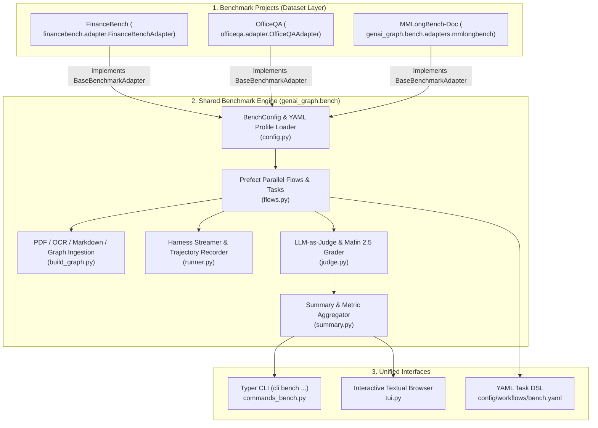

# Unified Benchmark Framework (`genai_graph.bench`)

This document provides a comprehensive technical guide to the shared, multi-dataset benchmark infrastructure implemented in **GenAI Graph (`genai-graph`)**.

The framework mutualizes dataset loading, document conversion, graph ingestion, agent execution, LLM-as-judge evaluation, diagnostic reporting, and interactive TUI exploration across multiple benchmark suites (such as **FinanceBench**, **OfficeQA**, and **MMLongBench-Doc**).

---

## 1. Architectural Motivation & Invariants

Prior to mutualization, benchmark projects maintained duplicated pipelines, CLI commands, and grading logic (~2,800 lines of code per repository). The unified benchmark framework in [genai_graph/bench/](genai-graph/genai_graph/bench/__init__.py) consolidates all common orchestration, execution, and evaluation routines while allowing each benchmark project to encapsulate only its domain-specific dataset formats, document fetchers, and grading rubrics.



### Core Architecture Invariants
1. **Config-Driven Dynamism**: The benchmark profile in `config/bench.yaml` specifies the adapter class (e.g. `adapter: financebench.adapter.FinanceBenchAdapter`) dynamically resolved via Python reflection.
2. **Backward Compatibility**: Preserves all legacy JSONL schema keys (`financebench_id`, `officeqa_id`, `question_id`, `question`, `gold_answer`, `evidence`, `tool_calls`, `tool_results`).
3. **Pydantic v2 Models**: All internal entities (`BenchQuestion`, `BenchRunRecord`, `JudgeVerdict`, `BenchScoreRecord`, `BenchSummary`) use Pydantic v2 models.
4. **Resilient Prefect Orchestration**: Parallelized task execution with automatic retry backoffs and thread semaphores to protect single-writer database locks (e.g. Ladybug DB).

---

## 2. Unified Data Models

Defined in [genai_graph/bench/models.py](genai-graph/genai_graph/bench/models.py):

| Model | Description | Key Fields |
|---|---|---|
| `BenchQuestion` | Standardized input question definition loaded from any dataset. | `id`, `doc_name`, `doc_names`, `question`, `gold_answer`, `justification`, `evidence`, `metadata` |
| `BenchRunRecord` | Complete execution trace of an agent attempt on a question. | `id`, `doc_name`, `question`, `gold_answer`, `agent_answer`, `agent_thinking`, `tool_calls`, `tool_results`, `n_tool_calls`, `input_tokens`, `output_tokens`, `error`, `llm`, `started_at` |
| `JudgeVerdict` | Structured judgment outcome emitted by the LLM-as-judge. | `correctness` (`correct`, `partial`, `incorrect`), `numeric_match` (bool), `groundedness` (`grounded`, `partial`, `ungrounded`), `error_category`, `rationale` |
| `BenchScoreRecord` | Joined record pairing the execution run with its judge verdict. | `run: BenchRunRecord`, `verdict: JudgeVerdict`, `judge_llm`, `scored_at` |
| `BenchSummary` | Aggregated metrics report for an entire evaluation run profile. | `profile`, `total_questions` (alias `n`), `correct`, `partial`, `incorrect`, `accuracy`, `partial_accuracy`, `ocr_adjusted_accuracy`, `numeric_match_rate`, `grounded_rate`, `error_breakdown`, `total_tool_calls`, `avg_tool_calls`, `total_input_tokens`, `total_output_tokens` |

---

## 3. Dynamic Adapter Architecture

Each dataset implements the `BaseBenchmarkAdapter` abstract base class defined in [genai_graph/bench/adapters/base.py](genai-graph/genai_graph/bench/adapters/base.py):

```python
class BaseBenchmarkAdapter(ABC):
    """Base adapter defining contracts for dataset loading, fetching, and judge rubrics."""

    @abstractmethod
    def load_dataset(self, split: str | None = None, cache_dir: Path | None = None) -> list[BenchQuestion]:
        """Load questions from the dataset converted to standard BenchQuestion models."""

    @abstractmethod
    def fetch_document(self, doc_name: str, output_dir: Path) -> Path:
        """Download or fetch a single raw document (PDF or text) to output_dir."""

    @abstractmethod
    def get_judge_rubric(self) -> str:
        """Return the domain-specific grading system prompt rubric."""

    def resolve_doc_name(self, raw_name: str) -> str:
        """Normalize a raw document reference into a clean stem."""

    def get_available_docs(self, split: str | None = None, cache_dir: Path | None = None) -> list[str]:
        """Return a sorted unique list of all document names referenced in the dataset."""
```

### Reusable Utilities in `genai_graph.bench.adapters.base`
- `download_hf_file(repo_id, filename, output_dir, ...)`: Downloads files from Hugging Face datasets.
- `load_hf_dataset_to_pandas(dataset_id, split, cache_file, ...)`: Downloads HF datasets and caches to Parquet.
- `download_http_file(url, output_path, ...)`: Resilient HTTP/HTTPS downloader with custom User-Agent and timeouts.
- `match_docs_by_pathspecs(all_docs, pathspecs)`: Filters document names using gitwildmatch/gitignore syntax (including `!` negations).
- `resolve_benchmark_adapter(adapter_spec)`: Dynamically resolves and imports dotted class paths or built-in aliases.

---

## 4. Benchmark Configuration (`BenchConfig`)

Configuration is declared in `config/bench.yaml` in each benchmark project. Supported fields:

```yaml
default_profile: mistral_glm
adapter: financebench.adapter.FinanceBenchAdapter

paths:
  pdfs_dir: ${paths.data_root}/pdfs
  markdown_dir: ${paths.data_root}/markdown_multi
  kg_db: ${paths.data_root}/kg/financebench_multi.db
  saved_markdown_dir: ~/OneDrive/prj/financebench/markdown   # Generic location for cached Markdown
  onedrive_markdown_dir: ${paths.saved_markdown_dir}       # Backward-compatibility alias
  runs: ${paths.data_root}/financebench/{profile}/runs.jsonl
  scores: ${paths.data_root}/financebench/{profile}/scores.jsonl
  scores_summary: ${paths.data_root}/financebench/{profile}/scores_summary.json

bench_profiles:
  mistral_glm:
    description: "GLM 5.2 agent with Mistral OCR and DeepSeek V4 Pro judge"
    markdownize_profile: best
    monitoring: null
    llms:
      agent: glm_5.2@openrouter
      build: deepseek-v4-flash-0731@openrouter
      judge: DeepSeek-V4-Pro-0813@openrouter
    build:
      skip_ocr: false
      force: false
      llm: deepseek-v4-flash-0731@openrouter
      structure_strategy: auto
      summaries: true
      workers: 4
      embeddings: qwen3_06b@deepinfra
      fts: true
      chunk_size_tokens: 1500
    files:
      pathspecs:
        - "*"
```

---

## 5. Pipeline Stages & Execution Engine

The pipeline comprises 5 sequential or standalone stages managed in [genai_graph/bench/flows.py](genai-graph/genai_graph/bench/flows.py):

### 1. Document Fetching (`fetch_flow`)
- Uses `adapter.fetch_document(doc_name, pdfs_dir)` to download missing source files.
- Skips already downloaded and non-empty local documents.

### 2. Document Conversion & Graph Ingestion (`build_graph_flow`)
- **Staging / Reuse**: Checks `saved_markdown_dir` (e.g. pre-converted OCR from OneDrive or local archives).
- **OCR Ladder**: Converts PDFs using `mistral_ocr` $\rightarrow$ `anydoc` $\rightarrow$ `markitdown`.
- **Hierarchical Ingestion**: Uses `DocumentGraphFactory` to parse Markdown into `Folder ➔ Document ➔ MarkdownSection` trees in Ladybug DB with BM25 full-text indexing and dense embeddings.

### 3. Agent Question Execution (`run_questions_flow`)
- Streams questions through `genai_tk` agent harnesses (`LangChainHarness` in `deep` mode).
- Captures full streaming events (`ThinkingEvent`, `ToolCallEvent`, `ToolResultEvent`, `UsageEvent`).
- Writes structured results to `runs.jsonl` with thread-safe append locks.
- Idempotent: skips already-executed question IDs unless `--rerun` / `--force` is provided.

### 4. LLM-as-Judge Evaluation (`grade_flow`)
- Evaluates agent answers against ground-truth answers and citations using the adapter's `get_judge_rubric()`.
- Applies **Mafin 2.5 numerical equivalence rules** (fractions, percentages, and rounding tolerances).
- Automatically categorizes root cause errors:
  - `missing_ocr_or_visual_chart`: Unread plots/diagrams in scanned text.
  - `calculation_or_math_error`: Arithmetic or formula errors.
  - `retrieval_or_lookup_error`: Wrong section/table consulted.
  - `halted_or_empty_response`: Timeouts or aborted responses.
- Writes structured scores to `scores.jsonl`.

### 5. Summary & Diagnostic Aggregation (`summary.py`)
- Computes overall accuracy, weighted accuracy, numeric match rate, groundedness, and OCR-adjusted accuracy.
- Saves summary JSON (`scores_summary.json`) and outputs Rich terminal summaries.

---

## 6. CLI Command Suite (`cli bench ...`)

The command group in [genai_graph/core/commands_bench.py](genai-graph/genai_graph/core/commands_bench.py) is registered across all projects:

```bash
# List configured profiles
cli bench list

# Execute a full evaluation run
cli bench run -p mistral_glm
cli bench run -n 5                          # Limit to first 5 questions
cli bench run -q FB_001,FB_002              # Run specific question IDs
cli bench run -f "BESTBUY*,Pfizer*"         # Filter by document pathspecs
cli bench run --skip fetch --skip build      # Run only questions and grading
cli bench run --step grade                  # Re-grade existing runs
cli bench run --rerun                       # Re-execute questions even if in runs.jsonl

# Inspect evaluation summaries
cli bench report
cli bench report -p glm_5.3_Flash

# Inspect questions, gold answers, agent traces, and grader verdicts
cli bench questions                         # Rich table overview
cli bench questions -n 20                   # Table limited to 20 items
cli bench questions -q UID0056              # Detailed Rich panel with trajectory
cli bench questions -q UID0056 --no-trajectory

# Launch the interactive Textual TUI browser
cli bench tui
cli bench tui -q UID0056                    # Launch and focus on a specific question
```

---

## 7. Interactive Textual Dataset Browser (`tui.py`)

Implemented in [genai_graph/bench/tui.py](genai-graph/genai_graph/bench/tui.py):

- **Live Summary Bar**: Displays profile name, total count, breakdown (`✓ Correct`, `~ Partial`, `✗ Incorrect`), and run/scored totals.
- **Search & Filter**: Real-time substring filter (`/` key) across question IDs, document names, question text, and answers, plus status dropdown filter.
- **Detailed Markdown Panel**:
  - Question text, metadata, and referenced documents.
  - Gold answer, justification, and citations.
  - Agent response, model identifier, tool count, and token usage.
  - **Recorded Execution Trajectory**: Step-by-step tool invocations with JSON arguments and formatted tool outputs. Toggle between compact and full output with `t`.
  - **Grader Evaluation**: Verdict badge, numeric match, groundedness, error category, and full reviewer comment.

---

## 8. Adding a New Benchmark in 3 Steps

To test `genai-graph` against a new benchmark (e.g. `mybench`):

1. **Subclass `BaseBenchmarkAdapter`** in `mybench/adapter.py`:
   ```python
   from genai_graph.bench.adapters.base import BaseBenchmarkAdapter
   from genai_graph.bench.models import BenchQuestion

   class MyBenchAdapter(BaseBenchmarkAdapter):
       name = "mybench"

       def load_dataset(self, split=None, cache_dir=None) -> list[BenchQuestion]:
           # Load and convert your questions
           ...

       def fetch_document(self, doc_name: str, output_dir: Path) -> Path:
           # Fetch source document
           ...

       def get_judge_rubric(self) -> str:
           # Return your domain-specific judge prompt
           ...
   ```

2. **Configure `config/bench.yaml`**:
   ```yaml
   default_profile: default
   adapter: mybench.adapter.MyBenchAdapter

   paths:
     pdfs_dir: ${paths.data_root}/pdfs
     markdown_dir: ${paths.data_root}/markdown
     kg_db: ${paths.data_root}/kg/mybench.db
     saved_markdown_dir: ~/saved_markdown
     runs: ${paths.data_root}/mybench/{profile}/runs.jsonl
     scores: ${paths.data_root}/mybench/{profile}/scores.jsonl
     scores_summary: ${paths.data_root}/mybench/{profile}/scores_summary.json

   bench_profiles:
     default:
       description: "My Benchmark default profile"
       llms:
         agent: glm_5.2@openrouter
         judge: DeepSeek-V4-Pro-0813@openrouter
   ```

3. **Register `BenchCommands` in `config/app_conf.yaml`**:
   ```yaml
   cli:
     commands:
       - genai_graph.core.commands_bench.BenchCommands
   ```

You can now run `cli bench run`, `cli bench report`, `cli bench questions`, and `cli bench tui` out of the box!
