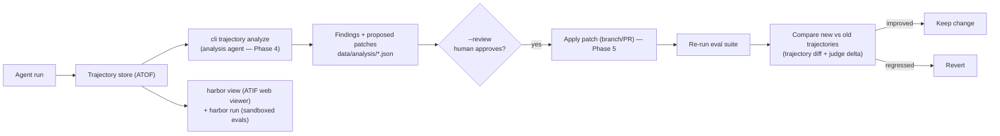

# Agent Trajectory Observability — Next Phases

> Status: Phases 0–3 implemented (capture via NeMo Relay, per-session ATOF store,
> `cli trajectory` command group, store-based evals). This memo covers the
> **remaining** phases: the analysis agent (Phase 4), the closed loop
> (Phase 5), the Harbor integration, and open risks.
> Date: 2026-08-21
> Scope: LangChain `type: deep` (DeepAgents SDK) path. DeerFlow, `react`/`custom`,
> and sandbox/Docker paths are future work.
> Related: [docs/trajectory.md](../trajectory.md) (user guide),
> `harness_interoperability_proposal.md` (implemented harness layer)

## What is implemented (summary)

- **Phase 0 — Spike.** `nemo-relay[deepagents]` 0.7.3 installed; `langsmith`
  bumped to `>=0.9` (resolved 0.11.1); `add_nemo_relay_integration`
  composition confirmed from source. Real-model smoke test confirms the
  `LangChainCodec` round-trips model name, token usage, and tool calls into
  ATOF `llm` end events.
- **Phase 1 — Local store.** A manual ATOF subscriber writes each run to
  `<data_root>/trajectories/<run_id>/events.jsonl` + `meta.json`, with one
  line per run in `index.jsonl`. Flush discipline via `atexit` + `aclose()`.
- **Phase 2 — Trajectory CLI.** `cli trajectory list/show/tail/replay/export/
  diff/skills/stats/prune/view` over the store. `view` shells out to
  `harbor view`.
- **Phase 3 — Store-based evals.** `load_trajectory_messages` /
  `compare_trajectory_to_golden` / `judge_trajectory` (deterministic
  tool_use/grounding/efficiency + LLM correctness/trajectory_accuracy). Gated
  real-model evals capture a run to an eval-local store and judge the captured
  trajectory — no agent re-run.

See [docs/trajectory.md](../trajectory.md) for the user guide.

## Architecture (target)



## Analysis agent (`cli trajectory analyze`) — Phase 4

This is the mechanism by which "skills and harness could be automatically
improved": another agent reads a recorded trajectory and proposes concrete
changes.

### Shape

The analyzer is itself a `type: deep` agent (eat our own dogfood) with a small,
read-only tool set over the trajectory store and the project's skill/profile
files. It is traced too → its own trajectory is analysable (recursion bounded:
no nested analyzers).

### Tools (read-only)

| Tool | Returns |
|---|---|
| `list_trajectories(profile=None, since=None, status=None)` | Matching run summaries from `index.jsonl`. |
| `read_trajectory(id)` | The trajectory: scope tree, llm/tool scopes with inputs/outputs, `skill.load` marks, tokens/cost per step. |
| `read_trajectory_messages(id)` | OpenAI-format message projection (to reason about the conversation). |
| `diff_trajectories(id1, id2)` | Structural diff. |
| `read_skill(name)` | The `SKILL.md` content (so the analyzer can compare what a skill *says* vs. what the agent *did*). |
| `list_skills()` | Discoverable skills (reuses `harness.list_skills()`). |
| `read_profile(name)` | The resolved agent profile (system prompt, tools, middleware, recursion_limit, skill dirs) — to reason about harness config. |
| `read_file(path)` | Bounded read of a project file (skills, prompts) — Relay will even auto-emit `skill.load` marks for `SKILL.md` reads here. |

### Task / prompt

Given one or more trajectories for profile X, analyse:

- **Wasted steps / bad tool choices** — redundant calls, wrong tool for the job, loops, over-reading.
- **Grounding failures** — claims not backed by tool-read evidence (esp. docgraph).
- **Skill usage** — skills loaded but unused; relevant skills not loaded; skill instructions ignored or mis-followed.
- **Harness config** — recursion limit hit, system-prompt gaps, missing/mis-scoped tools, middleware effects.

Output **structured findings** + **proposed changes**.

### Output schema

Written to `data/analysis/<trajectory_id>-analysis.json` (+ a human-readable `.md`):

```json path=null start=null
{
  "trajectory_id": "...",
  "profile": "docgraph",
  "summary": "...",
  "findings": [
    {
      "step_ref": "step[3].tool_call[get_section_content]",
      "category": "skill | prompt | tool | harness | grounding",
      "severity": "low | medium | high",
      "observation": "Agent called get_section_content 4 times for the same section before answering.",
      "suggested_change": "Add a one-line rule to the navigation skill: 'read each section at most once'.",
      "target_file": "genai_graph/agent/skills/navigation/SKILL.md"
    }
  ],
  "proposed_patches": [
    { "target_file": "...", "diff": "..." }
  ]
}
```

### Review loop (Phase 4) and closed loop (Phase 5, gated)

- **Phase 4:** `cli trajectory analyze <id>` produces the report; `--review`
  opens the report + proposed patches for a human to approve/apply.
  Auto-apply is gated behind `--review`.
- **Phase 5 (future, gated):** an `--apply` step that, under guardrails,
  applies suggested `SKILL.md`/profile edits as a branch/PR, re-runs the eval
  suite, and compares new vs old trajectories + judge deltas to decide
  keep/revert. This is the closed loop that "automatically improves"
  skills/harness. It is explicitly gated: no auto-apply without the
  eval-gated verification.
- **Judging the analyzer (meta-eval):** the signal that a suggestion
  *actually improved* something is the eval-score delta after applying it. That
  delta is the feedback signal for the closed loop.

## Harbor: ATIF viewer & sandboxed eval runner

[Harbor](https://www.harborframework.com/) (GitHub `harbor-framework/harbor`,
Apache-2.0, from the Terminal-Bench team; `uv tool install harbor`) is a
framework for evaluating and optimising agents in sandboxed (Docker / cloud)
environments. It is relevant on two axes.

### ATIF is a shared spec — Harbor is a first-class ATIF consumer

ATIF is **not** a NeMo-Relay-proprietary format. The canonical specification
is Harbor's [ATIF RFC](https://github.com/harbor-framework/harbor/blob/main/rfcs/0001-trajectory-format.md)
(v1.7 current), and NVIDIA engineers co-authored the v1.7 changes. NeMo Relay
**exports ATIF** conforming to that spec; Harbor **consumes / validates /
renders ATIF** natively. So the ATIF files our local store writes are directly
consumable by Harbor tooling — Harbor is a ready-made projection of our store,
not a parallel silo.

Harbor's ATIF support is concrete:
- Pydantic models (`harbor.models.trajectories`: `Trajectory`, `Agent`, `Step`,
  `ToolCall`, `Observation`, `ObservationResult`, `Metrics`, `FinalMetrics`) —
  usable as a **validation library** for our emitted ATIF.
- A trajectory validator (`harbor.utils.trajectory_validator.TrajectoryValidator`).
- Automatic ATIF generation by integrated agents (Terminus-2, OpenHands, Claude
  Code, Codex, Gemini CLI, Mini-SWE-Agent).

### Fit 1 — Trajectory viewer (high value, low effort)

Harbor ships a web results viewer: `harbor view <jobs-dir>` starts a local
server to browse jobs, inspect trials, **step through trajectories** (tool
calls, observations, multimodal content), see token/cost/timing metrics, and
**compare jobs side-by-side**.

`cli trajectory view` shells out to `harbor view` on the store. `cli trajectory
show` stays the quick terminal view. Caveat: Harbor's viewer is oriented around
coding-agent trials (asciinema, verifier output); our docgraph agent is a
vectorless-RAG navigation agent, but the ATIF `trajectory.json` represents it
fine — only the terminal-specific bits are unused.

### Fit 2 — Sandboxed eval runner (Phase 5 candidate, heavier)

Harbor is also a sandboxed task-eval runner: define tasks (instruction + Docker
environment + `test.sh` verifier), run an agent against them, get ATIF + reward
+ per-trial verdicts, parallelised across Docker / Daytona / Modal. This
overlaps with the Phase 5 closed loop:
- A custom **Harbor agent adapter** could run our deep agent as
  `--agent genai-tk-deep` under Harbor tasks, producing ATIF + verifier verdicts.
- The closed-loop `--apply` could re-run a Harbor task suite and compare ATIF +
  reward deltas — the "eval-gated verification" the closed loop needs.
- This is a **heavier** integration (agent adapter, Docker task definitions, a
  task dataset) and is **optional** relative to the core capture/store/CLI/
  analyzer path.

### Dependency model

Harbor is installed as a **tool** (`uv tool install harbor`), separate from
runtime deps — a dev/ops companion, not a runtime dependency. Do **not** import
`harbor` from runtime code except lazy imports in `cli trajectory view` /
validation.

### Spike item

Confirm **ATIF schema-version alignment** between NeMo Relay's ATIF export and
Harbor's ATIF-v1.7 (fields: `schema_version`, `session_id` / `trajectory_id`,
`agent`, `steps`, `final_metrics`, subagent embedding). If aligned → `harbor
view` reads our Relay-produced ATIF directly. If not → add a thin projection
(Relay ATIF → Harbor ATIF-v1.7) in the export path, and use Harbor's
`TrajectoryValidator` in tests to catch drift.

## Open questions & risks (remaining)

1. **Short-lived CLI flush.** Async subscriber delivery → must flush before
   exit. Wired via `atexit` + `aclose()` + CLI exit. Risk: lost final events on
   crash.
2. **Docker/sandbox deep agents.** When the deep agent runs in
   `AioSandboxBackend` (Docker), tool/LLM calls execute *in-container*; Relay
   instrumentation must be active in the container to capture internal calls.
   → Scope current capture to the **local `FilesystemBackend`** deep path
   (in-process, fully captured). Docker path = later.
3. **BAML / LiteLLM-outside-LangChain LLM calls.** LLM calls made outside
   LangChain (BAML, direct litellm) won't be auto-captured. → Either route them
   through `nemo_relay.llm.execute` manually, or confirm they flow through
   `langchain-litellm` (and thus are captured). Investigate.
4. **ATIF/ATOF schema stability + Relay↔Harbor alignment.** ATOF is `0.1`;
   Relay is Beta (v0.7–0.8). ATIF is Harbor's spec (RFC 0001, v1.7). → Pin a
   Relay version; version-tag stored/golden trajectories (`schema_version`
   field); validate emitted ATIF with Harbor's `TrajectoryValidator` in tests;
   add a thin projection in the export path if Relay/Harbor ATIF fields diverge.
5. **Storage growth.** ATOF with full payloads is large. → Default to
   compacted/sanitised, `enable_full_payloads` opt-in, retention + `prune`.
6. **`react`/`custom`/DeerFlow paths.** Out of scope now. The store/CLI/evals/
   analyzer are framework-agnostic (consume ATIF), so they generalise; only the
   *capture* integration differs per framework (Relay has `langchain`/
   `langgraph` integrations; DeerFlow would need its own). Later.
7. **Remote projections.** LangFuse (openinference) / OTel / LangSmith as
   projections of the ATOF stream — wired per environment. Currently the local
   store is the only sink; remote fan-out is a follow-up.
8. **Judge-model JSON flakiness.** The `openevals` correctness judge over
   `fast_model` (claude-haiku via openrouter) intermittently returns prose
   instead of JSON. `judge_trajectory` handles this as a structured skip, not a
   crash. A stronger judge model or a JSON-enforcing wrapper would make it a
   hard pass.

## Remaining phasing

- **Phase 4 — Analysis agent.** `cli trajectory analyze` with the
  trajectory-reading tool set, structured findings, `--review` loop. Design
  done (above); build after the store + `show/export` are stable.
- **Phase 5 (future, gated) — Closed loop.** `--apply` → branch/PR → re-eval →
  trajectory/judge delta → keep/revert. Optional: Harbor sandboxed-eval-runner
  integration (Fit 2) as the eval harness for the closed loop.
- **Remote projections.** LangFuse (openinference) / OTel / LangSmith fanned
  out from the ATOF stream, enabled per environment.
- **Other frameworks.** `react`/`custom` via the Relay `langchain` integration;
  DeerFlow via its own capture integration.

## Appendix — StreamEvent ↔ ATOF: why the split stays

The live-UI translation (`astream_events` → `StreamEvent`) and the Relay ATOF
capture are **kept separate** — live-UI convergence is not a simplification:

1. **Relay emits lifecycle events only — no per-token chunks.**
   `NemoRelayCallbackHandler` has no `on_llm_new_token` override; it wraps the
   whole model call as one LLM scope. ATOF defines only `scope` (start/end) +
   `mark` — no token-chunk kind. So `TokenEvent` (the most frequent,
   latency-critical live-UI event) **cannot come from Relay**.
2. **Relay subscriber delivery is asynchronous.** Deriving live UI events from
   an async subscriber adds lag + ordering complexity vs the synchronous
   `astream_events` callback — worse for live UX.
3. **Coupling.** Driving the live UI from the Relay subscriber means
   disabling/misconfiguring Relay breaks the UI. The split keeps UI
   (`astream_events`) and record (Relay) decoupled.

| Source | Role | Granularity | Timing |
|---|---|---|---|
| Relay ATOF/ATIF | Canonical **record** (persisted, agent-readable, `skill.load` marks, codec-annotated req/resp) | lifecycle (scope start/end + marks) | async |
| `astream_events` → `StreamEvent` | Live **UI** projection (CLI/Streamlit) | token + lifecycle | sync |

The real de-duplication (single *record* source) is already done: the flat LLM
log + re-run message extractor + remote-backend private stores are replaced by
the Relay ATOF store as the single record. The live-UI translation stays
because it serves a different consumer at a different granularity.
