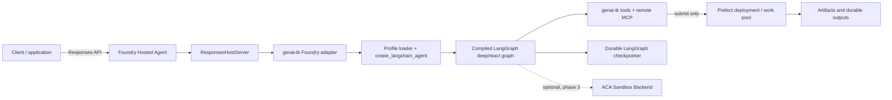

# Azure Foundry Hosted Agents for genai-tk

## Decision Summary

Use Microsoft Foundry Hosted Agents as the serving runtime for **LangChain
profiles** first, including `type: deep` profiles. Add a small hosting adapter
that resolves a normal genai-tk profile and exposes its compiled LangGraph
object through `ResponsesHostServer` from `langchain-azure-ai`.

Host DeerFlow profiles through the same Foundry protocol once genai-tk adds a
small, version-pinned graph factory. The installed DeerFlow client lazily builds
a compiled LangGraph internally, but its construction and graph fields are
private upstream APIs. The factory must own that boundary, create the graph
without a warm chat turn, and fail fast on incompatible DeerFlow versions.

The main integration pain point is **state and sandbox lifecycle**, not
Prefect. Prefect should remain the orchestration engine for asynchronous,
durable workflows triggered by an agent tool; it should not run inside the
request/response path of a hosted conversational agent.

## Context

The requested target is Microsoft's LangChain hosted-agent integration:

- `ResponsesHostServer` exposes a compiled LangGraph graph at an
  OpenAI-compatible `/responses` endpoint, with streaming, response history,
  conversations, and human-in-the-loop support.
- `InvocationsHostServer` exposes a generic `/invocations` endpoint, intended
  for non-conversational or custom JSON contracts.
- Foundry builds and deploys a container image, supplies the project endpoint,
  model deployment name, and Application Insights configuration, and manages
  the hosted endpoint and identity.

This is a good match for the LangChain side of genai-tk because
`create_langchain_agent()` already returns a compiled LangGraph runtime for
`react`, `deep`, and `custom` profile types. It is not a direct match for the
unified harness abstraction: that abstraction deliberately exposes a common
event interface across LangChain and DeerFlow, but Foundry's hosting library
expects the LangGraph graph below that interface.

## Current-State Assessment

| Concern | LangChain / DeepAgents | DeerFlow | Implication for Foundry |
|---|---|---|---|
| Runtime created by genai-tk | Compiled LangGraph (`create_agent`, `create_deep_agent`, or custom graph) | An embedded DeerFlow client that lazily builds a compiled LangGraph with `langchain.agents.create_agent()` | Both can be hosted through a graph factory; DeerFlow needs a stable genai-tk factory around upstream private construction. |
| Conversation state | Configurable LangGraph checkpointer | SQLite file at `data/kv_store/deerflow_checkpoints.db`, with memory fallback | Local-file state is unsuitable for horizontally scaled/restarted hosted containers. |
| Agent interface | `ainvoke` / `astream_events` on graph | Client-specific streaming-event translation | Foundry protocol maps naturally to the former, not the latter. |
| Code/browser sandbox | `AioSandboxBackend` talks to local OpenSandbox daemon and Docker | DeerFlow provider manages Docker directly | Neither local-Docker assumption should be carried into a managed Foundry container without validation. |
| Long-running orchestration | Independent Prefect flows and deployments | Independent of DeerFlow chat runtime | Invoke Prefect asynchronously through a tool/API; do not couple a chat request to a flow run. |

## Root Cause and Trade-offs

### 1. The hosting boundary is below the shared harness

The shared harness is intentionally a UI/CLI-facing abstraction: it converts
runtime-specific events into `TokenEvent`, `ToolCallEvent`, and related
events. A Foundry hosted agent instead needs the executable graph itself so its
host server can manage protocol state, streaming, and interrupts.

**Trade-off:** Hosting the graph bypasses the shared harness event translation.
This is desirable for protocol correctness, but it means Foundry telemetry and
protocol tests need their own adapter tests. The profile models, tool loading,
MCP loading, middleware, and checkpointer configuration can still be shared.

### 2. Sandbox continuity is the largest technical uncertainty

Current deep-agent sandbox support assumes that the application process can
start or reach an OpenSandbox server which in turn manages Docker containers.
The development model also relies on local bind mounts for skills and data.
Managed hosted-agent containers may not permit Docker-in-Docker, privileged
container access, local daemon startup, or host path mounts.

Foundry's session routing can preserve a hosted sandbox when callers retain an
`agent_session_id` or conversation, but that does not make the existing
OpenSandbox/Docker implementation portable. It only addresses routing to a
platform-provided session/sandbox where supported.

**Trade-off:**

- Preserve code execution by moving it to a remotely reachable, separately
  operated sandbox service. This retains capability but increases network,
  identity, cost, and cleanup requirements.
- Disable filesystem/browser/code-execution tools for the first hosted-agent
  pilot. This gives the simplest supported deployment but does not validate the
  deepest agent profile.
- Depend on a Foundry-provided sandbox only after confirming its tool protocol,
  filesystem semantics, retention, networking, and browser support can replace
  the `SandboxBackendProtocol` contract.

The recommended pilot starts without Docker/OpenSandbox. The preferred
production candidate for the second pilot is **Azure Container Apps (ACA)
Sandboxes**, behind a new deepagents backend adapter. It removes the
unverifiable Docker-in-Docker and host bind-mount assumptions while preserving
the filesystem and command contract expected by deep agents.

## Azure Container Apps Sandboxes: Recommended Backend

Yes. ACA Sandboxes are a strong fit for a
`deepagents.backends.protocol.SandboxBackendProtocol` adapter. The protocol is
not a LangChain interface; it is the deepagents execution/file backend that a
LangChain `type: deep` agent receives through `create_deep_agent()`.

ACA Sandboxes expose the capabilities required by that protocol through their
Python data-plane client:

| Deepagents contract | ACA Sandbox mapping |
|---|---|
| `id` | ACA sandbox ID returned by `begin_create_sandbox(...).result()` |
| `aexecute(command, timeout=...)` | `sandbox.exec(command)`, converting stdout, stderr, exit status, and truncation to `ExecuteResponse` |
| `als`, `aread`, `awrite`, `aedit`, `agrep`, `aglob` | ACA file APIs where available; otherwise run tightly quoted POSIX commands through `exec` and map results to the current deepagents result objects |
| `aupload_files`, `adownload_files` | ACA SDK file write/read/stream APIs |
| `start()` | Resolve/reuse or create a labelled microVM from a disk image/snapshot, then retain its ID |
| `stop()` | Apply the configured lifecycle: delete for ephemeral jobs, or suspend for session continuity |

The service adds several characteristics that OpenSandbox does not provide to
the current hosted-agent deployment model: per-sandbox microVM isolation,
group-scoped managed identity and VNet configuration, deny-by-default egress
with audited allow rules, OCI disk images, persistent data disks/Azure Blob
volumes, suspend/resume, and snapshots for primed environments.

### Adapter Shape

The first implementation should be an optional module named
`genai_tk.agents.sandbox.azure_aca_backend.AzureContainerAppsSandboxBackend`.
It should inherit `SandboxBackendProtocol`, mirror the async-first public API
of `AioSandboxBackend`, and use `DefaultAzureCredential` with the ACA Sandbox
Python SDK (`azure-containerapps-sandbox`). The current SDK examples are
synchronous, so the adapter should call blocking SDK operations through
`asyncio.to_thread` rather than blocking LangGraph's event loop.

The existing `BackendConfig` already supports this without changing its model:

```yaml
backend:
  type: class
  class: genai_tk.agents.sandbox.azure_aca_backend.AzureContainerAppsSandboxBackend
  kwargs:
    subscription_id: ${oc.env:AZURE_SUBSCRIPTION_ID}
    resource_group: ${oc.env:AZURE_RESOURCE_GROUP}
    sandbox_group: ${oc.env:AZURE_SANDBOX_GROUP}
    region: ${oc.env:AZURE_REGION}
    disk: genai-tk-deep-agent
    work_dir: /workspace
    lifecycle: suspend
    auto_suspend_seconds: 300
```

`instantiate_backend()` already dynamically loads this class and the agent
factory already invokes an async `start()` method. Therefore the first proof of
concept should use `type: class`; do not add an `azure_aca` enum value until
the adapter's configuration and lifecycle semantics are proven.

### Required Design Decisions

The adapter must make these policies explicit rather than inheriting the local
Docker defaults:

1. **Ownership and routing:** create one sandbox per LangGraph `thread_id` or
   Foundry `agent_session_id`, store the mapping durably, and never select a
   sandbox based only on an untrusted client-provided ID. Label each sandbox
   with an opaque, hashed owner/session key for operations and cleanup.
2. **Lifecycle:** use `delete` for a one-shot request; use `suspend` only for a
   bounded conversational session. Auto-suspend controls compute cost but
   retains disk state. A TTL/auto-delete policy and an orphan-reaper job are
   mandatory.
3. **Isolation and egress:** make the sandbox group the security boundary.
   Enable a deny-default policy with full traffic inspection and only the hosts
   required by package indexes, model/tool APIs, approved MCP services, and
   the domain workflow. Treat each allowlist entry as a security review item.
4. **Identity and secrets:** use the Foundry-hosted agent identity to operate
   the sandbox data plane (`Container Apps SandboxGroup Data Owner` at group
   scope), and use a separate least-privilege group managed identity inside
   the microVM for Azure data-plane calls. Do not pass static credentials as
   sandbox environment variables unless a specific non-Azure dependency
   demands it.
5. **Files and skills:** bake stable interpreter/dependency/tooling into an OCI
   disk image or snapshot. Supply immutable skills and read-heavy reference
   data from a read-only Azure Blob volume. Use a single-attach data disk only
   for session-specific writable workspace state. Do not emulate local host
   bind mounts.
6. **Timeouts and limits:** map the deepagents per-command timeout to the ACA
   exec timeout where supported; otherwise enforce it with `asyncio.wait_for`
   and return a clear timeout result. Set CPU, memory, process, storage, and
   output-size limits in the ACA image/group policy and adapter configuration.

### Capability Boundaries

ACA's `exec` is well suited to non-interactive commands; the Python SDK does
not provide an interactive PTY shell. That is not a blocker because
`SandboxBackendProtocol` needs one-shot `execute` semantics, not a terminal
UI. Browser automation needs a separate evaluation: ACA can expose ports, but
the current `SandboxBrowserSession` assumes an OpenSandbox-specific execd/CDP
endpoint. A browser-capable ACA image can support Playwright/CDP, but it needs
an ACA-specific browser session adapter and protected port access; it is not a
drop-in replacement for the existing browser tool.

## ACA Trade-offs

| Advantage | Cost or risk |
|---|---|
| Removes Docker daemon and local host mounts from the Foundry container | Requires an additional Azure service, SDK, RBAC, network path, and cleanup control plane |
| Individual microVMs, snapshots, suspend/resume, and volumes fit agent workspaces | Persistent disks can retain sensitive data if sandbox-to-session mapping and deletion are weak |
| Managed identity, VNet, egress allowlists, and audit support enterprise controls | Group-scoped identity can be over-privileged unless the group is dedicated to one trust boundary |
| OCI disk images/snapshots make warm tool environments reproducible | Image and snapshot supply-chain patching become a release responsibility |
| Direct API lifecycle enables explicit per-thread ownership | Sandbox creation/resume latency and ACA quotas must be measured before interactive use |
| Native file APIs avoid a custom sidecar protocol | Some filesystem operations may need command fallbacks; test POSIX behavior and error mapping |

### 3. Durable checkpointers are mandatory in production

Foundry's Responses protocol can replay conversation history for a graph with
no checkpointer. A real agent with interrupts, plans, subagent state, or
node-local state needs a LangGraph checkpointer. `MemorySaver` and the current
SQLite-on-container pattern lose state when a hosted instance is recycled and
cannot safely coordinate multiple replicas.

**Trade-off:** A managed PostgreSQL-compatible durable checkpointer adds
operational work and database latency, but is required for correct recovery and
multi-turn semantics. It should be selected by a distinct production profile,
with secrets supplied through managed identity or platform secret references.

### 4. Prefect is an integration pattern, not the blocker

Prefect is designed for durable, multi-stage execution, scheduling,
retries, artifacts, and deployment/work-pool placement. A Foundry Responses
request is a conversational-serving path with client streaming and response
timeouts. Waiting synchronously for a full Prefect flow creates an unreliable,
hard-to-cancel request path and duplicates lifecycle management.

**Recommended pattern:** expose a narrowly scoped LangChain tool that submits
a validated workflow request to a Prefect deployment. Return a run identifier,
status URL, and any immediate artifact reference. A separate tool can retrieve
status/artifacts, and a domain UI can subscribe to progress. Use an agent
interrupt for human approval before costly or irreversible submission.

## Recommended Architecture



### Hosting Adapter Contract

Add an optional `foundry-hosting` dependency group, rather than making Azure
packages core dependencies. It should include at least:

```toml
"langchain-azure-ai[hosting]>=1.2.4"
"azure-identity>=1.0"
"azure-ai-projects>=1.0"
```

The adapter should:

1. Load an explicitly named `harness: langchain` profile using the existing
   profile resolver.
2. Reject `harness: deerflow` with an actionable startup error.
3. Build the graph via `create_langchain_agent(profile)`.
4. Require a non-memory production checkpointer unless an explicit local-dev
   escape hatch is enabled.
5. Start `ResponsesHostServer(graph)` by default. Support `InvocationsHostServer`
   only where the caller needs a custom non-chat schema.
6. Obtain the chat model through `DefaultAzureCredential` and Foundry project
   environment variables when the profile uses a Foundry model.
7. Apply existing monitoring setup, with trace metadata for profile, hosted
   agent version, Foundry conversation/session ID, and Prefect run ID where
   applicable.

The adapter should be a package-level deployment entry point, not a CLI-only
wrapper. A scaffolded application can then provide a thin `main.py` that
imports the profile-specific host factory.

### Model Resolution

The existing model IDs use `name@provider`. The pilot needs a single explicit
mapping from a profile model to the Foundry deployment name. Do not silently
replace all `get_llm()` providers with Azure. Recommended options:

- Add a dedicated provider alias such as `gpt_4_1@azure_foundry` to the normal
  provider configuration, or
- Add a hosting-only `FOUNDRY_MODEL_NAME` override and fail startup when the
  profile points to an incompatible provider.

The first option is clearer and keeps profile selection declarative. The second
is lower-effort for a proof of concept.

## DeerFlow Position

### Revised Assessment: Native Graph Hosting Is Feasible

The earlier assumption that DeerFlow needed a separate service because it was
not a LangGraph runtime was incorrect for the installed `deerflow-harness`
version. `deerflow.client.DeerFlowClient._ensure_agent()` calls
`langchain.agents.create_agent(**kwargs)`, retains the resulting compiled graph
in `client._agent`, and uses a `ThreadState` containing the required
`messages` field. This meets the default Foundry host's compiled-graph schema
requirement.

Therefore, a DeerFlow profile can be hosted directly with
`ResponsesHostServer` **without** wrapping the existing `DeerFlowHarness` as a
tool or proxying through a separate DeerFlow service. This preserves the graph's
native tool calls, LangGraph checkpoints, interrupts, and event topology.

The caveat is an API boundary, not a graph-compatibility boundary:

- `DeerFlowClient._agent` is private and is `None` before the first build.
- The client rebuilds its graph when its model/mode/subagent/skill configuration
  changes, or after `reset_agent()`.
- The helper methods required to build it (`_get_runnable_config` and
  `_ensure_agent`) are also private upstream APIs.

Do not pass `client._agent` directly to the host server or warm it with a fake
chat turn. The first approach creates an unmanaged stale reference; the second
pollutes conversation/checkpoint state and may call tools or models during
startup.

### Recommended genai-tk Factory

Add a genai-tk-owned factory such as
`create_deerflow_langgraph(profile_key, ...) -> CompiledStateGraph`. It should:

1. Call the existing `prepare_profile()` flow to resolve a DeerFlow profile,
   model, generated DeerFlow configuration, monitoring, MCPs, and skills.
2. Construct `EmbeddedDeerFlowClient` with the resolved model, middleware, and
   available-skill set, just as `DeerFlowHarness` does.
3. Build a `RunnableConfig` using the resolved profile mode (`flash`,
   `thinking`, `pro`, or `ultra`), then invoke the upstream private builder
   exactly once without running the graph.
4. Return the compiled graph only after validating that it has a `messages`
   state channel and the configured durable checkpointer.
5. Retain both the embedded client and graph in one hosting application
   lifetime object so a configuration reload cannot silently replace the graph
   under the server.
6. Pin `deerflow-harness` to a tested revision and fail startup with a precise
   compatibility error if `_get_runnable_config`, `_ensure_agent`, or `_agent`
   is absent or changes type.

The factory can initially use these private APIs behind a single tested adapter.
A public upstream graph-builder/accessor would remove that version-sensitive
dependency and should be requested from DeerFlow, but it is not required for a
proof of concept.

### DeerFlow and ACA Sandboxes Are Separate Integration Tracks

The ACA adapter proposed above implements the **deepagents**
`SandboxBackendProtocol`, so it applies directly to genai-tk `type: deep`
profiles. DeerFlow's generated configuration currently selects its own local or
Docker `AioSandboxProvider`; it does not consume a deepagents backend.

Directly hosting the DeerFlow graph therefore does not automatically give it
ACA sandbox support. Choose one of these explicitly:

- Extend DeerFlow with an ACA-native sandbox provider matching its sandbox
  state/tool contract.
- Disable DeerFlow's internal code/file sandbox in the first hosted pilot and
  offer ACA-backed execution as explicit genai-tk tools.
- Use a remote MCP service that owns ACA sandbox lifecycle and exposes typed
  command/file operations to DeerFlow.

The second option is the smallest initial deployment. The first is the best
long-term user experience if DeerFlow-specific artifact and workspace semantics
must be retained.

### When a Separate Service Still Makes Sense

A sidecar or independent DeerFlow service remains appropriate only when it
needs a separately scaled runtime, incompatible dependencies, an independent
release cadence, or a sandbox provider that cannot safely share Foundry's
identity/network boundary. It is no longer the default recommendation based on
the claim that DeerFlow lacks a hostable LangGraph.

## Phased Pilot Plan

### Phase 0: Preconditions and Decisions

- Confirm the Azure subscription, Foundry project, deployed chat model,
  container registry, and `Foundry Project Manager` deployment role.
- Decide network topology: public ingress versus private endpoints/VNet,
  outbound egress policy, private DNS, and access to MCP, Prefect, and state.
- Choose a durable checkpointer database and its connection/identity model.
- Define data classification, tool allowlist, egress allowlist, logging
  retention, and approval rules.

**Exit criterion:** a documented security and networking decision for a
no-sandbox deep-agent profile.

### Phase 1: Stateless-Tool Hosting Proof of Concept

Create a small scaffolded app using a normal `harness: langchain`, `type: deep`
profile with planning, ordinary API/MCP tools, and no Docker sandbox or local
volume assumptions.

- Use `ResponsesHostServer`.
- Authenticate with `DefaultAzureCredential`; use managed identity after local
  development.
- Use a development `MemorySaver` only locally; test a durable checkpointer in
  the deployed environment before declaring success.
- Build locally with `azd ai agent run`, test non-streaming/streaming responses,
  conversation continuation, and error paths, then deploy with `azd deploy`.

**Exit criterion:** two-turn continuation survives a replica restart and a
tool-call audit record carries the profile and Foundry session/conversation ID.

### Phase 2: Asynchronous Workflow Tool

Add a narrowly typed `submit_workflow` tool. It validates an approved workflow
and parameters, submits a Prefect deployment, and returns a durable run ID.
Add `get_workflow_status` and artifact retrieval tools. Use LangGraph
interrupts/Foundry approval outputs for high-impact submissions.

**Exit criterion:** an agent can submit, observe, and report a workflow without
holding a Foundry response open for the flow duration.

### Phase 3: ACA Sandbox Adapter

Implement `AzureContainerAppsSandboxBackend` as an optional dependency and
prove the protocol mapping with unit tests that fake the ACA client. Run an
Azure integration test for create, command execution, file upload/download,
file list/read/write/edit, egress denial, suspend/resume, and delete. Start
with an ephemeral `delete` lifecycle and no browser tools.

**Exit criterion:** a threat model and integration test prove that no Docker
daemon, local bind mount, or stateful local disk is required in the Foundry
hosted container; every sandbox is bound to one trusted session and is deleted
or suspended according to a verified lifecycle policy.

### Phase 4: DeerFlow Native-Hosting Proof of Concept

Implement the version-pinned `create_deerflow_langgraph()` factory and start a
`ResponsesHostServer` with its result. Test profile-mode selection, streaming,
tool calls, a durable checkpoint restart, and a graph rebuild attempt during a
running host. Keep DeerFlow's internal sandbox disabled or replace it with a
separately tested ACA/MCP integration for this phase.

**Exit criterion:** a DeerFlow `pro` or `ultra` profile completes a two-turn
Foundry Responses conversation with the expected graph state, tools, and trace
correlation, without accessing `client._agent` outside the factory boundary.

## Validation Matrix

| Test | Required behavior |
|---|---|
| Container startup | Host binds to the platform `PORT`; profile and model configuration fail fast when invalid. |
| Responses protocol | Non-streaming and server-sent-event streaming conform to the Foundry protocol. |
| Continuation | `previous_response_id`/conversation preserves context; durable checkpointer preserves graph state after restart. |
| Interrupts | Approval/reject and resume calls correctly restore the graph. |
| Identity | No static production model credential; managed identity accesses the Foundry project and dependent services. |
| Tool containment | Tool allowlist, argument validation, outbound policy, timeouts, and audit events are enforced. |
| Prefect handoff | Submission returns promptly; retries are owned by Prefect, not a held chat request. |
| ACA sandbox, if enabled | Separate user/session microVMs, no host mount dependency, deny-by-default egress, managed identity, and cleanup after configured TTL. |
| DeerFlow native graph | A profile-mode-specific graph starts without a warm chat invocation and exposes a `messages` state channel. |
| DeerFlow version guard | An unsupported upstream client layout fails during host startup, not on the first user turn. |
| Scale | Concurrent conversations do not share checkpoint or sandbox state. |

## Open Questions

The initial requirements leave these decisions intentionally open. They need
answers before production architecture is selected:

1. Is private networking mandatory, and can Foundry reach the durable
   checkpointer, Prefect API/work pool, MCP services, and a remote sandbox
   through approved private paths?
2. Which identities need data-plane access: the hosted-agent managed identity,
   Prefect workers, sandbox workers, and human operators?
3. Must the agent execute arbitrary code, operate a browser, or retain files
   across turns? What is the required retention and data classification?
4. Is conversation continuity enough, or must plan/subagent state and
   interrupt state survive deployments and regional failover?
5. Which DeerFlow capability cannot be delivered by a LangChain deep profile
   plus standard tools? This determines whether a second runtime is justified.
6. What response-time, concurrency, and cost targets rule out synchronous
   external-tool calls or require asynchronous job submission?
7. Does the target application need the OpenAI-compatible Responses contract,
   or does it have a domain request schema better suited to Invocations?

## Source Material

- Microsoft Learn: [Host LangGraph agents as Foundry hosted agents](https://learn.microsoft.com/en-us/azure/foundry/how-to/develop/langchain-hosted-agents)
- [ACA Sandboxes overview](https://sandboxes.azure.com/docs/sandboxes/)
- [ACA Sandboxes Python SDK quickstart](https://sandboxes.azure.com/docs/sandboxes/quickstart/setup-python-sdk)
- [ACA Sandbox lifecycle](https://sandboxes.azure.com/docs/sandboxes/sandbox/lifecycle)
- [ACA Sandbox files](https://sandboxes.azure.com/docs/sandboxes/sandbox/files)
- [ACA Sandbox identity](https://sandboxes.azure.com/docs/sandboxes/identity)
- [ACA Sandbox egress policy](https://sandboxes.azure.com/docs/sandboxes/sandbox/egress)
- [genai_tk/agents/langchain/factory.py](../../genai_tk/agents/langchain/factory.py)
- [genai_tk/agents/harness/deerflow_harness.py](../../genai_tk/agents/harness/deerflow_harness.py)
- [genai_tk/agents/deer_flow/embedded_client.py](../../genai_tk/agents/deer_flow/embedded_client.py)
- [sandbox support](../sandbox_support.md)
- [Prefect workflow-engine redesign](workflow_engine_prefect_redesign.md)