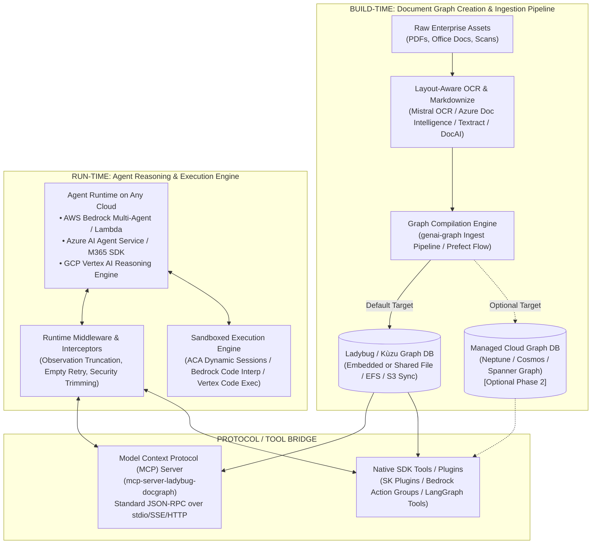
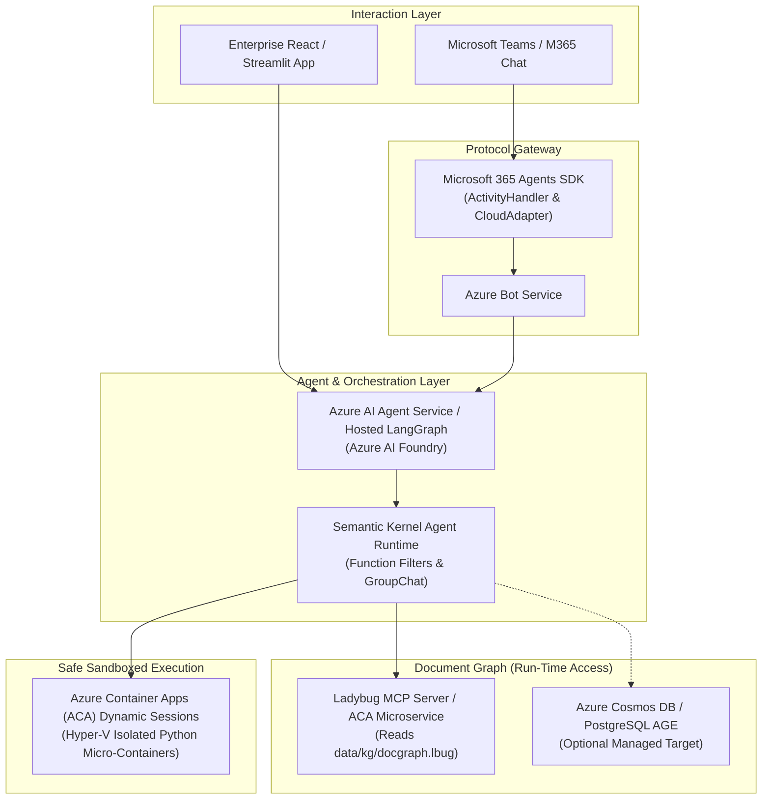
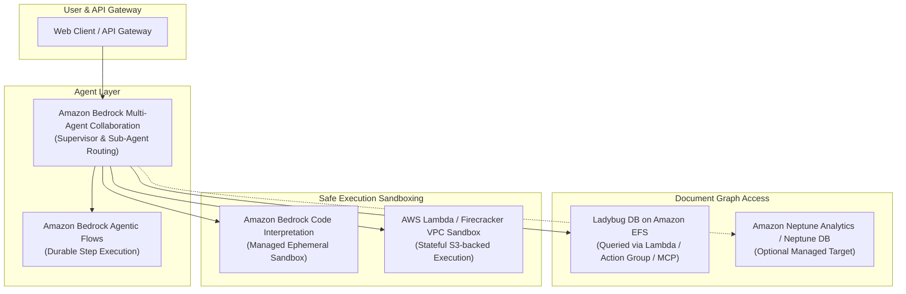
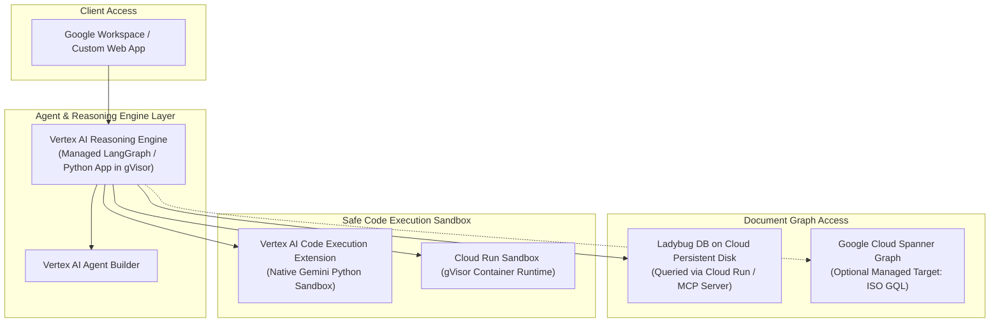
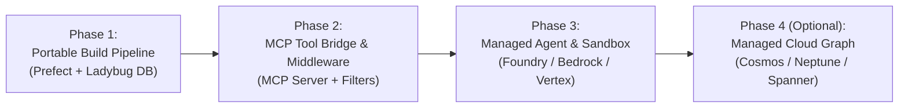

# Enterprise Cloud Agent Architectures: Implementing Graph Navigation, Safe Code Sandboxing, and Multi-Agent Orchestration on Microsoft, AWS, and Google Cloud

> **Executive Context:**  
> This architectural report builds upon the empirical findings and meta-harness architecture of [docs/design/deerflow_architecture_and_benchmarks.md](docs/design/deerflow_architecture_and_benchmarks.md). It investigates how the core capabilities demonstrated in **genai-tk** (hierarchical agent orchestration, structured Document Graph navigation with **genai-graph**, sandboxed Python CodeAct execution, progressive skill loading, and multi-modal grounding) can be implemented using managed cloud services from **Microsoft (Azure / M365)**, **Amazon Web Services (AWS)**, and **Google Cloud Platform (GCP)**.

---

## 1. Executive Summary & Core Architectural Invariants

In demanding enterprise domains (financial auditing, contract analysis, RFP pricing, technical compliance), standard flat RAG fails because it suffers from **structural blindness**, **table destruction**, **hallucinated multi-step arithmetic**, and **uncontrolled tool execution**.

As established in the genai-tk / DeerFlow benchmark evaluation on **OfficeQA** and **MMLongBench**:
1. **Hierarchical Document Graph (DocGraph):** Navigating an explicit outline tree ($Docs \rightarrow Sections \rightarrow Tables \rightarrow Figures$) via Table-of-Contents (TOC) routing and deterministic section anchors achieves $100\%$ precision on complex document QA, eliminating the noise and truncation of chunk-based vector search.
2. **Safe CodeAct & Sandboxed Python Execution:** Offloading tabular calculations, multi-year aggregations, and data joins to an isolated, stateful Python runtime with host-tool bridging yields mathematically guaranteed outputs ($100\%$ calculation accuracy).
3. **Progressive Skill Loading:** Decoupling system prompt tokens from domain instructions by staging `SKILL.md` files dynamically prevents prompt pollution and keeps token costs low.
4. **Multimodal Visual Anchoring:** Treating charts, diagrams, and figures as first-class nodes with visual query budgets enables targeted visual question answering (VLM) only when pixel-level verification is needed.

---

## 2. Decoupling Build-Time (Graph Creation Pipeline) from Run-Time (Agent Navigation)

A critical architectural clarity is the **strict separation between Build-Time ETL/Workflow processes and Run-Time Agent Querying**.



### 2.1 Build-Time: Graph Creation is an Orchestrated Workflow
* **Creation is an ETL Pipeline:** Ingesting documents, extracting hierarchies, detecting tables, generating figure captions, and compiling relations (`HAS_SUBSECTION`, `CONTAINS_TABLE`, `PARENT_SECTION`) is purely a build-time batch or streaming workflow.
* **Prefect / Workflow Portability:** In genai-tk / genai-graph, this workflow is orchestrated via **Prefect flows** (or the YAML-driven workflow engine). Because this pipeline runs independently in containers or batch jobs, it can run without modification in any cloud (AWS ECS/EKS/Batch, Azure Container Apps/Batch, GCP Cloud Run/Batch) and write directly into a high-performance **Ladybug (Kùzu)** database directory or cloud storage.
* **Cloud-Specific Graph DBs as an Evolution (Phase 2):** Migrating to native managed graph databases (Amazon Neptune, Azure Cosmos DB, Google Cloud Spanner Graph) is **not required** to use cloud-native agent runtimes. A cloud-hosted agent (e.g., running on AWS Bedrock or Azure AI Foundry) can query a shared or read-only mounted **Ladybug** graph database directly or via an MCP server. Native cloud graph databases can be introduced later if global replication, multi-master writes, or distributed horizontal scaling become necessary.

### 2.2 Run-Time: Graph Navigation is a Read-Only Query Surface
* At run-time, agents only require read-only access to query navigation tools: `get_document_toc`, `get_section_content`, `search_sections`, and `query_image`.
* As long as the agent framework has access to these tools (and the associated runtime middleware), the agent's cloud runtime is completely agnostic to whether the underlying storage is an embedded Ladybug file or a multi-region distributed cloud graph database.

---

## 3. Tool Access & Middleware: Implementing LangChain Concepts in Other Ecosystems

In `genai-tk`, the LangChain/DeepAgent harness relies on a composable **Middleware Chain** and **Tool Registries** to govern execution:
* **Observation Truncation Middleware:** Protects context window limits by truncating oversized tool observations (e.g., massive tables or long file outputs).
* **Empty-Response & Model Retry Middleware:** Intercepts empty LLM generation or transient API errors and prompts the model with targeted retry instructions.
* **Security Trimming & Context Propagation:** Injects caller identity (`allowed_principals`) into query parameters to enforce early-binding ACL trimming on graph nodes.
* **Progressive Skill Loading:** Stages `SKILL.md` files into the execution environment on demand.

### 3.1 Exposing the Document Graph via Model Context Protocol (MCP)

To make Ladybug/DocGraph universally accessible to **any** cloud framework without rewriting backend query code for each vendor SDK, the recommended integration pattern is an **MCP Server** (`mcp-server-ladybug-docgraph`):

```
┌────────────────────────────────────────────────────────┐
│               Any Cloud Agent Runtime                  │
│ (Azure AI Foundry / AWS Bedrock / GCP Vertex / Claude) │
└───────────────────────────┬────────────────────────────┘
                            │ JSON-RPC (stdio / SSE / HTTP)
                            ▼
┌────────────────────────────────────────────────────────┐
│         mcp-server-ladybug-docgraph (MCP Server)        │
│                                                        │
│  • Tools: get_document_toc, get_section_content, ...    │
│  • Resources: docgraph://{doc_id}/toc, docgraph://...   │
│  • Security: Early-binding security trimming via auth   │
└───────────────────────────┬────────────────────────────┘
                            │ Cypher Queries
                            ▼
┌────────────────────────────────────────────────────────┐
│            Ladybug Graph DB (Kùzu Backend)             │
│            data/kg/docgraph.lbug (Disk/EFS)            │
└────────────────────────────────────────────────────────┘
```

**Benefits of the MCP Architecture:**
1. **Universal Protocol:** Azure AI Foundry, AWS Bedrock (via Agent Action Groups / Gateway), GCP Vertex AI, Claude Desktop, and local agents can consume the exact same DocGraph tools using open standard JSON-RPC.
2. **Encapsulated Invariant Logic:** Security trimming, query validation, and Cypher execution are maintained in one place, shielding cloud agents from database dialect details.

### 3.2 Mapping LangChain Middleware to Hyperscaler Frameworks

| LangChain / genai-tk Middleware Concept | Microsoft Semantic Kernel | AWS Bedrock Agents | Google Cloud Vertex AI / Gemini |
| :--- | :--- | :--- | :--- |
| **Observation Truncation** | **Function Filters / Auto-Function Invocation Filters:** Intercept `FunctionInvokedContext.Result`, inspect byte/token length, and truncate with a summary note before returning to LLM context. | **Bedrock Return of Control (RoC) Interceptor:** Intercept tool outputs in the orchestration lambda / gateway worker before passing back to Bedrock. | **Vertex AI Extension Middleware / Custom Client wrapper:** Post-process function execution response in the Reasoning Engine loop prior to appending to message history. |
| **Empty Response & Tool Retry** | **Prompt Filters & Execution Handlers:** `OnPromptRendered` and retry policies in `Kernel.InvokeAsync`. | **Guardrail Intervention & Step Loop Hooks:** Bedrock Guardrails evaluate responses and trigger built-in agent fallback topics. | **Reasoning Engine Error Handler:** Python loop try/except inside the `CustomAgent` class deployed on Vertex Reasoning Engine. |
| **Security Trimming (User Context)** | **Context Variables / HttpContext Accessor:** Inject Entra ID OID into `KernelArguments`; filter queries against user claims. | **Session Attributes / IAM Tags:** Forward `$session.attributes.user_id` in Action Group payload; evaluate against Neptune or Ladybug ACLs. | **Vertex Grounding Auth / IAM Context:** Pass end-user credentials via Request Context in Vertex AI Reasoning Engine. |
| **Progressive Skill Loading** | **Dynamic Plugin Registration:** `Kernel.Plugins.AddFromFunctions()` or `AddFromType()` loaded conditionally based on intent classification. | **Action Group Activation:** Enable/disable specific Action Groups dynamically via supervisor agent routing. | **Gemini Dynamic Tool Declarations:** Pass subset of tool schemas per turn based on previous agent thought/classification. |

---

## 4. Hyperscaler Implementation Blueprints

```mermaid
graph TB
    subgraph Component["Architectural Dimension"]
        A["1. Agent & Multi-Agent Runtime"]
        B["2. DocGraph Access (Run-Time)"]
        C["3. Safe Code Sandbox"]
        D["4. Multimodal Vision Grounding"]
        E["5. Identity & Security Trimming"]
    end

    subgraph MS["Microsoft (Azure / M365)"]
        A1["Azure AI Agent Service / SK / M365 Agents SDK"]
        B1["Ladybug via MCP Server / Cosmos DB (Gremlin) / Postgres (AGE)"]
        C1["ACA Dynamic Sessions (Hyper-V Micro-Containers)"]
        D1["Azure AI Vision + GPT-4o"]
        E1["Entra ID (OBO Token Flow)"]
    end

    subgraph AWS["Amazon Web Services (AWS)"]
        A2["Bedrock Multi-Agent Collaboration & Flows"]
        B2["Ladybug on EFS / MCP Server / Neptune Analytics (openCypher)"]
        C2["Bedrock Code Interpretation / Firecracker Lambda"]
        D2["Claude 3.7 Sonnet Multimodal"]
        E2["IAM Identity Center + Neptune FGAC"]
    end

    subgraph GCP["Google Cloud Platform (GCP)"]
        A3["Vertex AI Reasoning Engine / Agent Builder"]
        B3["Ladybug on Persistent Disk / MCP / Spanner Graph (ISO GQL)"]
        C3["Vertex AI Code Execution / Cloud Run (gVisor)"]
        D3["Gemini 2.0 Flash / Pro (Native Multimodal & Coordinates)"]
        E3["Cloud IAM + Spanner Row-Level Security"]
    end

    A --> A1 & A2 & A3
    B --> B1 & B2 & B3
    C --> C1 & C2 & C3
    D --> D1 & D2 & D3
    E --> E1 & E2 & E3
```



---

### 4.1 Microsoft Ecosystem Implementation (Azure & M365)

Microsoft provides the most complete end-to-end integration for workplace collaboration (Teams/M365) combined with high-security container sandboxes.



* **Agent Orchestration & M365 Delivery:**
  * **Microsoft 365 Agents SDK & Azure Bot Service:** Exposes the agent across Microsoft Teams, Outlook, and Microsoft 365 Copilot using Model A (LangGraph / Agent as Orchestrator), as detailed in [docs/design/copilot-studio-integration.md](docs/design/copilot-studio-integration.md).
  * **Azure AI Agent Service / Foundry Hosted Agents:** Managed hosting of LangGraph or Semantic Kernel agents with built-in streaming, conversation memory, and Application Insights tracing.
* **DocGraph Integration:**
  * **Phase 1 (Immediate):** Run `mcp-server-ladybug-docgraph` as an Azure Container App reading the Ladybug database file from Azure Files / Blob storage. Semantic Kernel or LangGraph connects via MCP.
  * **Phase 2 (Managed):** Ingest graph into **Azure Cosmos DB** (Gremlin/TinkerPop) or **Azure Database for PostgreSQL with Apache AGE** (openCypher).
* **Safe Code Execution:** **ACA Dynamic Sessions** provides on-demand, Hyper-V-isolated lightweight sandbox containers in sub-second timeframes, with pre-installed Pandas/NumPy and REST APIs for file and script execution.

---

### 4.2 Amazon Web Services (AWS) Implementation

AWS provides a decoupled, scalable architecture centered around Amazon Bedrock, Amazon Neptune, and Firecracker microVMs.



* **Agent Orchestration:** **Amazon Bedrock Multi-Agent Collaboration** natively mirrors DeerFlow's supervisor/sub-agent routing pattern. Bedrock's **Return of Control (RoC)** enables intercepting tool calls and enforcing middleware (e.g., observation truncation) in application code.
* **DocGraph Integration:**
  * **Phase 1 (Immediate):** Mount the Ladybug database directory via **Amazon EFS** to an AWS Lambda / Fargate task exposing the DocGraph tools or MCP server to Bedrock Action Groups.
  * **Phase 2 (Managed):** Ingest the compiled graph into **Amazon Neptune Analytics** for in-memory openCypher graph-vector search (GraphRAG).
* **Safe Code Execution:**
  * **Amazon Bedrock Code Interpretation:** Built-in managed sandbox for mathematical calculations, data aggregation, and chart generation.
  * **Custom Firecracker / Lambda Sandbox:** For complex CodeAct workflows with custom binaries, isolated Lambda functions running inside a private VPC provide microVM isolation with ephemeral storage.

---

### 4.3 Google Cloud Platform (GCP) Implementation

Google Cloud pairs leading multimodal reasoning (Gemini 2.0 Flash/Pro) with Cloud Spanner Graph and Vertex AI Reasoning Engine.



* **Agent Orchestration:** **Vertex AI Reasoning Engine** allows deploying and scaling custom Python agent runtimes (including LangGraph, Semantic Kernel, or custom ReAct loops) in managed gVisor sandboxes with native OpenTelemetry tracing.
* **DocGraph Integration:**
  * **Phase 1 (Immediate):** Run `mcp-server-ladybug-docgraph` on Cloud Run with a mounted persistent volume or Cloud Storage sync, exposing tools to Vertex Reasoning Engine.
  * **Phase 2 (Managed):** Ingest into **Google Cloud Spanner Graph** for unified relational and graph querying using standard ISO GQL and openCypher.
* **Safe Code Execution:**
  * **Vertex AI Code Execution:** Native tool within Gemini models for instant in-sandbox calculation with zero round-trip infrastructure overhead.
  * **Cloud Run with gVisor:** Stateful container sandbox for full CodeAct and shell execution.

---

## 5. Detailed Comparative Analysis Matrix

| Capability / Dimension | Reference Architecture (genai-tk) | Microsoft Ecosystem (Azure / M365) | Amazon Web Services (AWS) | Google Cloud Platform (GCP) |
| :--- | :--- | :--- | :--- | :--- |
| **Orchestration Flexibility** | **Highest:** Complete code-level control over StateGraph, middleware, retries, and AST | **High:** Azure AI Agent Service + Semantic Kernel; premier M365 Teams/Office integration | **Medium-High:** Bedrock Multi-Agent Collaboration + Return of Control | **High:** Vertex AI Reasoning Engine manages custom Python/LangGraph runtimes |
| **DocGraph: Phase 1 (File/MCP)** | Embedded Ladybug / Kùzu (`data/kg/docgraph.lbug`) | Ladybug on Azure Container Apps / Files via MCP Server | Ladybug on Amazon EFS / Lambda via MCP Server | Ladybug on Cloud Run / Persistent Disk via MCP Server |
| **DocGraph: Phase 2 (Managed)** | Custom persistent graph backend | **Azure Cosmos DB** (Gremlin) / **Postgres AGE** (openCypher) | **Amazon Neptune Analytics** (openCypher & vector) | **Google Cloud Spanner Graph** (ISO GQL / openCypher) |
| **Middleware & Truncation** | Composable LangChain / DeepAgent Middleware Pipeline | Semantic Kernel **Function & Prompt Filters** | Bedrock **Return of Control (RoC)** interceptor | Reasoning Engine Python wrapper / gVisor interceptor |
| **Safe Code Sandbox** | OpenSandbox Docker daemon (`AioSandboxBackend`) | **ACA Dynamic Sessions** (Hyper-V isolated REST micro-containers) | **Bedrock Code Interpretation** or Firecracker Lambda | **Vertex AI Code Execution** (built-in) or Cloud Run (gVisor) |
| **Multimodal Grounding** | Layout OCR + VLM visual queries on bounded figure nodes | Azure AI Vision + GPT-4o / GPT-4.1 | Claude 3.7 Sonnet multimodal tool inspection | **Gemini 2.0 Native Multimodal** (native pixel coordinates & 2M context) |
| **Enterprise Identity / RBAC** | Configurable ACL provider (`allowed_principals`) | **Entra ID** (native OBO token propagation across Teams & Graph) | **IAM Identity Center** + Neptune fine-grained data policies | **Cloud IAM** + Spanner Row-Level Access Policies |
| **Observability & Trajectories** | ATOF (NeMo Relay) + LLM-as-a-Judge | **Azure AI Foundry Tracing** + Application Insights | **Amazon CloudWatch** + Bedrock Model Evaluation & Guardrails | **Vertex AI GenAI Evaluation** + Cloud Trace & Logging |

---

## 6. Phased Implementation & Migration Blueprint

To implement this architecture on any enterprise cloud without unnecessary complexity, follow a structured four-phase roadmap:



### Phase 1: Portable Build-Time Ingestion Pipeline
1. Run the existing **Prefect / genai-graph workflow** as containerized batch jobs in your target cloud (Azure Container Apps, AWS ECS, GCP Cloud Run).
2. The pipeline converts PDFs/Office docs to Markdown, detects table structures and figures, and writes the compiled outline tree into a **Ladybug / Kùzu database directory**.
3. Persist the database directory to high-performance shared storage (Azure Files, Amazon EFS, or Google Cloud Persistent Disk / GCS sync).

### Phase 2: Expose DocGraph via MCP & Implement Middleware
1. Wrap the Ladybug query engine in a lightweight **MCP Server** (`mcp-server-ladybug-docgraph`) or REST microservice.
2. Expose the standard four navigation tools:
   * `get_document_toc(document_id, max_level=2)`
   * `get_section_content(section_id)`
   * `query_image(figure_id, prompt)`
   * `search_sections(query, top_k)`
3. Implement observation truncation and security trimming inside the MCP server or as framework middleware (Semantic Kernel Filters, Bedrock RoC, Vertex wrappers).

### Phase 3: Deploy Managed Agent Runtimes & Safe Code Sandboxes
1. **Microsoft:** Deploy the agent in **Azure AI Agent Service / Semantic Kernel** hooked into Teams via **M365 Agents SDK**. Configure **ACA Dynamic Sessions** for Python CodeAct execution.
2. **AWS:** Configure **Amazon Bedrock Multi-Agent Collaboration** with **Bedrock Code Interpretation** enabled.
3. **GCP:** Deploy the agent to **Vertex AI Reasoning Engine** with native **Vertex Code Execution** enabled.

### Phase 4 (Optional): Migrate to Managed Cloud Graph Databases
If enterprise requirements demand distributed multi-region replication, horizontal write scaling, or native database-managed role permissions:
* Target **Amazon Neptune Analytics** on AWS.
* Target **Azure Cosmos DB** or **Azure Database for PostgreSQL with Apache AGE** on Azure.
* Target **Google Cloud Spanner Graph** on GCP.
* *Note: The agent's query tools remain unchanged because the navigation interface contract is identical.*

---

## 7. Strategic Conclusions

1. **Build-Time vs. Run-Time Independence:** Document Graph creation is purely an ETL workflow (orchestrated cleanly with Prefect) and can run in any cloud environment. Agents running on AWS, Azure, or GCP can immediately query high-performance **Ladybug** databases without waiting for complex cloud-specific graph database migrations.
2. **The Power of the MCP Tool Abstraction:** By standardizing DocGraph navigation tools behind the **Model Context Protocol (MCP)**, the entire graph navigation intelligence remains portable across Azure AI Foundry, Amazon Bedrock, Google Vertex AI, and local dev environments.
3. **Middleware Portability:** Critical runtime guards (observation truncation, empty retry, security trimming) are not unique to LangChain; they map directly to **Semantic Kernel Function Filters**, **Bedrock Return of Control (RoC)**, and **Vertex Reasoning Engine wrappers**.
4. **Sandboxed Code Execution is Invariant:** Zero-hallucination mathematical accuracy requires delegating arithmetic to an isolated Python sandbox (**ACA Dynamic Sessions**, **Bedrock Code Interpretation**, or **Vertex Code Execution**).

---

## 8. References & Related Documents

* [docs/design/deerflow_architecture_and_benchmarks.md](docs/design/deerflow_architecture_and_benchmarks.md)
* [docs/design/copilot-studio-integration.md](docs/design/copilot-studio-integration.md)
* [docs/design/azure_foundry_hosted_agents.md](docs/design/azure_foundry_hosted_agents.md)
* [docs/design/sandbox_backend.md](docs/design/sandbox_backend.md)
* [genai-graph/docs/graph-definition-guide.md](genai-graph/docs/graph-definition-guide.md)
* [genai-graph/docs/design/access control - security triming.md](genai-graph/docs/design/access%20control%20-%20security%20triming.md)

