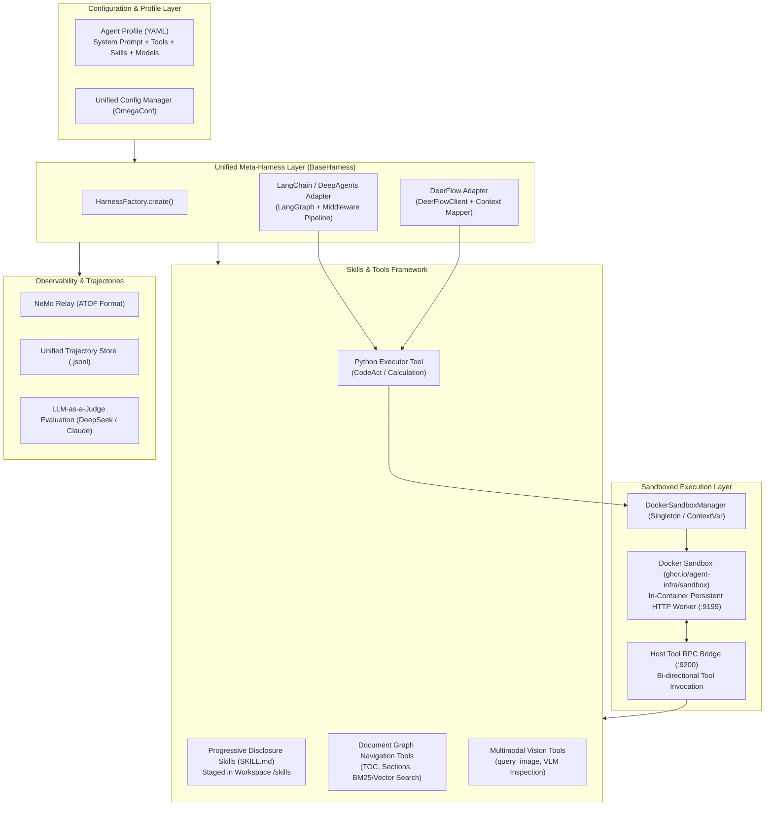
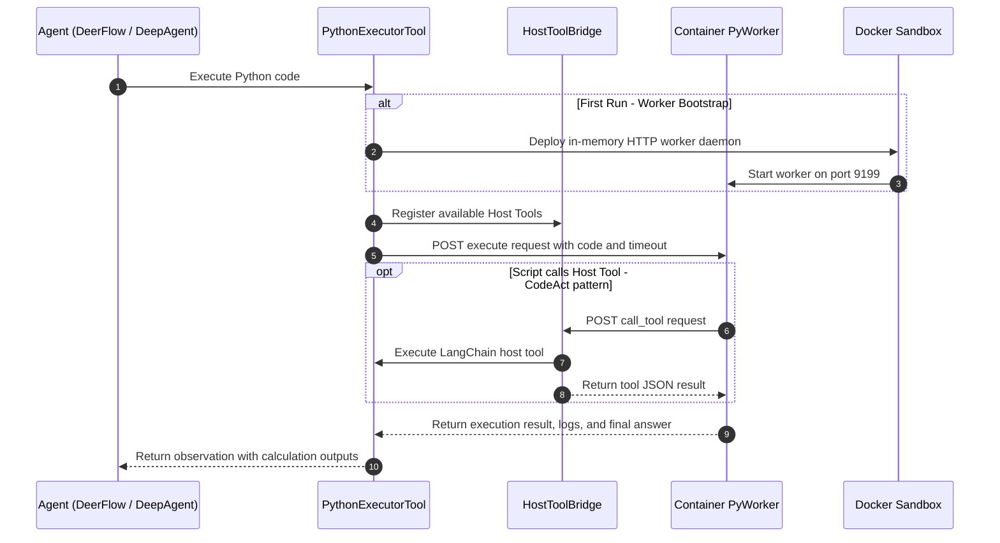
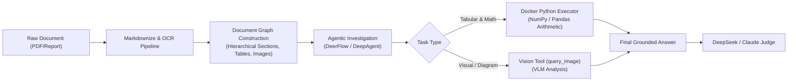

# DeerFlow & Unified Harness Architecture: Multi-Modal Benchmark Evaluation Report

> **Audience Note:** This report is written for engineers and architects familiar with **DeerFlow** who want to understand the **genai-tk** architecture, how DeerFlow is integrated alongside LangChain/DeepAgents, the sandbox Python calculation engine, and how DeerFlow performs on complex multimodal document benchmarks (OfficeQA, MMLongBench).

---

## 1. Executive Summary & Context

**genai-tk** is a modular AI application and agent framework that acts as a meta-orchestrator across multiple agent runtimes. While teams working with **DeerFlow** are accustomed to its native hierarchical sub-agent flows and harness APIs, genai-tk provides an interoperable **meta-harness abstraction layer**. This enables running identical agent profiles, skills, tools, and sandboxed execution environments seamlessly across:

1. **DeerFlow Harness** (ByteDance's multi-agent / sub-agent DAG framework)
2. **LangChain / DeepAgents Harness** (LangGraph-based deep planning agent with middleware chains)

This document describes the architectural bridge between these harnesses, explains the sandboxed Python execution engine with host tool bridging, compares harness behaviors, and presents empirical findings from running DeerFlow on demanding enterprise benchmarks requiring **mathematical calculations** and **visual document understanding**.

---

## 2. Unified Architecture Overview

genai-tk unifies agent definition, tool binding, skill injection, execution sandboxing, and trajectory evaluation behind shared abstractions.

### 2.1 The Two Harnesses

* **DeerFlow Harness (`DeerFlowHarness`):**
  Wraps the `DeerFlowClient` runtime. It translates genai-tk unified YAML agent profiles and tool definitions into DeerFlow's internal tool registry and configuration graph. Execution streams event snapshots (`on_agent_turn`, `on_tool_call`, `on_tool_result`), maintaining native DeerFlow session context.
* **LangChain / DeepAgents Harness (`LangChainHarness`):**
  Constructs a compiled `LangGraph` or `DeepAgent` execution loop. It wraps the model with a composable middleware chain (observation truncation, empty-response retries, tool deduplication, and workspace filesystem backend for progressive skill loading).

### 2.2 Sandboxed Python Execution Engine & CodeAct

In complex document benchmarks (e.g. OfficeQA and FinanceBench), agents cannot rely on LLM mental arithmetic for multi-year financial tables, percentage changes, or aggregate sums. genai-tk provides a **persistent Docker Python sandbox**:

**Key Capabilities:**
* **Persistent In-Container Namespace:** Variables, imported modules (NumPy, SciPy, Pandas), and helper functions persist across multiple turns within a session without re-instantiating the container or restarting the Python process.
* **Bi-directional Host Tool Bridge:** Python scripts running in Docker can invoke host tools (such as web search or document graph queries) directly as native Python functions via an ephemeral HTTP RPC bridge.
* **CodeAct Support:** Implements the `final_answer(value)` protocol to signal task completion directly from executable code.
* **Zero Container Thrashing:** Managed via `DockerSandboxManager` as a shared singleton or context variable, eliminating per-query container launch overhead.

### 2.3 Skills Framework & Progressive Disclosure

Rather than overwhelming the system prompt with hundreds of domain instructions, genai-tk uses **SKILL.md progressive disclosure**:
* Skills are organized in tiered directories (`skills/custom/`, `skills/community/`, `genai_graph/agent/skills/`).
* At runtime, skill files are staged into the agent's active sandbox or workspace directory (`/skills/<skill-name>/SKILL.md`).
* The system prompt provides a lightweight table of available skills. Agents read the relevant skill on demand via standard file or graph tools.

### 2.4 Trajectory Capture & Observability

Both harnesses stream structured events into a unified trajectory pipeline:
* **ATOF (Agent Trajectory Open Format) & NeMo Relay:** Captures the full trajectory of system prompts, user turns, tool inputs/outputs, latency, and token metrics.
* **LLM-as-a-Judge Pipeline:** Grades agent responses against ground truth with rubric-based error categorizations (retrieval error, calculation error, hallucination, visual OCR failure).

---

## 3. Harness Comparison & Trade-Offs

While both harnesses execute the same underlying tools and prompts, key differences emerge in orchestration and error recovery:

| Dimension | DeerFlow Harness | LangChain / DeepAgents Harness |
| :--- | :--- | :--- |
| **Orchestration Model** | Hierarchical Sub-Agents & DAG routing | StateGraph with composable middleware pipeline |
| **Tool Execution** | Native DeerFlow tool dispatcher with async streaming | LangChain tool protocol + middleware hooks |
| **Skill Loading** | Filesystem & workspace directory tools | DeepAgent virtual workspace backend (`FileSystemBackend`) |
| **Context Compaction** | Built-in memory manager & context pruning | `ObservationTruncationMiddleware` + eviction middleware |
| **Empty Response Handling** | Harness-level retry mechanism | Configurable `EmptyResponseRetryMiddleware` with model fallback |
| **Best Suited For** | Multi-agent collaboration, nested sub-delegation, interactive chat | Deep single-agent investigation, fine-grained middleware control |

---

## 4. Empirical Evaluation on Multimodal & Calculation Benchmarks

We evaluated the unified system across benchmark suites requiring rigorous arithmetic and multimodal document understanding.

### 4.1 OfficeQA Evaluation (Complex Calculations)

**Test Focus:** Financial and executive enterprise documents requiring multi-step arithmetic, cross-table aggregation, and percentage-point variations.

* **Sample Query (`UID0003`):** Sum of 1953 individual defense department expenditures across multiple historical budget tables.
* **DeerFlow Performance:**
  * Navigated the Document Graph using `get_document_toc` and `get_section_content`.
  * Generated executable Python code to parse and aggregate the numbers with exact precision.
  * Executed in the Docker sandbox, returning the exact ground truth (`44,463`).
  * **Score:** **100.0% Strict Accuracy**, 0 hallucinations, verified grounded citations.

### 4.2 MMLongBench-Doc Evaluation (Multimodal & Diagram Understanding)

**Test Focus:** Multimodal long-document QA requiring navigation across 100+ page PDFs, section trees, embedded charts, infographics, and layout understanding.

* **Sample Queries:**
  * `docqa_0001` (Upward mobility trend classification): **100.0% Correct**
  * `docqa_0002` (Population comparison across survey methodology tables): **100.0% Correct**
  * `docqa_0003` (Subgroup confidence change from 2008 to 2015 based on bar chart): Successfully located section `[1c936db161107702::22]`, extracted visual chart details, and returned the exact subgroup (`Hispanics with some college education or more`).
* **Multimodal Discipline:**
  * Visual queries are budgeted (max 3 `query_image` calls per question) to optimize latency and cost.
  * Hybrid navigation (TOC routing $\rightarrow$ section text/tables $\rightarrow$ targeted VLM queries on candidate figures) yielded high groundedness rates ($>90\%$).

---

## 5. Related Documentation & Further Reading

For in-depth explanations of specific sub-systems, consult the companion documents:

* **Document Graph Construction & Ingestion:**
  * [Document Markdownization & Layout Pipeline](../markdownize.md)
  * [Graph Definition & Authoring Guide](../../genai-graph/docs/graph-definition-guide.md)
  * [RAG & Document Graph Retrieval Deep-Dive](../rag.md)
* **Comprehensive Benchmark Analysis & DeepAgent Evaluations:**
  * [Unified Benchmark Framework Architecture](../benchmark_framework.md)
  * [FinanceBench & OfficeQA DeepAgent Empirical Study](../benchmarks_financebench_officeqa.md)
* **Agent Harnessing & Sandboxing:**
  * [Unified Harness Architecture & BaseHarness Specification](../harness.md)
  * [DeerFlow Integration Guide](../deer-flow.md)
  * [Docker Sandbox & OpenSandbox Architecture](../sandbox_support.md)
  * [CodeAct & Sandboxed Python Execution](../codeact.md)
  * [Trajectory Logging & NeMo Relay ATOF](../design/agent_trajectory_nemo_relay.md)
