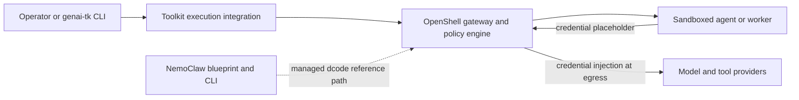

# NemoClaw Assessment for the genai-tk Harness

**Status:** Recommendation

**Reviewed:** 2026-07-26

**NemoClaw snapshot:** `9d4a5c6a2fbac00a7792daf07aec5f6201451ac1`

## Decision Summary

Do **not** integrate NemoClaw directly into `genai_tk.agents.harness` or add a
`NemoClawBackend` now.

Instead, use NemoClaw as a reference for a toolkit-owned, optional secure
execution integration. Its most valuable ideas for genai-tk are:

- host-owned credentials and a gateway that injects them only at egress;
- deny-by-default, process-aware network policy;
- explicit filesystem, process, and sandbox lifecycle policy;
- versioned, checked deployment blueprints; and
- rebuild, snapshot, and policy-drift handling as first-class operations.

NemoClaw itself is not the appropriate runtime abstraction for both existing
harnesses. It currently manages a pinned **LangChain Deep Agents Code**
(`dcode`) terminal application, not the programmable DeepAgents SDK used by
`LangChainHarness`; it also has no documented DeerFlow managed-agent package.
Its own documentation says it has no public extension SDK or stable third-party
lifecycle seam.

The recommended path is to evaluate **OpenShell directly** behind a small,
provider-neutral genai-tk execution boundary. NemoClaw can remain a supported
adjacent deployment for users who want its managed `dcode` environment, but it
should not be made a dependency of the toolkit harness.

## Scope and Current Baseline

This assessment compares NemoClaw and its associated OpenShell components with
the current genai-tk harness implementation:

| genai-tk surface | Current responsibility | Security and lifecycle implication |
| --- | --- | --- |
| `BaseHarness` | Normalizes streaming events, threads, models, skills, and shutdown. | It intentionally does not own process isolation, policy, or credentials. |
| `LangChainHarness` | Builds a LangChain ReAct, custom, or DeepAgents SDK graph and translates LangGraph events. | A Deep Agents profile can supply a `BackendProtocol`, but the harness has no policy or attestation contract. |
| `AioSandboxBackend` | Starts an OpenSandbox-managed Docker container and exposes the DeepAgents filesystem and command protocol. | It has lifecycle, mounts, and execution RPCs, but no built-in egress policy, credential broker, or host-controlled policy reconciliation. |
| `DeerFlowHarness` | Embeds the DeerFlow client in-process and translates native events. | Upstream DeerFlow supports a pluggable `SandboxProvider`, but genai-tk profiles and config generation currently narrow that choice to `local` or its AIO Docker provider. It cannot substitute a DeepAgents `BackendProtocol`. |
| Shared profiles and middleware | Share LLM resolution, MCP configuration, skills, Pydantic events, trace metadata, and LangChain middleware. | These are valuable toolkit-level contracts and must remain available regardless of the execution provider. |

The current split is deliberate and useful: `BaseHarness` is a thin runtime
normalization layer, not a second agent framework. Security integration should
not change that property.

## NemoClaw and Associated Components

NemoClaw is an opinionated host-side reference stack. It coordinates a
versioned blueprint and a compatible agent runtime through NVIDIA OpenShell.
OpenShell is the lower-level platform that provides sandbox lifecycle,
filesystem/process/network enforcement, a credential store, and an L7
inference proxy.



The important components are:

| Component | What it supplies | Relevance to genai-tk |
| --- | --- | --- |
| **NemoClaw CLI and blueprint** | Guided onboarding, a pinned image/runtime, policy presets, deployment-plan verification, snapshots, rebuilds, and state migration. | A good operational reference. The current blueprint is tailored to supported agents, especially `dcode`. |
| **OpenShell gateway** | Provider credential storage, sandbox coordination, L7 proxying and egress-time credential substitution. | Strong candidate platform capability for a future secure execution provider. |
| **OpenShell sandbox policy** | Network endpoint/method/binary restrictions plus filesystem, process, Landlock, seccomp, and network namespace controls. | Addresses a material gap in the current Docker/OpenSandbox setup. |
| **Managed Deep Agents Code runtime** | Pinned `dcode`, generated configuration, managed MCP projection, interactive approvals, and headless execution restrictions. | Useful as a separate terminal-agent offering. It is not a drop-in backend for `create_deep_agent()`. |
| **NemoClaw lifecycle contribution model** | Internal host orchestration for onboard, rebuild, reconcile, recovery, policy, and credential attachment. | Explicitly not a public plugin API; do not couple genai-tk to it. |

NemoClaw's documented security posture is materially stronger than a plain
container launch:

- The sandbox receives an inference route and a placeholder, not a raw provider
  key. OpenShell injects the credential only in the outbound request.
- Network policy starts deny-by-default and can constrain destination, method,
  path, requesting binary, and read-only versus read-write access.
- Managed Deep Agents uses strict Landlock compatibility, a dedicated sandbox
  user, read-only system paths, and narrowly writable work/state paths.
- The managed runtime disables several escape or configuration paths, including
  unmanaged MCP autoloading, direct alternative model routes, nested remote
  sandboxes, and ambient tracing exporters.
- Blueprints are versioned, digest-verified, and include explicit lifecycle and
  recovery behavior rather than treating a container as disposable plumbing.

Those controls protect a different boundary from model prompt safety or
LangChain middleware. They protect host secrets and host resources when an
agent can execute code, install dependencies, browse, call tools, or follow
untrusted instructions.

## Fit by Harness

### Deep Agents SDK in `LangChainHarness`

The Deep Agents path is the closest technical fit. `AgentProfileConfig` already
permits a `class` backend, and `create_langchain_agent()` calls `start()` before
passing a DeepAgents-compatible backend to `create_deep_agent()`. A custom
OpenShell-backed implementation could therefore fit beneath the existing agent
factory without changing canonical events, CLI commands, or the Streamlit
workbench.

However, this is an **OpenShell custom integration**, not a direct NemoClaw
integration:

1. NemoClaw's managed Deep Agents package wraps the `dcode` application. Its
   launcher and policy assumptions are designed for a terminal UI and `dcode
   -n`, not a Python process constructing a compiled graph in genai-tk.
2. The managed package deliberately owns model routing, MCP projection,
   tracing, and nested sandbox decisions. Those choices conflict with genai-tk
   profile-level LLM resolution, dynamic `--mcp`, and direct LangSmith/LangFuse
   or OTEL configuration.
3. NemoClaw states that it exposes no public extension SDK or stable lifecycle
   contribution interface. Calling its internal CLI or copying an agent package
   as a library would create a release-to-release compatibility risk.

The practical proof of concept is a narrow `BackendProtocol` adapter using an
OpenShell-supported command/filesystem service or a small, genai-tk-owned
worker image. It must first demonstrate that DeepAgents filesystem semantics,
skill mounts, cancellation, and cleanup work without exposing Docker or raw
credentials to the agent.

### DeerFlow

DeerFlow is a substantially better fit than this assessment initially assumed.
Its Lead Agent is a standard LangGraph graph (`make_lead_agent`), it accepts
LangChain `AgentMiddleware`, and the documented `SandboxProvider` interface
lets an application replace its `local`, AIO Docker, or Kubernetes-backed
sandbox implementation. This means an **OpenShell-backed DeerFlow sandbox
provider** can secure file and command tools without first moving the entire
DeerFlow agent into a remote worker.

This is a different extension seam from DeepAgents' `BackendProtocol`, but it
has the same architectural role: acquire a sandbox per thread, return its
command/file-capable sandbox instance, and release it deterministically. It is
a direct upstream-supported integration seam, not a private NemoClaw one.

The genai-tk changes are focused:

1. Expand `DeerFlowProfile.sandbox` beyond `local | docker`, or introduce an
   explicit execution-provider config that emits a DeerFlow `SandboxProvider`
   import path and settings.
2. Extend `config_bridge.write_deer_flow_config()` so it does not hard-code
   `LocalSandboxProvider` or `AioSandboxProvider`.
3. Implement a genai-tk-owned OpenShell provider that maps acquire/get/release
   to the reviewed lifecycle and exposes the sandbox operations expected by
   DeerFlow's standard file and bash tools.
4. Record the provider, image, policy, and sandbox identity in canonical trace
   metadata and preserve the existing `SandboxAuditMiddleware` events.

There is still a critical security boundary to state accurately: this protects
**DeerFlow tool execution**, not the embedded DeerFlow process itself. The
lead graph, LangChain model clients, custom middleware, and direct web/MCP
tools continue to run in the host Python process. Their network access and
credentials need a separate gateway-aware configuration if the goal is that no
raw secret reaches the host process. For full-process isolation, a remote
DeerFlow worker remains a later option, but it is no longer the prerequisite
for sandboxing DeerFlow's file and command work.

There is no NemoClaw DeerFlow package or documented compatibility path in the
reviewed source tree. The recommended integration remains OpenShell directly,
using DeerFlow's public provider contract rather than attempting to reuse
NemoClaw's managed `dcode` package.

## Benefits and Costs

| Area | Potential benefit | Cost, limitation, or risk |
| --- | --- | --- |
| Credential custody | Provider, MCP, and search keys can stay in a host gateway instead of environment variables or sandbox files. | Requires a gateway-aware LLM/tool provider configuration and changes local developer setup. It does not sanitize arbitrary application processes automatically. |
| Egress control | Explicit destination and request policy reduces SSRF, exfiltration, package, and tool abuse impact. | Agents need a policy review/approval workflow. Dynamic web and MCP use become operationally more complex. |
| Filesystem and process isolation | Stronger protection than a conventional container with broad mounts and default network access. | Custom images, mounts, PTYs, browser services, and developer tools need careful policy design and cross-platform testing. |
| Lifecycle quality | Rebuild/snapshot/reconcile semantics reduce leaked or drifted environments. | Adds a stateful platform dependency and an operational support burden. |
| Supply chain controls | Pinned, verified images and blueprints make runtime provenance inspectable. | Version pinning needs a compatible upgrade and security-patch process in genai-tk. |
| Deep Agents | Existing custom backend seam makes a focused proof of concept plausible. | NemoClaw supports `dcode`, not the SDK. A toolkit adapter must own its own compatibility and lifecycle contract. |
| DeerFlow tool sandbox | A custom `SandboxProvider` can apply OpenShell policy to filesystem and command execution using a documented upstream seam. | The lead graph, model clients, web tools, and MCP clients remain in the host process; this is not full-process isolation. |
| DeerFlow remote worker | Can apply policy to the whole multi-agent runtime. | Requires a new execution mode, event transport, state synchronization, and a larger test matrix. Defer unless full-process isolation is required. |
| Observability | A host collector can avoid putting telemetry credentials in the sandbox. | NemoClaw's managed `dcode` intentionally disables direct LangSmith and ambient OTEL. genai-tk must preserve its monitoring contract through a controlled collector path. |

## Recommended Architecture

Add a provider-neutral **execution integration** below harness construction,
not a third harness and not a NemoClaw-specific profile type.

Conceptually, a profile would select an execution provider and a reviewed
policy, while retaining its existing `harness`, `llm`, tools, skills, MCP, and
middleware fields:

```yaml
execution:
  provider: openshell       # local, opensandbox, openshell
  policy: restricted-research
  persistence: ephemeral    # ephemeral, named-workspace
  credential_mode: gateway
```

The exact Pydantic model and configuration names should be designed in a
separate proposal. The architectural rules should be fixed first:

1. **Keep `BaseHarness` unchanged.** It remains a session/event abstraction.
2. **Keep `LangChainHarness` and `DeerFlowHarness` as runtime adapters.** They
   should report execution identity and policy decisions as structured trace
   metadata or events, but must not acquire platform-specific orchestration.
3. **Introduce a small execution-provider lifecycle contract.** It should
   provision/attach, expose declared command/file capabilities, report a
   policy identity, and close deterministically. It must not accept arbitrary
   host executable extensions.
4. **Compile profiles into immutable runtime inputs.** Dynamic MCP additions,
   skills, mounts, provider routes, and policy presets must be resolved before
   sandbox creation and recorded with a policy/version digest.
5. **Make credentials gateway-only for secure profiles.** `LlmFactory` and
   supported tool factories need a non-secret gateway endpoint and placeholder
   route. Do not pass a raw provider key through profile YAML or sandbox
   environment variables.
6. **Separate development from controlled execution.** Existing local and
   OpenSandbox paths should remain fast developer defaults. OpenShell should be
   explicit, policy-driven, and optional.

For Deep Agents, the execution provider may implement the existing
`SandboxBackendProtocol`. For DeerFlow, it should first implement DeerFlow's
documented `SandboxProvider` contract. Sharing the execution policy and
lifecycle model is worthwhile; forcing the two runtime-specific provider APIs
into one transport interface is not. A containerized remote DeerFlow session is
an optional later execution mode for full-process isolation.

## Feasibility and Indicative Effort

The estimates below assume one engineer familiar with the current harness and
with access to an OpenShell-capable Linux/Docker test environment. They exclude
enterprise approval, support, and security review lead time.

| Phase | Deliverable | Feasibility | Indicative engineering effort |
| --- | --- | --- | --- |
| 0. Threat-model and platform spike | Define workloads, secret classes, trusted mounts, required egress, and test a minimal custom OpenShell image plus gateway route. | High | 1-2 weeks |
| 1. Shared policy model | Design profile configuration, policy digest/trace metadata, secret-free inference route, and acceptance tests. No runtime migration yet. | High | 1-2 weeks |
| 2. Deep Agents proof of concept | One static Deep Agents profile using a custom OpenShell-backed backend, with filesystem, command, cancellation, cleanup, and no-raw-secret tests. | Medium | 3-5 weeks |
| 3. Deep Agents productionization | Policy compilation, explicit MCP/tool allowlists, image provenance, lifecycle reconciliation, local collector observability, docs, and CI integration. | Medium | 5-8 additional weeks |
| 4. DeerFlow tool-sandbox provider | Implement and validate an OpenShell-backed DeerFlow `SandboxProvider` for acquire/get/release, skills/data mounts, auditing, cancellation, and cleanup. | Medium | 3-5 additional weeks |
| 5. DeerFlow secure worker | Run the complete DeerFlow process in a sandbox and bridge canonical events, threads, artifacts, cancellation, and persistence to the host harness. Do this only for full-process isolation. | Medium-low | 6-10 additional weeks |

The work becomes materially larger if the target includes browsers, arbitrary
Docker access, privileged local tools, broad internet research, customer
credentials, Windows/macOS parity, or multi-tenant remote execution.

## Gates and Validation

Proceed beyond the platform spike only when all of these are demonstrated for
the intended workload:

1. The sandbox cannot read a provider or MCP secret from its environment,
   configuration, mounted files, process arguments, or traces.
2. An undeclared endpoint and an undeclared writable path are denied and
   produce an actionable, observable policy result.
3. Required model, MCP, browser, package, and skill operations work through
   explicitly declared policy entries.
4. Cancellation, normal completion, harness errors, and process interruption
   leave no live sandbox or gateway-owned temporary resource behind.
5. The profile, policy, image, and provider-route identities are attached to
   the canonical trace metadata without leaking credentials.
6. Rebuild, upgrade, and policy changes either reproduce the approved state or
   fail closed with a repair path.
7. Existing local Deep Agents and DeerFlow profiles continue to work without
   OpenShell installed.

## Alternatives

| Option | Recommendation | Rationale |
| --- | --- | --- |
| Run `nemo-deepagents` separately for high-assurance coding tasks | Adopt now for users who accept its managed `dcode` workflow. | Immediate security value without coupling genai-tk to unstable internals. It remains a separate tool/session. |
| Add a direct `NemoClawBackend` to genai-tk | Do not adopt. | No public SDK, a mismatched `dcode` runtime boundary, and no DeerFlow coverage. |
| Harden the existing OpenSandbox image and Docker configuration | Continue as a baseline improvement. | Low disruption, but it cannot provide OpenShell's policy-aware egress credential broker by itself. |
| Build a custom OpenShell execution provider | Recommended for investigation after Phase 0. | Best match for a toolkit-owned contract that can later serve both harnesses. |
| Build a full DeerFlow remote worker first | Defer. | Upstream's `SandboxProvider` enables a lower-risk tool-sandbox adapter; use a remote worker only when the host-side lead graph and model/tool clients must also be isolated. |

## Recommendation

Start Phase 0 only when genai-tk has a concrete controlled-execution use case:
agents handling sensitive provider/tool credentials, operating on untrusted
repositories or documents, or performing high-impact network and code actions.
For ordinary local development and trusted internal workflows, keep the current
OpenSandbox and DeerFlow Docker paths, while incrementally hardening their
images, mounts, cleanup, and documentation.

If the spike succeeds, implement the shared execution-policy model and a
**custom OpenShell Deep Agents proof of concept**, followed by a DeerFlow
`SandboxProvider` proof of concept. Do not claim NemoClaw compatibility or
vendor-lock the harness. A full DeerFlow remote-worker mode should remain out
of scope until a requirement exists to isolate the lead graph and all host-side
model/tool clients.

## Sources

- [NVIDIA NemoClaw README](https://github.com/NVIDIA/NemoClaw/blob/9d4a5c6a2fbac00a7792daf07aec5f6201451ac1/README.md)
- [NemoClaw Deep Agents ecosystem](https://github.com/NVIDIA/NemoClaw/blob/9d4a5c6a2fbac00a7792daf07aec5f6201451ac1/docs/about/ecosystem-deepagents.mdx)
- [NemoClaw architecture details](https://github.com/NVIDIA/NemoClaw/blob/9d4a5c6a2fbac00a7792daf07aec5f6201451ac1/docs/reference/architecture.mdx)
- [NemoClaw Deep Agents quickstart and managed runtime constraints](https://github.com/NVIDIA/NemoClaw/blob/9d4a5c6a2fbac00a7792daf07aec5f6201451ac1/docs/get-started/quickstart-langchain-deepagents-code.mdx)
- [NemoClaw network policies](https://github.com/NVIDIA/NemoClaw/blob/9d4a5c6a2fbac00a7792daf07aec5f6201451ac1/docs/reference/network-policies.mdx)
- [NemoClaw credential storage](https://github.com/NVIDIA/NemoClaw/blob/9d4a5c6a2fbac00a7792daf07aec5f6201451ac1/docs/security/credential-storage.mdx)
- [NemoClaw extension taxonomy and SDK readiness](https://github.com/NVIDIA/NemoClaw/blob/9d4a5c6a2fbac00a7792daf07aec5f6201451ac1/docs/reference/extension-taxonomy-sdk-readiness.mdx)
- [DeerFlow integration guide](https://deerflow.tech/en/docs/harness/integration-guide#integrating-with-langgraph)
- [DeerFlow customization: custom sandbox provider](https://deerflow.tech/en/docs/harness/customization#custom-sandbox-provider)
- [DeerFlow sandbox modes and audit middleware](https://deerflow.tech/en/docs/harness/sandbox)
- Local implementation references: [docs/harness.md](../harness.md), [genai_tk/agents/harness/langchain_harness.py](../../genai_tk/agents/harness/langchain_harness.py), [genai_tk/agents/harness/deerflow_harness.py](../../genai_tk/agents/harness/deerflow_harness.py), [genai_tk/agents/langchain/factory.py](../../genai_tk/agents/langchain/factory.py), and [genai_tk/agents/sandbox/aio_backend.py](../../genai_tk/agents/sandbox/aio_backend.py).