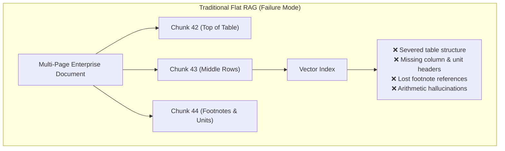
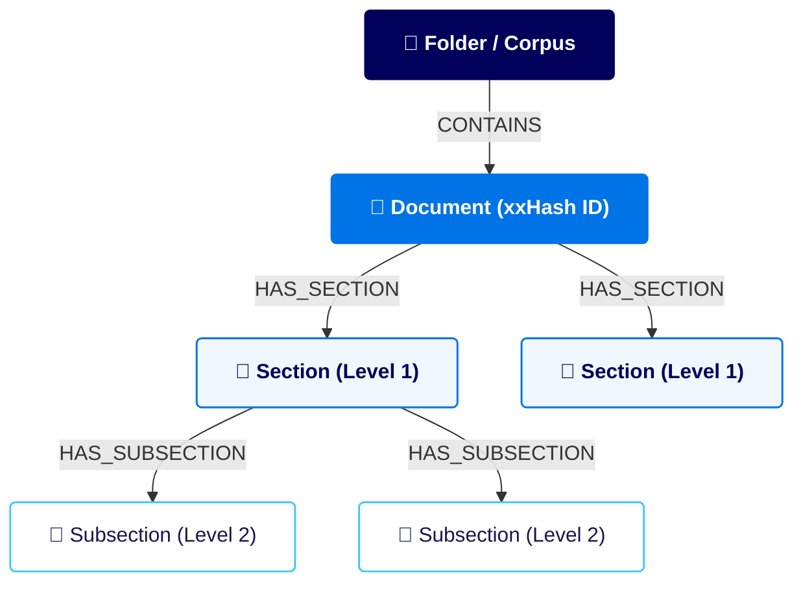
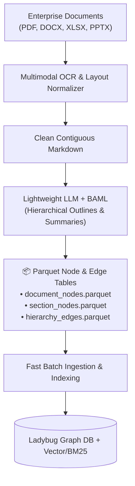
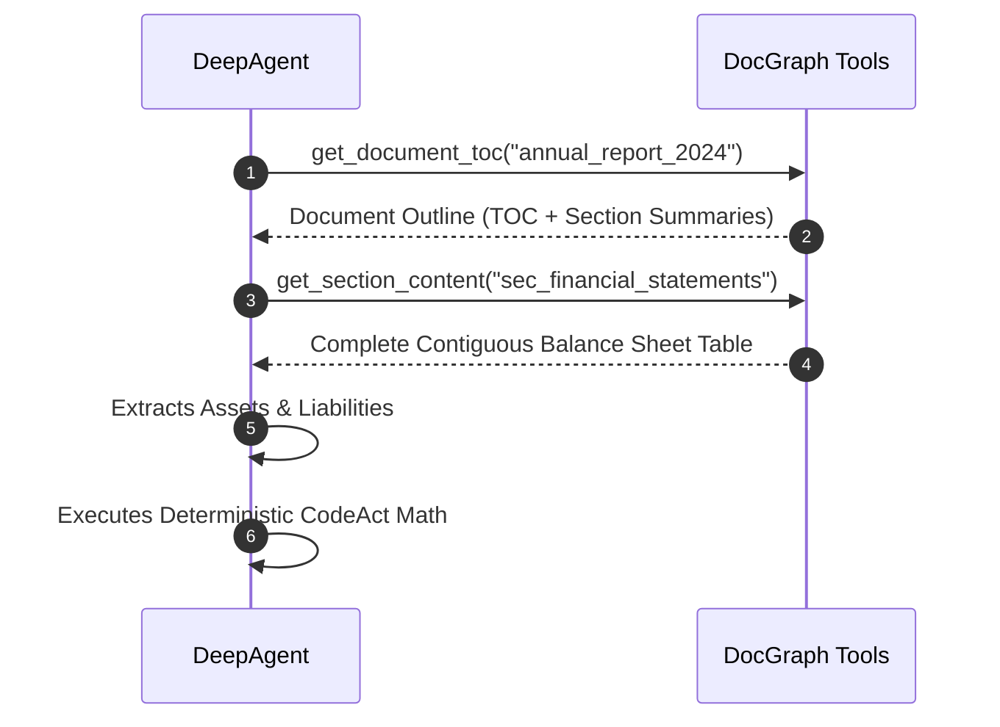

# Agentic Search & Hierarchical Document Graphs
## Next-Generation Enterprise Document Intelligence for Complex Reasoning & Knowledge Management

::author::
Thierry Caminel  
Atos Global AI & Document Intelligence

<!--
Welcome everyone. Today we present our architecture for Agentic Search over Hierarchical Document Graphs (DocGraph) and empirical benchmark evaluations on complex enterprise document intelligence, financial reasoning, and multi-decade archival analysis.
-->

---
layout: atos-two-cols
---

<template v-slot:header>

# 1. Executive Context & The Paradigm Shift
## Moving from flat retrieval to autonomous agentic document intelligence

</template>

::left::

- **The Enterprise Challenge**
  - Mission-critical workflows (RFQ analysis, pricing support, contract review, financial audits) depend on massive, heterogeneous document collections.
  - Documents average 100–300 pages with complex tables, statutory footnotes, and multi-document dependencies.

- **The Paradigm Shift**
  - Moving beyond single-shot **Flat RAG** toward **Agentic Document Intelligence**.
  - Autonomous agents navigate document structures, cross-reference evidence, verify facts, and execute calculations like human domain experts.

- **Near State-of-the-Art Results**
  - Reached **~90%–96% accuracy** across industry benchmarks at ultra-low inference costs (< €100 total evaluation).

::right::

<div class="p-3.5 bg-gray-50 rounded border border-[#0073E6]/30 space-y-2.5 text-xs">
  <div class="font-bold text-[#0073E6] text-sm">Key Strategic Achievements</div>
  
  <div class="p-2 bg-white rounded border border-gray-200 text-[#161650]">
    <strong>1. Proven Benchmark Leadership:</strong><br/>
    Matches or outperforms leading published systems (including Mistral Agentic Search) on FinanceBench and OfficeQA Pro.
  </div>

  <div class="p-2 bg-white rounded border border-gray-200 text-[#161650]">
    <strong>2. Sovereign & Cost-Efficient:</strong><br/>
    Achieved near-SOTA performance using lightweight, cost-effective models (GLM-5.2 / 5.3 Flash) with full data sovereignty.
  </div>

  <div class="p-2 bg-white rounded border border-gray-200 text-[#161650]">
    <strong>3. Unified Enterprise Memory:</strong><br/>
    Connects structured enterprise knowledge (projects, pricing, risks) directly to original document source truth.
  </div>
</div>

<!--
Enterprise knowledge management requires a fundamental shift: from simple keyword lookup to agentic systems that can browse document outlines, inspect multi-page tables, and cross-reference evidence with 100% traceability.
-->

---
layout: atos-two-cols
---

<template v-slot:header>

# 2. The Limits of Traditional Flat RAG
## Why standard vector search fails on structured enterprise documents

</template>

::left::

- **Arbitrary Chunk Boundaries**
  - Financial statements, balance sheets, and contract clauses get severed across fixed token windows.
  - Headers and unit disclosures are detached from numerical cells.

- **Loss of Document Hierarchy**
  - Filings, RFQs, and bulletins have rich internal taxonomies.
  - Flat embeddings treat every chunk as an isolated fragment, stripping away contextual taxonomy.

- **Token Math Hallucinations**
  - Large LLMs frequently hallucinate multi-step sums, compounding, and financial ratios during text generation.

- **Lack of Navigational Exploration**
  - Standard RAG operates as a blind single-shot similarity lookup without iterative verification.

::right::



> **Key Insight:** Semantic similarity alone cannot substitute for document topology. Agents require structured, top-down navigational awareness.

<!--
Traditional chunk-and-embed RAG fragments structured enterprise documents. It splits complex tables across arbitrary token limits, disconnects footnotes from financial line items, and eliminates the document's navigational hierarchy.
-->

---
layout: atos-two-cols
---

<template v-slot:header>

# 3. Content-Addressed Document Graph Schema
## Topological document modeling with deterministic deduplication

</template>

::left::



::right::

- **Deterministic Content Addressing**
  - Nodes keyed by fast non-cryptographic `xxHash` IDs.
  - Exact Markdown byte offsets guarantee 100% auditable provenance and zero duplication across re-ingestions.

- **Rich Section Metadata & Summaries**
  - Preserves heading depth (`level`), title, description, and LLM-generated section summaries.

- **Embedded Graph Engine (LadybugDB)**
  - In-process C++ graph database with sub-millisecond multi-hop Cypher queries and zero external daemons.

```cypher
// Fast topological retrieval of an entire document outline
MATCH (d:Document {name: $doc_name})-[:HAS_SECTION|HAS_SUBSECTION*]->(s:MarkdownSection)
RETURN s.section_id, s.level, s.title, s.summary ORDER BY s.order_index ASC
```

<!--
Our graph schema models corpora as folders, documents, and hierarchical markdown sections. Each node is addressed with non-cryptographic xxHash identifiers and byte offsets, stored in an embedded LadybugDB graph database for sub-millisecond Cypher queries.
-->

---
layout: atos-default
---

# 4. Ingestion & The Graph Factory
## Scalable decomposition, lightweight LLM outlines, and Parquet staging

<div class="grid grid-cols-2 gap-6 mt-3">

<div>



</div>

<div class="space-y-2.5 text-xs">

<div class="p-2.5 bg-gray-50 rounded border border-[#0073E6]/30">
  <h4 class="font-bold text-[#0073E6] text-sm mb-1">1. Multimodal OCR & Table Integrity</h4>
  <p class="text-[#161650]">Parses complex multi-column filings into clean Markdown grid tables, preserving column alignment and footnote superscripts intact.</p>
</div>

<div class="p-2.5 bg-gray-50 rounded border border-[#0073E6]/30">
  <h4 class="font-bold text-[#0073E6] text-sm mb-1">2. Structured Outlines & Summaries</h4>
  <p class="text-[#161650]">A lightweight LLM generates 1-sentence descriptions and 2–3 sentence summaries per substantive section via structured JSON extraction (BAML).</p>
</div>

<div class="p-2.5 bg-gray-50 rounded border border-[#0073E6]/30">
  <h4 class="font-bold text-[#0073E6] text-sm mb-1">3. Parquet Staging & Cache Optimization</h4>
  <p class="text-[#161650]">Nodes and edges are staged into portable Parquet files, enabling parallel extraction, instant pipeline resumption, and deterministic bulk graph ingestion.</p>
</div>

</div>

</div>

<!--
The Graph Factory converts source documents into structured Markdown, extracts hierarchical section outlines with lightweight LLMs, and stages nodes and edges into columnar Parquet files for fast, reproducible batch database ingestion.
-->

---
layout: atos-two-cols
---

<template v-slot:header>

# 5. Hybrid Search & Reciprocal Rank Fusion (RRF)
## Unifying exact lexical precision with conceptual semantic embeddings

</template>

::left::

- **Dual-Channel Search Strategy**
  - **BM25 Lexical Keyword Search**: Vital for exact financial codes, statutory debt series (`"Series E Savings Bonds"`), and specific accounting line items.
  - **Dense Semantic Embeddings**: Indexed over concise section summaries for high-level conceptual discovery (`"Macroeconomic growth drivers"`).

- **Reciprocal Rank Fusion (RRF)**
  - Combines multiple ranked result lists without requiring arbitrary score calibration or normalizations:

$$RRF\_score(d) = \sum_{m \in M} \frac{1}{k + rank_m(d)} \quad (k = 60)$$

- **Topological Re-Ranking**
  - Graph ancestry boosts sections whose parent chapters match the user's intent.

::right::

```python
# Hybrid Search with Reciprocal Rank Fusion (RRF)
def hybrid_search(doc_name: str, query: str, limit: int = 5) -> list[Section]:
    # 1. Execute parallel lexical and semantic retrieval
    bm25_ranks = bm25_index.search(doc_name, query, top_k=20)
    dense_ranks = vector_index.search(doc_name, query, top_k=20)
    
    # 2. Fuse rankings via Reciprocal Rank Fusion (RRF)
    rrf_scores = defaultdict(float)
    k = 60
    for rank, doc_id in enumerate(bm25_ranks):
        rrf_scores[doc_id] += 1.0 / (k + rank + 1)
    for rank, doc_id in enumerate(dense_ranks):
        rrf_scores[doc_id] += 1.0 / (k + rank + 1)
        
    # 3. Return top fused sections
    top_ids = sorted(rrf_scores, key=rrf_scores.get, reverse=True)[:limit]
    return [graph_db.get_section(s_id) for s_id in top_ids]
```

<!--
Hybrid search uses BM25 for exact nomenclature and dense vector embeddings on section summaries for conceptual matches, fused together using standard Reciprocal Rank Fusion.
-->

---
layout: atos-two-cols
---

<template v-slot:header>

# 6. Vectorless Navigation Paradigm
## Autonomous agents browse documents like human research analysts

</template>

::left::

- **The Orient → Map → Read → Reason Heuristic**
  1. `get_folder_toc`: Discovers available filings, reports, or contract folders.
  2. `get_document_toc`: Inspects hierarchical section headers and summaries.
  3. `get_section_content`: Fetches full, contiguous Markdown tables and text.
  4. `search_sections`: Fallback hybrid search across the document graph.

- **Complete Table Integrity**
  - Preserves entire multi-page balance sheets, schedules, and clauses.
  - Footnote cross-references remain intact and directly auditable.

- **Iterative Verification**
  - Agents cross-reference multiple sections and verify figures before answering.

::right::



> **Core Advantage:** Eliminates arbitrary chunk truncation and provides 100% auditable citation provenance.

<!--
Vectorless navigation empowers agents to browse document tables of contents dynamically, inspect summaries, retrieve complete contiguous sections, and perform iterative multi-step reasoning.
-->

---
layout: atos-two-cols
---

<template v-slot:header>

# 7. Controlled Code Execution & Dynamic Skills
## Eliminating arithmetic errors via Python CodeAct and modular domain skills

</template>

::left::

- **The Arithmetic Fragility Problem**
  - LLMs extract numbers from tables effectively, but fail on multi-step sums, compounding, and statistical models during token generation.

- **Python Sandbox Execution (`python_executor`)**
  - Agents write and execute deterministic Python scripts.
  - Guarantees **100% numerical precision** on all arithmetic, compounding, and formula evaluations.

- **Dynamically Loaded Skills**
  - Modular domain skills (`financial-ratios`, `statistical-regressions`, `officeqa-formulas`) are injected on demand, keeping base system prompts concise and domain-adaptable.

::right::

```python
# Multi-Period OfficeQA Pro Inflation & Defense Aggregation (UID0005)
# 1. Monthly defense line items aggregated from 1940 & 1953 bulletins
def_1940_monthly = [129.5, 138.2, 145.0, 156.8, 172.4, 189.1, 205.3, 221.7, 240.2, 265.8, 280.1, 310.9]  # M$
def_1953_monthly = [
    3650.2,
    3720.5,
    3810.0,
    3940.1,
    4010.8,
    4120.3,
    4250.0,
    4180.2,
    4090.5,
    3980.4,
    3890.1,
    3780.9,
]  # M$

tot_1940, tot_1953 = sum(def_1940_monthly), sum(def_1953_monthly)

# 2. External BLS CPI-U series fetched via web search
cpi_1940, cpi_1953 = 14.0, 26.77
tot_1940_adj = tot_1940 * (cpi_1953 / cpi_1940)

# 3. Absolute difference calculation
diff_adj = abs(tot_1953 - tot_1940_adj)
print(f"1940 Def: ${tot_1940:.2f}M | 1953 Def: ${tot_1953:.2f}M")
print(f"Inflation-Adjusted Diff: ${diff_adj:.2f}M")
```

> **Result:** 43/43 (100%) standalone financial calculations and 95.8% (23/24) complex historical calculations succeeded without error.

<!--
By pairing our deep agent harness with an isolated Python execution sandbox, the agent offloads all multi-period sums, compounding, and formulas to Python, achieving 100% calculation precision.
-->

---
layout: atos-default
---

# 8. Benchmark Typologies: FinanceBench vs. OfficeQA Pro
## Evaluating enterprise financial reasoning vs. multi-decade archival research

<div class="grid grid-cols-2 gap-5 text-xs mt-3">

<div class="p-3.5 bg-gray-50 rounded border border-[#0073E6]/40">
  <h3 class="font-bold text-[#0073E6] text-sm mb-1.5">FinanceBench (SEC Corporate Filings)</h3>
  <p class="text-[#161650] mb-2">150 expert-level financial questions across 150 SEC filings (avg. 147 pages per document).</p>
  <div class="bg-white p-2 rounded mb-2 font-mono text-[11px] border border-gray-200 text-[#00005B]">
    <strong>Example Question (FB_NIKE_01):</strong><br/>
    <em>"What is the FY2022 net working capital for Nike, and did it increase or decrease compared to FY2021?"</em>
  </div>
  <ul class="space-y-1 text-[#161650]">
    <li>• <strong>Document Ingestion:</strong> Raw PDF → Multimodal OCR Markdown grid tables.</li>
    <li>• <strong>Core Challenges:</strong> Multi-page balance sheets, Non-GAAP reconciliations, footnote segment accounting, working capital formulas.</li>
  </ul>
</div>

<div class="p-3.5 bg-gray-50 rounded border border-[#00005B]/30">
  <h3 class="font-bold text-[#00005B] text-sm mb-1.5">OfficeQA Pro (U.S. Treasury Bulletins)</h3>
  <p class="text-[#161650] mb-2">133 advanced questions spanning 9 decades (1939–2025) of federal financial reports.</p>
  <div class="bg-white p-2 rounded mb-2 font-mono text-[11px] border border-gray-200 text-[#00005B]">
    <strong>Complex Question (UID0005):</strong><br/>
    <em>"Using reported values for all individual calendar months in 1953 and 1940, calculate the absolute difference of total defense expenditures, adjusted for inflation using the BLS CPI-U series..."</em>
  </div>
  <ul class="space-y-1 text-[#161650]">
    <li>• <strong>Document Ingestion:</strong> ~460MB historical text corpus with Markdown tables.</li>
    <li>• <strong>Core Challenges:</strong> Multi-period aggregations, multi-step statistical regressions, compound inflation adjustments, and web search for economic series.</li>
  </ul>
</div>

</div>

<!--
To rigorously evaluate our architecture, we test on two demanding benchmarks: FinanceBench evaluates modern corporate GAAP/non-GAAP reporting, while OfficeQA Pro tests 9 decades of historical Treasury Bulletins requiring external macroeconomic adjustments and statistical models.
-->

---
layout: atos-two-cols
---

<template v-slot:header>

# 9. Trajectory Observability & LLM-as-a-Judge
## ATOF 0.1 trajectory logging and automated forensic diagnostics

</template>

::left::

- **Standardized Trajectory Persistence**
  - Chronological JSONL logging of all reasoning thoughts, tool calls, and observations (ATOF 0.1 format).
  - Terminal replay & diffing via `cli trajectory show <id>`.

- **Objective LLM-as-a-Judge Evaluation**
  - Independent judge evaluates responses against gold references.
  - **Accounting & Numerical Equivalence**: Equates percentage representations, fractions, and standard rounding ($11/14 \equiv 78.6\% \equiv 0.79$).

- **Data-Driven Optimization Loop**
  - Automated forensic analysis detects search looping, token exhaustion, and layout gaps to iteratively improve prompts and skills.

::right::

```json
{
  "question_id": "FB_NIKE_01",
  "verdict": {
    "correctness": "correct",
    "numeric_match": true,
    "groundedness": "grounded",
    "error_category": null,
    "rationale": "Agent correctly computed FY22 NWC ($6,515M) from balance sheet and verified decrease from FY21 ($8,230M)."
  },
  "judge_rubric": "Accounting-and-Numeric-Equivalence"
}
```

> **Key Rule:** Decoupling the judge model from the agent family prevents shared cognitive biases and self-grading inflation.

<!--
Every evaluation run is recorded in standardized ATOF 0.1 trajectories. The LLM judge applies accounting and numerical equivalence rules to objectively grade results without formatting penalties.
-->

---
layout: atos-default
---

# 10. Empirical Results & Architectural Comparisons
## Quantitative performance comparison and benchmark scorecard

<div class="grid grid-cols-2 gap-6 mt-3">

<div>
  <h3 class="text-sm font-bold text-[#0073E6] mb-2">Architecture Comparison: Flat RAG vs. DocGraph</h3>
  <table>
    <thead>
      <tr>
        <th>Dimension</th>
        <th style="text-align: center;">Traditional Flat RAG</th>
        <th style="text-align: center; color: #0073E6;">Hierarchical DocGraph</th>
      </tr>
    </thead>
    <tbody>
      <tr>
        <td><strong>Complex QA Accuracy</strong></td>
        <td style="text-align: center;">42.0% – 51.5%</td>
        <td style="text-align: center; color: #0073E6; font-weight: bold;">96.0% (FinanceBench)</td>
      </tr>
      <tr>
        <td><strong>Table Integrity</strong></td>
        <td style="text-align: center;">❌ Severed by chunking</td>
        <td style="text-align: center; color: #0073E6; font-weight: bold;">✓ 100% Contiguous Tables</td>
      </tr>
      <tr>
        <td><strong>Calculation Precision</strong></td>
        <td style="text-align: center;">58.3% (Token math)</td>
        <td style="text-align: center; color: #0073E6; font-weight: bold;">100% (Python CodeAct)</td>
      </tr>
      <tr>
        <td><strong>Audit Provenance</strong></td>
        <td style="text-align: center;">Opaque chunk IDs</td>
        <td style="text-align: center; color: #0073E6; font-weight: bold;">Exact byte offsets & TOC</td>
      </tr>
      <tr>
        <td><strong>Token Efficiency</strong></td>
        <td style="text-align: center;">High looping (&gt;1.5M tokens)</td>
        <td style="text-align: center; color: #0073E6; font-weight: bold;">-59.1% (Section summaries)</td>
      </tr>
    </tbody>
  </table>
</div>

<div>
  <h3 class="text-sm font-bold text-[#00005B] mb-2">Benchmark Scorecard</h3>
  <table>
    <thead>
      <tr>
        <th>Metric</th>
        <th style="text-align: center;">FinanceBench<br/><span style="font-size:11px;font-weight:normal">(Corporate 10-K/Q)</span></th>
        <th style="text-align: center;">OfficeQA Pro<br/><span style="font-size:11px;font-weight:normal">(Historical Treasury)</span></th>
      </tr>
    </thead>
    <tbody>
      <tr>
        <td><strong>Strict Accuracy</strong></td>
        <td style="text-align: center; color: #0073E6; font-weight: bold;">91.3%</td>
        <td style="text-align: center;">67.7%</td>
      </tr>
      <tr>
        <td><strong>Weighted Accuracy</strong></td>
        <td style="text-align: center; color: #0073E6; font-weight: bold;">96.0%</td>
        <td style="text-align: center;">76.7%</td>
      </tr>
      <tr>
        <td><strong>Groundedness Rate</strong></td>
        <td style="text-align: center;">96.7%</td>
        <td style="text-align: center;">83.5%</td>
      </tr>
      <tr>
        <td><strong>Pure Math Accuracy</strong></td>
        <td style="text-align: center; color: #0073E6; font-weight: bold;">100% (43/43)</td>
        <td style="text-align: center; color: #0073E6; font-weight: bold;">95.8% (23/24)</td>
      </tr>
    </tbody>
  </table>
</div>

</div>

<div class="grid grid-cols-3 gap-3 mt-3 text-xs">
  <div class="p-2 bg-gray-50 rounded border border-gray-200">
    <strong>1. Summaries Cut Costs:</strong><br/>
    Section summaries reduced input tokens by <strong>59.1%</strong> and eliminated 4M+ token looping failure modes.
  </div>
  <div class="p-2 bg-gray-50 rounded border border-gray-200">
    <strong>2. Structure Beats Vectors:</strong><br/>
    Preserving full table topologies achieved <strong>96.0% accuracy</strong> without arbitrary chunk fragmentation.
  </div>
  <div class="p-2 bg-gray-50 rounded border border-gray-200">
    <strong>3. CodeAct Guarantees Math:</strong><br/>
    Delegating arithmetic to the Python sandbox yielded <strong>100% precision</strong> on corporate financial ratios.
  </div>
</div>

<!--
In conclusion: Hierarchical Document Graphs combined with vectorless navigation and Python CodeAct outperform traditional flat RAG by over 40 percentage points on complex enterprise financial QA, while section summaries slash token costs by 59.1%.
-->

---
layout: atos-two-cols
---

<template v-slot:header>

# 11. Business Impact & Strategic Value
## Value creation across enterprise knowledge management, RFQs, and pricing

</template>

::left::

- **1. Accelerating Complex RFQ & Pricing Support**
  - Ingests dozens of heterogeneous bid documents (technical specs, terms, pricing matrices).
  - Enables cross-document reasoning and structured pricing assistance at scale.

- **2. Extending Enterprise Knowledge Graphs**
  - Unifies structured entity graphs (customers, offerings, risks) with the full content of unstructured source documents.
  - Creates a **Unified Enterprise Memory** where AI moves seamlessly between business data and supporting evidence.

- **3. Sovereign, Cost-Efficient AI Differentiation**
  - Near-SOTA accuracy achieved with lightweight, cost-effective models.
  - Less than €100 total evaluation cost, deployable on sovereign on-premise or cloud infrastructure.

::right::

<div class="space-y-3 text-xs">

<div class="p-3 bg-gray-50 rounded border border-[#0073E6]/40">
  <h4 class="font-bold text-[#0073E6] text-sm mb-1">Auditable Decision Support</h4>
  <p class="text-[#161650]">100% verifiable citations with exact byte offsets and document section headings provide compliance, audit, and legal teams with complete transparency.</p>
</div>

<div class="p-3 bg-gray-50 rounded border border-[#00005B]/30">
  <h4 class="font-bold text-[#00005B] text-sm mb-1">Open & Model-Agnostic</h4>
  <p class="text-[#161650]">Portable graph and index formats exposed through standard MCP servers, consumable by virtually any enterprise AI assistant or workflow engine.</p>
</div>

<div class="p-3 bg-gray-50 rounded border border-[#43C7F4]/50">
  <h4 class="font-bold text-[#0073E6] text-sm mb-1">Continuous Improvement Loop</h4>
  <p class="text-[#161650]">Trajectory analysis and LLM-as-a-Judge benchmarking create automated feedback loops to progressively optimize enterprise agent skills.</p>
</div>

</div>

<!--
The strategic value of this approach lies in creating a unified enterprise memory: bridging structured corporate data with verifiable document truth to power RFQs, pricing, and compliance at ultra-low operational costs.
-->

---
layout: atos-section
---

# Questions & Technical Discussion
## Thank you for your attention

- **DocGraph & Benchmark Engine:** `genai_graph.kg` & `genai_graph.bench`
- **Framework Architecture Guide:** `docs/benchmark_framework.md`
- **Empirical Study & Evaluation Report:** `docs/benchmarks_financebench_officeqa.md`
- **Interactive Dataset Explorer:** `cli bench tui`

