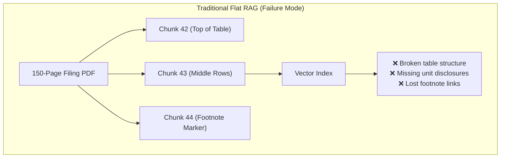
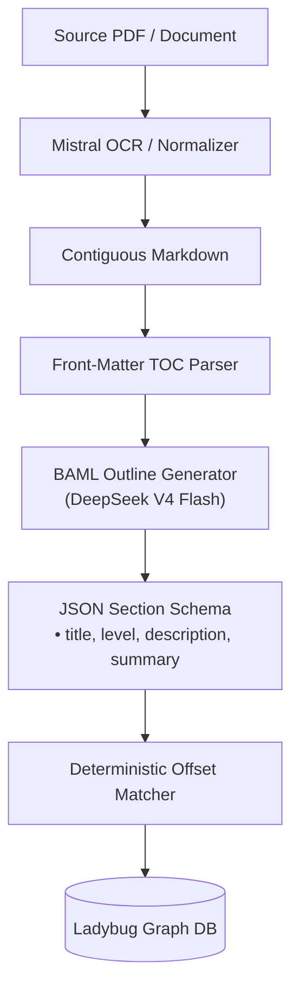
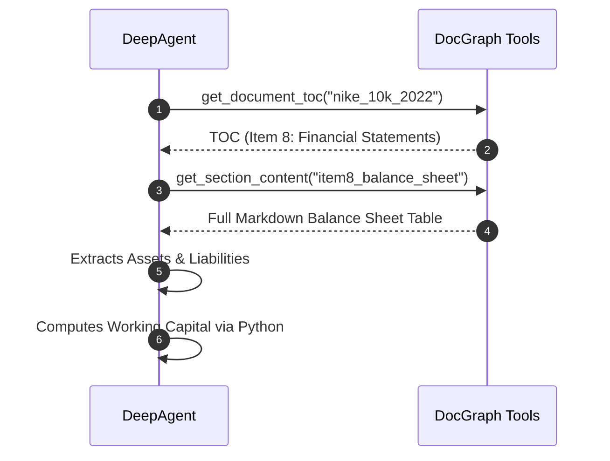
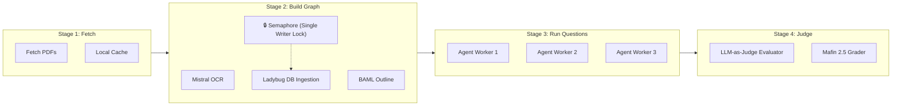

# Hierarchical Document Graphs & Agent Benchmarking
## Evaluating Complex Financial & Archival QA with Deep Agents

::author::
**GenAI Graph & GenAI Toolkit Engineering**  
Atos Global AI & Document Intelligence

<!--
Welcome everyone. Today we are presenting the architecture and empirical results of our Hierarchical Document Graph (DocGraph) engine and the multi-dataset benchmark framework powering our evaluations on FinanceBench and OfficeQA Pro.
-->

---
layout: atos-two-cols
---

<template v-slot:header>

# 1. The Limits of Flat Chunking RAG
## Why traditional vector search fails on complex enterprise documents

</template>

::left::

- **Arbitrary Chunk Boundaries**
  - Financial statements, P&Ls, and footnotes split across arbitrary token limits.
  - Contextual headers and column definitions are severed from numerical cells.

- **Loss of Document Hierarchy**
  - Multi-page SEC 10-K filings and Treasury Bulletins have rich internal taxonomies (`Item 8` $\rightarrow$ `Consolidated Statements` $\rightarrow$ `Note 12`).
  - Flat embeddings treat every chunk as an isolated fragment.

- **Table & Citation Integrity**
  - Strict financial audits require contiguous tables and 100% provenance tracing to source headings.

::right::



> **Key Takeaway:** Semantic similarity alone is insufficient for structured financial navigation. Agents need topological awareness.

<!--
In traditional RAG, splitting complex 150-page documents into 500-token chunks breaks multi-page tables, detaches footnotes from values, and removes the document's navigational outline.
-->

---
layout: atos-default
---

# 2. Content-Addressed Graph Schema
## Embedded LadybugDB topology with cryptographic deduplication

```
Folder ──CONTAINS──▶ Document ──HAS_SECTION──▶ MarkdownSection ──HAS_SUBSECTION──▶ MarkdownSection
```

<div class="grid grid-cols-3 gap-4 mt-4 text-xs">

<div class="p-3 bg-gray-50 rounded border border-gray-200">
  <h3 class="text-sm font-bold text-[#0073E6] mb-1">1. Identity & Provenance</h3>
  <ul class="space-y-1 text-[#161650]">
    <li>• Cryptographic <code>xxHash</code> content-addressed IDs.</li>
    <li>• Exact Markdown byte offsets for deterministic auditing.</li>
    <li>• Zero duplication across repeated ingestions.</li>
  </ul>
</div>

<div class="p-3 bg-gray-50 rounded border border-gray-200">
  <h3 class="text-sm font-bold text-[#0073E6] mb-1">2. Section Taxonomy</h3>
  <ul class="space-y-1 text-[#161650]">
    <li>• <code>level</code>: Heading depth (1 to 6).</li>
    <li>• <code>title</code>: Section title from document header.</li>
    <li>• <code>content</code>: Clean, contiguous Markdown table/text.</li>
  </ul>
</div>

<div class="p-3 bg-gray-50 rounded border border-gray-200">
  <h3 class="text-sm font-bold text-[#0073E6] mb-1">3. Graph Ingestion Engine</h3>
  <ul class="space-y-1 text-[#161650]">
    <li>• Embedded C++ graph engine (Ladybug / Kùzu fork).</li>
    <li>• Sub-millisecond multi-table Cypher joins.</li>
    <li>• Zero external server daemon required.</li>
  </ul>
</div>

</div>

<div class="mt-3">

```cypher
// Fast topological retrieval of an entire document outline
MATCH (d:Document {name: $doc_name})-[:HAS_SECTION|HAS_SUBSECTION*]->(s:MarkdownSection)
RETURN s.section_id, s.level, s.title, s.description, s.summary
ORDER BY s.order_index ASC
```

</div>

<!--
Our graph model keys every node by cryptographic content hashes (xxHash). In LadybugDB, we model folders, documents, and hierarchical markdown sections, queryable in sub-milliseconds via Cypher.
-->

---
layout: atos-two-cols
---

<template v-slot:header>

# 3. Ingestion & Structured Outlines
## Deterministic decomposition with BAML & Flash LLMs

</template>

::left::

1. **Multimodal OCR & Layout Normalization**
   - **Mistral OCR** parses complex multi-column PDFs into structured Markdown grid tables.
   - Preserves footnote superscripts, alignment, and headings.

2. **Front-Matter TOC Extraction**
   - Scans initial $\approx 350$ lines to detect printed Table of Contents.

3. **Outline & Summary Generation**
   - **DeepSeek V4 Flash** via **BAML** extracts structured JSON outlines.
   - 1-sentence `description` + 2–3 sentence `summary` for substantive sections.

4. **Deterministic Offset Alignment**
   - Aligns outline headings to byte offsets in the Markdown corpus.

::right::



> **Benefit:** Summaries allow agents to discover relevant sections without ingesting millions of raw tokens.

<!--
The ingestion pipeline combines high-fidelity OCR with deterministic outline generation. A fast flash model extracts section summaries, which are bound directly to the Markdown byte offsets.
-->

---
layout: atos-default
---

# 4. Dual-Layer Hybrid Retrieval
## Combining exact lexical indexing with semantic embeddings

<div class="grid grid-cols-2 gap-6 mt-4">

<div class="p-4 bg-gray-50 rounded border border-[#0073E6]/30">
  <div class="flex items-center gap-2 mb-2">
    <span class="text-[#0073E6] font-bold text-sm">Layer 1: BM25 Keyword Engine</span>
  </div>
  <p class="text-xs text-[#161650] mb-2">
    Critical for financial accounting codes, specific statutory debt series, and exact line-item headers.
  </p>
  <div class="text-xs font-mono bg-white p-2 rounded border border-gray-200 text-[#00005B]">
    • "Series E Savings Bonds"<br/>
    • "Operating cash flow ratio"<br/>
    • "Note 14: Income Taxes"<br/>
    • "Foreign exchange gain/(loss)"
  </div>
</div>

<div class="p-4 bg-gray-50 rounded border border-[#43C7F4]/50">
  <div class="flex items-center gap-2 mb-2">
    <span class="text-[#0073E6] font-bold text-sm">Layer 2: Dense Semantic Embeddings</span>
  </div>
  <p class="text-xs text-[#161650] mb-2">
    Indexed on LLM-generated section summaries for high-level conceptual matching without token noise.
  </p>
  <div class="text-xs font-mono bg-white p-2 rounded border border-gray-200 text-[#00005B]">
    • "Macroeconomic growth drivers"<br/>
    • "Capital allocation policies"<br/>
    • "Liquidity risk management"<br/>
    • "Legal proceedings and exposure"
  </div>
</div>

</div>

<div class="mt-4 text-xs">

```cypher
// Hybrid Cypher search combining BM25 full-text rank and vector similarity
CALL document_graph_search($doc_name, $query, $strategy='hybrid', $limit=5)
YIELD section_id, score, title, summary
RETURN section_id, title, summary, score ORDER BY score DESC
```

</div>

<!--
We index every section with both BM25 for statutory codes and exact line items, and dense vector embeddings on section summaries for conceptual queries.
-->

---
layout: atos-two-cols
---

<template v-slot:header>

# 5. Vectorless Navigation Paradigm
## Autonomous agents browse documents like human research analysts

</template>

::left::

- **The Orient $\rightarrow$ Map $\rightarrow$ Read $\rightarrow$ Iterate Heuristic**
  1. `get_folder_toc`: Discovers available filings or bulletins.
  2. `get_document_toc`: Inspects hierarchical section headers and summaries.
  3. `get_section_content`: Fetches exact Markdown table/text of targeted sections.
  4. `search_sections`: Fallback keyword/vector search across the graph.

- **Zero Arbitrary Chunking**
  - Section boundaries preserve complete multi-page financial statements.
  - Footnote cross-references remain intact and directly auditable.

::right::



> **Result:** 96.0% weighted accuracy on FinanceBench with 100% auditable provenance.

<!--
Vectorless navigation allows agents to walk document tables of contents and retrieve complete sections on demand, preserving table layouts and eliminating chunk boundary errors.
-->

---
layout: atos-default
---

# 6. Benchmark Typologies: FinanceBench vs. OfficeQA Pro
## Evaluating enterprise financial reasoning vs. multi-decade archival research

<div class="grid grid-cols-2 gap-4 text-xs mt-3">

<div class="p-3 bg-gray-50 rounded border border-[#0073E6]/40">
  <h3 class="font-bold text-[#0073E6] text-sm mb-1">FinanceBench (SEC Corporate Filings)</h3>
  <p class="text-[#161650] mb-2">84 complex 10-K, 10-Q, 8-K filings across ~30 US enterprises.</p>
  <div class="bg-white p-2 rounded mb-2 font-mono text-[11px] border border-gray-200 text-[#00005B]">
    <strong>Example Question (FB_NIKE_01):</strong><br/>
    <em>"What is the FY2022 net working capital for Nike, and did it increase or decrease compared to FY2021?"</em>
  </div>
  <ul class="space-y-1 text-[#161650]">
    <li>• <strong>Ingestion:</strong> Raw PDF $\rightarrow$ Mistral OCR grid tables.</li>
    <li>• <strong>Challenges:</strong> Multi-page balance sheets, Non-GAAP reconciliations, footnote segment accounting.</li>
  </ul>
</div>

<div class="p-3 bg-gray-50 rounded border border-[#00005B]/30">
  <h3 class="font-bold text-[#00005B] text-sm mb-1">OfficeQA Pro (U.S. Treasury Bulletins)</h3>
  <p class="text-[#161650] mb-2">133 questions spanning 9 decades (1939–2025) of Treasury reports.</p>
  <div class="bg-white p-2 rounded mb-2 font-mono text-[11px] border border-gray-200 text-[#00005B]">
    <strong>Example Question (UID0005):</strong><br/>
    <em>"Calculate inflation-adjusted expenditures for US national defense in 1953 vs 1940 using BLS CPI-U series..."</em>
  </div>
  <ul class="space-y-1 text-[#161650]">
    <li>• <strong>Ingestion:</strong> 460MB pre-converted Transformed Text corpus.</li>
    <li>• <strong>Challenges:</strong> Archaic statutory terminology, multi-issue revisions, web search for macroeconomic CPI series.</li>
  </ul>
</div>

</div>

<!--
Here we compare our two target benchmarks: FinanceBench tests modern corporate filings with GAAP/non-GAAP ratios, while OfficeQA Pro tests 9 decades of historical US Treasury Bulletins requiring external macroeconomic adjustments.
-->

---
layout: atos-two-cols
---

<template v-slot:header>

# 7. Agent Runtime & Python CodeAct
## Eliminating hallucinated arithmetic via controlled code execution

</template>

::left::

- **The Arithmetic Fragility Problem**
  - LLMs reliably extract numbers from financial tables, but fail on multi-step arithmetic, compounding, and fractional ratios during token generation.

- **Python Code Sandbox (`python_executor`)**
  - Integrated CodeAct tool allows the agent to write and execute deterministic Python code.
  - Guarantees **100% numerical accuracy** on arithmetic once numbers are extracted.

- **Dynamic `SkillsMiddleware`**
  - Progressively injects domain knowledge (`financial-ratios`, `officeqa-formulas`) only when relevant, keeping system prompts lightweight.

::right::

```python {all|4-6|8-10|12-14}
# Example CodeAct trace executed by agent
# FB_FL_02: Operating Cash Flow Ratio

# 1. Extracted from Cash Flow Statement & Balance Sheet
cash_from_ops_2018 = 829_000_000  # Note 15
current_liabilities_2018 = 612_000_000

# 2. Compute exact ratio
ocf_ratio = cash_from_ops_2018 / current_liabilities_2018
delta_pct = (ocf_ratio - 1.25) / 1.25 * 100

print(f"OCF Ratio: {ocf_ratio:.4f}")
print(f"Delta: {delta_pct:.2f}%")
# Output: OCF Ratio: 1.3546 | Delta: 8.37%
```

> **Empirical Validation:** 43/43 (100%) standalone financial calculations succeeded without arithmetic drift.

<!--
By pairing the LangChain DeepAgent harness with an isolated Python execution sandbox, the agent offloads all formula computation to Python, achieving 100% calculation accuracy.
-->

---
layout: atos-default
---

# 8. Prefect Concurrency & Pipeline Engine
## Resilient orchestration with database lock protection



<div class="grid grid-cols-3 gap-4 mt-4 text-xs">

<div class="p-3 bg-gray-50 rounded border border-gray-200">
  <h4 class="font-bold text-[#0073E6] mb-1">Concurrency Gates</h4>
  <p class="text-[#161650]">In-process thread-safe semaphores protect Ladybug DB's single-writer model during graph compilation while allowing high-throughput read queries.</p>
</div>

<div class="p-3 bg-gray-50 rounded border border-gray-200">
  <h4 class="font-bold text-[#0073E6] mb-1">Exponential Backoffs</h4>
  <p class="text-[#161650]">Asynchronous retry policies automatically absorb transient provider rate limits (OpenRouter, DeepSeek, Mistral OCR) without aborting runs.</p>
</div>

<div class="p-3 bg-gray-50 rounded border border-gray-200">
  <h4 class="font-bold text-[#0073E6] mb-1">Idempotent Resumes</h4>
  <p class="text-[#161650]">Runs record execution records to <code>runs.jsonl</code> with atomic file locks; re-running skips already completed question IDs.</p>
</div>

</div>

<!--
Our pipeline is orchestrated by Prefect flows. Concurrency semaphores protect Ladybug DB's single-writer model during graph building while allowing massive parallelism during agent question runs.
-->

---
layout: atos-two-cols
---

<template v-slot:header>

# 9. Observability & LLM-as-Judge
## ATOF 0.1 trajectory logging and automated forensic diagnostics

</template>

::left::

- **NeMo Relay & ATOF 0.1 Trajectory Store**
  - Chronological JSONL logging of all reasoning thoughts, tool inputs, and observations (`data/trajectories/<run_id>/`).
  - Terminal replay & diff via `cli trajectory show <id>`.

- **LLM-as-Judge (Mafin 2.5 Equivalence)**
  - Independent **DeepSeek V4 Pro** model grades answers against gold references.
  - **Numerical Equivalence**: Fractions, percentages, and rounding ($11/14 \equiv 78.6\% \equiv 0.79$) are verified equivalent.

- **Automated Root-Cause Diagnostics**
  - Detects *Search Looping Penalties*, *OCR Visual Gaps*, and *Reasoning Token Exhaustion*.

::right::

<div class="p-3 bg-gray-50 rounded border border-gray-200 font-mono text-[11px]">

```json
{
  "question_id": "FB_NIKE_01",
  "verdict": {
    "correctness": "correct",
    "numeric_match": true,
    "groundedness": "grounded",
    "error_category": null,
    "rationale": "Agent correctly computed FY22 NWC ($6,515M) from balance sheet and verified decrease from FY21 ($8,230M)."
  },
  "judge_llm": "DeepSeek-V4-Pro-0813@openrouter"
}
```

</div>

> **Insight:** Decoupling judge models from the agent family prevents shared cognitive biases and self-grading inflation.

<!--
We capture complete agent trajectories using NeMo Relay and ATOF 0.1 format. The LLM judge applies Mafin 2.5 numerical equivalence rules to grade responses accurately without penalizing formatting differences.
-->

---
layout: atos-default
---

# 10. Empirical Results & Architectural Insights
## Performance summary and key quantitative findings

<div class="grid grid-cols-2 gap-6 mt-4">

<div>
  <h3 class="text-sm font-bold text-[#0073E6] mb-2">Benchmark Scorecard</h3>
  <table>
    <thead>
      <tr>
        <th>Metric</th>
        <th style="text-align: center;">FinanceBench</th>
        <th style="text-align: center;">OfficeQA Pro</th>
      </tr>
    </thead>
    <tbody>
      <tr>
        <td><strong>Strict Accuracy</strong></td>
        <td style="text-align: center; color: #0073E6; font-weight: bold;">91.3%</td>
        <td style="text-align: center;">67.7%</td>
      </tr>
      <tr>
        <td><strong>Weighted Accuracy</strong></td>
        <td style="text-align: center; color: #0073E6; font-weight: bold;">96.0%</td>
        <td style="text-align: center;">76.7%</td>
      </tr>
      <tr>
        <td><strong>Groundedness Rate</strong></td>
        <td style="text-align: center;">96.7%</td>
        <td style="text-align: center;">83.5%</td>
      </tr>
      <tr>
        <td><strong>Pure Math Accuracy</strong></td>
        <td style="text-align: center; color: #0073E6; font-weight: bold;">100% (43/43)</td>
        <td style="text-align: center; color: #0073E6; font-weight: bold;">95.8% (23/24)</td>
      </tr>
    </tbody>
  </table>
</div>

<div class="space-y-2">
  <h3 class="text-sm font-bold text-[#00005B] mb-2">Core Engineering Insights</h3>
  
  <div class="p-2 bg-gray-50 rounded border border-gray-200 text-xs">
    <strong>1. Section Summaries Slashed Token Costs by 59.1%:</strong><br/>
    Enabled high-level intent matching, boosting accuracy by +19.4% and eliminating 4M+ token looping pathologies.
  </div>

  <div class="p-2 bg-gray-50 rounded border border-gray-200 text-xs">
    <strong>2. Vectorless Beats Flat Chunking:</strong><br/>
    Preserving full table and section topologies yielded 96.0% weighted accuracy on SEC corporate filings.
  </div>

  <div class="p-2 bg-gray-50 rounded border border-gray-200 text-xs">
    <strong>3. CodeAct Eliminates Token Math Errors:</strong><br/>
    Delegating arithmetic to the Python sandbox achieved 100% mathematical precision.
  </div>
</div>

</div>

<!--
To conclude: Our hierarchical document graph with vectorless navigation and Python CodeAct achieved 96.0% weighted accuracy on FinanceBench and 76.7% on OfficeQA Pro, while section summaries reduced token consumption by 59.1%.
-->

---
layout: atos-section
---

# Questions & Technical Discussion
## Thank you for your attention

- **Benchmark Framework:** `genai_graph.bench`
- **Documentation:** `docs/benchmark_framework.md`
- **Empirical Study:** `docs/benchmarks_financebench_officeqa.md`
- **Interactive TUI Dataset Explorer:** `cli bench tui`
