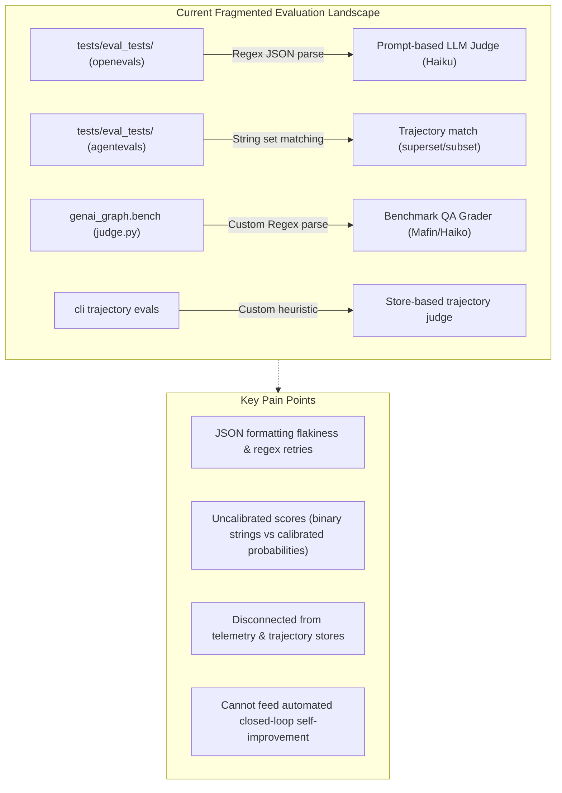
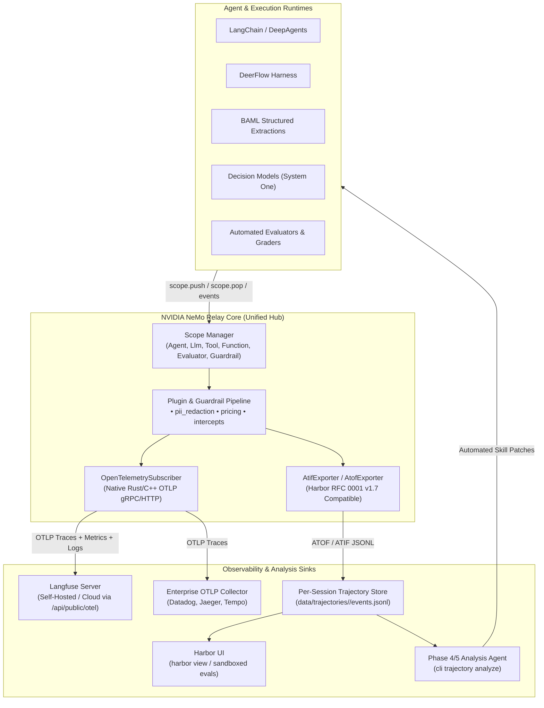
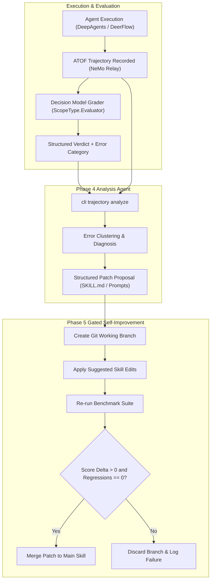

# Architecture Study: Unifying Tracing, Trajectories, and Evaluations with NeMo Relay and Decision Models

**Status:** Proposed Architecture & Migration Plan  
**Date:** 2026-10-09  
**Authors:** AI Architecture & Core Engineering Team  
**Target Repositories:** `genai-tk`, `genai-graph`  
**Related Documents:**
- `docs/trajectory.md` — NeMo Relay ATOF Trajectory Store (Phases 0–3)
- `docs/design/agent_trajectory_nemo_relay.md` — Agent Trajectory Observability & Analysis Agent Spec
- `docs/evaluation_testing.md` — Evaluation Testing Guide (Legacy `openevals` / `agentevals`)
- `docs/benchmark_framework.md` — Multi-Dataset Benchmark Framework
- `docs/studies/deerflow_architecture_and_benchmarks.md` — DeerFlow & Meta-Harness Architecture

---

## 1. Executive Summary & Problem Statement

Over the evolution of the GenAI Toolkit (`genai-tk`), tracing, trajectory collection, and evaluation evolved incrementally across multiple independent efforts:

1. **Telemetry & Tracing Sprawl:** We started with **LangSmith**, added **Langfuse** (self-hosted and cloud), incorporated **OpenTelemetry (OTLP)** via OpenInference auto-instrumentation, built an ad-hoc **local JSONL trace logger** (`local_trace_log.py`), and recently introduced **NVIDIA NeMo Relay** for capturing Agent Trajectory Observability Format (ATOF) records.
2. **Evaluation Tooling Sprawl:** In parallel, evaluations were fragmented across:
   - `openevals`: LLM-as-judge prompt wrappers returning unstructured text parsed with regular expressions.
   - `agentevals`: A lightweight library used solely for deterministic trajectory sequence comparisons (`strict`, `superset`, `subset`).
   - `genai_graph.bench.judge`: A custom regex-based LLM grader evaluating benchmark QA runs across multi-dataset benchmarks.
   - `genai_tk.extra.monitoring.trajectory_store`: Store-based trajectory evaluation logic.
3. **Critical Observability Gaps:** Significant execution paths currently bypass tracing entirely:
   - **BAML structured extractions** execute inside the Rust-backed `baml-py` engine without emitting spans to LangChain, OpenTelemetry, or NeMo Relay.
   - **Decision Models (System One models)** make direct HTTP calls (`httpx`) to OpenRouter or TypeSafe endpoints without scope tracking or token usage accounting.
4. **Redundant Storage & Dual Accounting:** The toolkit currently writes two separate local logs:
   - `data/traces/llm_calls.jsonl`: Flat, un-nested call logs with primitive string truncation.
   - `data/trajectories/<uuid>/events.jsonl`: Structured, hierarchical ATOF scope trees with token usage, tool arguments, results, and skill marks.

This study proposes a radical architectural simplification:
- **NeMo Relay as the Single Telemetry Core:** All agent, tool, LLM, BAML, and decision executions pass through NeMo Relay scopes (`ScopeType.Agent`, `ScopeType.Llm`, `ScopeType.Tool`, `ScopeType.Function`, `ScopeType.Evaluator`).
- **Retire Redundant Storage & Python-Level Auto-Instrumentation:** Sunset `local_trace_log.py` completely. Leverage NeMo Relay's native Rust/C++ `OpenTelemetrySubscriber` to stream OTLP directly to **Langfuse** and OpenTelemetry collectors, eliminating Python-level `openinference-instrumentation-langchain` overhead.
- **Retire `openevals` and `agentevals` in favor of Decision Models:** Replace brittle prompt-based judges with the toolkit's newly introduced **System One Decision Models** (`Noul`, `Choice`, `Score`).
- **Generalize Benchmark Graders toward Self-Improving Agents:** Convert benchmark evaluators into typed Decision Models running within NeMo Relay `Evaluator` scopes, piping structured verdicts and error categories into the Phase 4/5 Analysis Agent to enable automated skill improvement loops.

---

## 2. Current Architecture & Codebase Audit

### 2.1 The Tracing Matrix

| Backend / Layer | Implementation in `genai-tk` | Capture Mechanism | Strengths | Weaknesses & Redundancies |
|---|---|---|---|---|
| **Local Trace Log** | `genai_tk/extra/monitoring/local_trace_log.py` | LangChain `BaseCallbackHandler` | Simple append-only JSONL; no external server needed. | **Redundant.** Flat list of calls; loses scope hierarchy; un-queryable; does not track skills or agent loops. |
| **LangSmith** | `genai_tk/extra/monitoring/tracing.py` | Env vars (`LANGSMITH_TRACING=true`), native LangChain | Deep LangGraph integration; rich hosted UI and prompt playground. | Closed-source SaaS; privacy/data sovereignty friction in enterprise environments; license cost. |
| **Langfuse** | `deploy/docker-compose.langfuse.yaml`, `tracing.py` | OpenInference OTEL + Langfuse v4 SDK Callback | Open-source (Apache 2.0); self-hostable; tracks cost, users, sessions, and eval scores. | Currently instrumented via fragile dual-path (OpenInference OTEL + SDK CallbackHandler). |
| **OpenTelemetry** | `tracing.py` (`_setup_otel`) | `openinference-instrumentation-langchain` | Open standard; compatible with Jaeger, Datadog, Prometheus. | High Python runtime overhead; only covers LangChain calls; leaves BAML and Decision Models blind. |
| **NeMo Relay (ATOF)** | `genai_tk/extra/monitoring/nemo_relay_setup.py` | Relay Subscriber + DeepAgents middleware + Callbacks | Native hierarchical scopes (`Agent`, `Llm`, `Tool`); captures skills and trajectories; Harbor ATIF compatible. | Under-utilized; currently only sinks to local files; does not yet export to remote collectors or trace BAML. |

### 2.2 The Evaluation Matrix



1. **`openevals` Flakiness:** As documented in `docs/design/agent_trajectory_nemo_relay.md` (§8), prompt-based judges frequently return conversational markdown padding instead of JSON, requiring heuristic regex matchers and retry loops.
2. **`agentevals` Trivia:** Inspection of `tests/eval_tests/test_trajectory_match.py` reveals that `agentevals` is only used to check whether a list of tool names contains a given subset or superset. This is 20 lines of standard Python and does not justify an external package dependency.
3. **Benchmark Grader Redundancy:** In `genai_graph/bench/judge.py`, `evaluate_single_run` runs a 170-line loop with manual exponential backoff, regex parsing (`_parse_judge_json`), and raw string validation to populate `JudgeVerdict` (`correctness`, `numeric_match`, `groundedness`, `error_category`).

---

## 3. The Target Architecture: NeMo Relay as Core

### 3.1 Architectural Blueprint



### 3.2 NeMo Relay Native Capabilities

Inspection of the installed `nemo_relay` package reveals extensive capabilities that eliminate custom plumbing:

1. **Native `OpenTelemetrySubscriber`:**
   - Supports `full`, `http`, and `grpc` transport modes directly from native code.
   - Configurable headers, resource attributes, and completed span context TTL.
   - Transmits spans, events, and metrics in standard OTLP wire format.
2. **First-Class Scope Typology:**
   - Native support for: `ScopeType.Agent`, `ScopeType.Llm`, `ScopeType.Tool`, `ScopeType.Function`, `ScopeType.Evaluator`, `ScopeType.Guardrail`, `ScopeType.Retriever`, `ScopeType.Reranker`.
   - Context manager `with nemo_relay.scope.scope(name, scope_type, input=..., data=..., metadata=...)` automatically records exceptions and marks `otel.status_code = "ERROR"`.
3. **`AtifExporter` (Agent Trajectory Interchange Format v1.7):**
   - Directly exports trajectories conforming to the Harbor RFC 0001 specification, enabling seamless inspection with `harbor view` and evaluation with Harbor sandboxed runners.
4. **Plugins & Intercepts:**
   - `pii_redaction`: Centralized sanitization before telemetry leaves the host.
   - `pricing`: Native token-to-cost computation per model and span.
   - `intercepts` and `guardrails`: `LlmRequestIntercept`, `ToolConditionalExecutionGuardrail`, enabling policy enforcement without custom middleware.

---

## 4. Trade-off Analysis: Backends, Frameworks & Storage

### 4.1 Comparative Evaluation: Langfuse vs LangSmith vs NeMo Relay

| Dimension | NeMo Relay (Direct) | Langfuse (via NeMo OTLP) | LangSmith |
|---|---|---|---|
| **Primary Role** | Telemetry runtime & trajectory generator | Observability dashboard & analytics hub | SaaS developer workbench & prompt playground |
| **Architecture** | In-process native library (Rust/C++ + Python) | Client-Server (Web + DB + OTLP receiver) | Proprietary Cloud SaaS |
| **Self-Hosting** | Fully local (zero external dependencies) | Docker Compose (`deploy/docker-compose.langfuse.yaml`) | Closed source (Enterprise on-prem is complex) |
| **Data Privacy** | 100% on-premises; zero egress | Sovereign deployment; no third-party data leak | Egresses prompts and completions to LangChain servers |
| **OTLP Compliance** | Native OTLP Producer | Native OTLP Consumer (`/api/public/otel/v1/traces`) | Non-standard proprietary ingestion format |
| **Cost & Licensing** | Apache-2.0 / Permissive | Open-source (Apache 2.0 / FOSS core) | Commercial per-seat / per-trace pricing |
| **Trajectory Support** | First-class ATOF & ATIF (Harbor v1.7 RFC) | Trace / Session / Span view (no ATIF export) | Run tree view (no ATIF export) |
| **Upstream Alignment** | DeepAgents native middleware | DeerFlow native support | LangChain & DeepAgents native support |

### 4.2 Upstream Alignment: DeerFlow & DeepAgents

- **DeepAgents:** Uses LangGraph and standard LangChain callbacks. NeMo Relay already provides `NemoRelayDeepAgentsMiddleware` and `NemoRelayDeepAgentsCallbackHandler`. When NeMo Relay is active, every DeepAgents run emits full ATOF and OTLP spans.
- **DeerFlow:** DeerFlow supports trace metadata (`session_id`, `user_id`, `thread_id`) and native Langfuse/LangSmith toggles. We have already implemented `NemoRelayDeerFlowMiddleware` in `genai_tk/agents/deer_flow/relay.py`.
- **Strategic Recommendation:**
  1. **NeMo Relay is the Default Telemetry Core:** All frameworks (LangChain, DeepAgents, DeerFlow, BAML, Decision Models) feed NeMo Relay.
  2. **NeMo Relay exports OTLP to Langfuse:** Langfuse becomes the default self-hosted observability UI, receiving clean OTLP spans without requiring Python-level OpenInference patches.
  3. **LangSmith as an Opt-In Passthrough:** Keep LangSmith configuration (`monitoring.backends: [langsmith]`) as an optional pass-through for developers with existing LangSmith accounts, but do not couple toolkit internals to it.

### 4.3 Why Local Trace Storage (`local_trace_log.py`) Must Be Retired

The flat file `data/traces/llm_calls.jsonl` written by `local_trace_log.py` should be deprecated and removed for the following reasons:
1. **Structural Inferiority:** It records un-nested calls. It cannot distinguish between a standalone LLM call and an LLM call made as step 3 of a tool loop inside a sub-agent.
2. **Duplicate I/O:** Every LLM call is written twice: once to `llm_calls.jsonl` and once to `data/trajectories/<uuid>/events.jsonl`.
3. **Redundant Cost & Token Counting:** Token counts and cost estimates are calculated redundantly in `local_trace_log.py` and `nemo_relay_setup.py`. NeMo Relay's `pricing` plugin and ATOF aggregates already compute these metrics accurately.
4. **Maintenance Overhead:** Removing `local_trace_log.py` eliminates 290 lines of legacy code and simplifies the `MonitoringConfig` schema.

---

## 5. Unifying Evaluations: Retiring `openevals` in Favor of Decision Models

### 5.1 The Case for System One Decision Models

Prompt-based LLM judges (as packaged by `openevals`) suffer from fundamental architectural flaws:
- **String Parsing Fragility:** LLMs output prose explanations even when instructed to return pure JSON.
- **High Latency & Cost:** Invoking a general-purpose chat model with a large system prompt takes 1.5–4.0s per judgment.
- **Uncalibrated Confidence:** A binary string `"true"` or `"false"` provides no probability distribution.

In contrast, the toolkit's newly introduced **System One Decision Models** (`genai_tk/core/decision_models/`):
- Expose typed schemas:
  - **`Noul`:** Returns calibrated probability $P(\text{true}) \in [0.0, 1.0]$.
  - **`Choice`:** Returns a categorical selection with softmax confidence across labels.
  - **`Score`:** Returns an ordinal rubric score (e.g. 1 to 5) with probability distribution.
- Can be served by specialized, ultra-fast, low-cost classification endpoints (e.g., `clef_flash@openrouter`, TypeSafe System One) or wrapped over any local chat LLM via `ChatModelDecisionModel` with structured Pydantic outputs.
- Deliver responses in <300ms at a fraction of the token cost.

### 5.2 Mapping Legacy Evaluators to Decision Models

```
+------------------------------------+---------------------------------------------------+
| Legacy Evaluator (openevals/agent) | Decision Model Formulation                        |
+------------------------------------+---------------------------------------------------+
| correctness (openevals)            | Noul(instructions="Is the answer factually        |
|                                    | correct according to the reference text?")        |
|                                    | -> Returns probability [0.0, 1.0]                 |
+------------------------------------+---------------------------------------------------+
| conciseness (openevals)            | Score(instructions="Rate answer conciseness",     |
|                                    | criteria=["Verbose padding", "Acceptable",        |
|                                    | "Direct and concise"])                            |
+------------------------------------+---------------------------------------------------+
| answer_relevance (openevals)       | Noul(instructions="Does the response directly     |
|                                    | address the user question?")                      |
+------------------------------------+---------------------------------------------------+
| trajectory_match (agentevals)      | Deterministic Python function over ATOF tool      |
|                                    | sequence (no LLM, 0ms, 100% deterministic)        |
+------------------------------------+---------------------------------------------------+
| trajectory_accuracy (agentevals)   | Choice(instructions="Evaluate tool selection",    |
|                                    | criteria={"optimal": ..., "suboptimal": ...,      |
|                                    | "incorrect_tool": ...})                           |
+------------------------------------+---------------------------------------------------+
```

### 5.3 Deterministic Trajectory Matching without `agentevals`

Replacing `agentevals.trajectory.match` requires only a small utility in `genai_tk.extra.monitoring.trajectory_store`:

```python
def match_trajectory_tools(
    actual_tool_calls: list[str],
    expected_tool_calls: list[str],
    mode: Literal["strict", "superset", "subset"] = "superset",
) -> bool:
    """Evaluate trajectory tool sequences deterministically without external dependencies."""
    if mode == "strict":
        return actual_tool_calls == expected_tool_calls
    actual_set, expected_set = set(actual_tool_calls), set(expected_tool_calls)
    if mode == "superset":
        return expected_set.issubset(actual_set)
    if mode == "subset":
        return actual_set.issubset(expected_set)
    raise ValueError(f"Unknown match mode: {mode}")
```

This removes `agentevals` and `openevals` from `pyproject.toml` completely.

---

## 6. Generalizing Benchmark Graders toward Self-Improving Agents

### 6.1 The General Grader Contract

The benchmark grader in `genai_graph.bench.judge` evaluates agent outputs on complex tasks (FinanceBench, OfficeQA Pro). Today, it uses raw prompt formatting and regex parsing to populate `JudgeVerdict`:

```python
class JudgeVerdict(BaseModel):
    correctness: Literal["correct", "partially_correct", "incorrect"]
    numeric_match: bool
    groundedness: Literal["grounded", "partially_grounded", "ungrounded"]
    error_category: str
    rationale: str
```

Under the refactored architecture, this evaluation is modeled as a single, multi-question `ClassifierRequest` evaluated by a `DecisionModel`:

```python
def build_benchmark_decision_request(run: BenchRunRecord) -> ClassifierRequest:
    return ClassifierRequest(
        state={
            "question": run.question,
            "gold_answer": run.gold_answer,
            "gold_evidence": run.evidence,
            "agent_answer": run.agent_answer,
            "tool_calls": [t.get("name") for t in run.tool_calls],
        },
        questions={
            "correctness": Choice(
                instructions="Grade factual correctness against the gold answer.",
                criteria={
                    "correct": "Fully matches the facts and figures.",
                    "partially_correct": "Minor discrepancy or incomplete details.",
                    "incorrect": "Contradicts gold answer or hallucinated.",
                },
            ),
            "numeric_match": Noul(instructions="Are all numbers, percentages, and currencies numerically identical?"),
            "groundedness": Choice(
                instructions="Is the agent answer supported by the retrieved document evidence?",
                criteria={
                    "grounded": "Every claim is verified in evidence.",
                    "partially_grounded": "Some claims lack direct citation.",
                    "ungrounded": "Claims are fabricated or unsupported.",
                },
            ),
            "error_category": Choice(
                instructions="Classify the root cause failure mode if not fully correct.",
                criteria={
                    "none": "No error; correct answer.",
                    "wrong_document": "Navigated to or read the wrong file/document.",
                    "arithmetic_error": "Failed computation or currency conversion.",
                    "incomplete_synthesis": "Found correct facts but omitted key parts.",
                    "context_overflow": "Exceeded context limit or lost needle in haystack.",
                    "hallucination": "Invented facts not in source documents.",
                },
            ),
        },
    )
```

### 6.2 Closing the Loop: The Self-Improving Agent Pipeline

By formulating the benchmark grader as a typed `DecisionModel` wrapped in a NeMo Relay `ScopeType.Evaluator`, we complete the feedback loop required for **self-improving agents**:



When an agent fails a benchmark:
1. The `DecisionModel` outputs a deterministic error classification (e.g. `wrong_document`).
2. The Phase 4 Analysis Agent correlates the trajectory's tool calls (`read_section_content`) with the error category.
3. The Analysis Agent detects that the agent repeatedly opened section 1 when section 4 contained the relevant table, proposing a patch to `navigation/SKILL.md`: *"Always inspect document outline headers before opening full section text."*
4. The Phase 5 pipeline executes the benchmark against the patched skill, verifying that accuracy improves without regressions before committing.

---

## 7. Closing Tracing Holes: BAML and Decision Models

### 7.1 Tracing BAML Extractions

**The Problem:** BAML runs through `baml-py` (compiled Rust), completely bypassing Python-level LangChain callbacks and OpenTelemetry instrumentors.

**The Solution:** Instrument `baml_invoke` in `genai_tk/extra/structured/baml_util.py` using `baml_py.Collector` and NeMo Relay native scopes:

```python
async def baml_invoke(
    function_name: str,
    params: dict[str, Any],
    config_name: str = "default",
    llm: str = "default",
    check_result_is_pydantic: bool = False,
) -> Any:
    import baml_py
    import nemo_relay

    collector = baml_py.Collector(f"baml-{function_name}")
    baml_options = create_baml_options(llm)
    baml_options["collector"] = collector

    # 1. Open parent Function scope for the BAML extraction task
    with nemo_relay.scope.scope(
        name=f"baml.{function_name}",
        scope_type=nemo_relay.ScopeType.Function,
        input=params,
        metadata={"config_name": config_name, "framework": "baml"},
    ) as fn_scope:
        result = await baml_function(*args, baml_options=baml_options)

        # 2. Extract usage metrics and record an inner LLM scope
        usage = collector.usage
        input_tokens = getattr(usage, "input_tokens", 0) or 0
        output_tokens = getattr(usage, "output_tokens", 0) or 0

        with nemo_relay.scope.scope(
            name=f"baml.llm.{llm}",
            scope_type=nemo_relay.ScopeType.Llm,
            handle=fn_scope,
            metadata={
                "model_name": llm,
                "gen_ai.usage.input_tokens": input_tokens,
                "gen_ai.usage.output_tokens": output_tokens,
            },
        ):
            pass  # Inner LLM scope captures exact token accounting

        return result
```

**Benefits:**
- BAML function executions and their token usage instantly appear in NeMo Relay ATOF trajectories.
- OTLP export automatically streams BAML spans to Langfuse with correct parent-child hierarchies.
- Token consumption and latency are attributed accurately in cost reports.

### 7.2 Tracing Decision Models

**The Problem:** `OpenRouterDecisionModel` and `TypeSafeDecisionModel` execute direct `httpx.post()` calls without emitting telemetry.

**The Solution:** Instrument `BaseDecisionModel.invoke` and `ainvoke` with NeMo Relay `ScopeType.Evaluator`:

```python
class BaseDecisionModel(RunnableSerializable[ClassifierRequest, ClassifierResponse], abc.ABC):
    
    def invoke(self, input: ClassifierRequest | dict[str, Any], ...) -> ClassifierResponse:
        import nemo_relay

        req = input if isinstance(input, ClassifierRequest) else ClassifierRequest.model_validate(input)
        model_name = getattr(self, "model", self.__class__.__name__)

        with nemo_relay.scope.scope(
            name=f"decision.{model_name}",
            scope_type=nemo_relay.ScopeType.Evaluator,
            input={"questions": list(req.questions.keys())},
            metadata={"decision_model": model_name},
        ):
            response = self._do_invoke(req, ...)
            
            # Record decision marks and confidence values
            nemo_relay.scope.event(
                "decision.verdict",
                data={q_id: ans.model_dump() for q_id, ans in response.answers.items()},
                metadata={
                    "total_tokens": response.usage.input_tokens + response.usage.output_tokens
                },
            )
            return response
```

**Benefits:**
- Every routing decision, sensitivity classification, and evaluation step is fully traced.
- Decision probabilities, categorical choices, and token costs are visible in Langfuse and ATOF.

---

## 8. Actionable Migration & Implementation Plan

### Phase 1: Telemetry Consolidation & Local Storage Retirement
- [ ] **Deprecate `local_trace_log.py`:** Remove `LocalTraceLog` callback handler; remove `monitoring.local_log` configuration.
- [ ] **Upgrade `nemo_relay_setup.py` with Native OTLP:** Configure `nemo_relay.OpenTelemetrySubscriber` in `setup_nemo_relay` to stream directly to Langfuse (`http://localhost:3000/api/public/otel/v1/traces` or cloud) using basic authentication headers.
- [ ] **Retire `openinference-instrumentation-langchain`:** Remove openinference dependencies from `pyproject.toml`, relying entirely on NeMo Relay's C++/Rust OTLP export.
- [ ] **Keep LangSmith as Env-Var Pass-Through:** Retain `_setup_langsmith` so setting `LANGSMITH_TRACING=true` continues working for developers who want it.

### Phase 2: Closing the Tracing Holes
- [ ] **Instrument BAML:** Update `genai_tk/extra/structured/baml_util.py` to attach `baml_py.Collector` and wrap invocations in NeMo Relay `ScopeType.Function` and `ScopeType.Llm`.
- [ ] **Instrument Decision Models:** Update `genai_tk/core/decision_models/base.py` to wrap `invoke` and `ainvoke` inside `ScopeType.Evaluator` scopes and emit `decision.verdict` events.

### Phase 3: Evaluation Consolidation (Retiring `openevals` & `agentevals`)
- [ ] **Implement Deterministic Trajectory Matching:** Add `match_trajectory_tools` to `genai_tk/extra/monitoring/trajectory_store.py`.
- [ ] **Build Decision Model Evaluator Helpers:** Create `genai_tk/core/decision_models/evaluators.py` with standard evaluators: `correctness_judge()`, `conciseness_judge()`, `groundedness_judge()`.
- [ ] **Migrate Tests:** Update `tests/eval_tests/test_llm_judged.py`, `test_trajectory_match.py`, and `test_multiturn.py` to use `DecisionModel` and native trajectory matching.
- [ ] **Remove Dependencies:** Uninstall and drop `openevals` and `agentevals` from `pyproject.toml`.

### Phase 4: Benchmark Grader Generalization & Self-Improving Agent Loop
- [ ] **Refactor Benchmark Judge:** Migrate `genai_graph/bench/judge.py` from regex JSON parsing to `ClassifierRequest` evaluated by `DecisionModel`.
- [ ] **Tag Bench Verdicts with NeMo Scope:** Ensure benchmark grading runs inside a child scope of the execution run.
- [ ] **Wire Analysis Agent (`cli trajectory analyze`):** Connect `DecisionModel` error classifications into the Phase 4 diagnosis prompt and Phase 5 verification runner.

---

## 9. Conclusion

By establishing **NVIDIA NeMo Relay** as the singular telemetry and trajectory backbone and **Decision Models** as the typed evaluation standard, the toolkit achieves:
1. **Unification:** One runtime captures agent loops, tool calls, BAML extractions, and decision verdicts.
2. **Performance & Cleanliness:** Elimination of 3 redundant evaluation packages, Python-level OpenInference monkey-patching, and flat local trace files.
3. **Enterprise Readiness:** 100% sovereign self-hosting with Dockerized Langfuse and Harbor ATIF compatibility.
4. **Autonomous Self-Improvement:** Structured, calibrated error categorization directly feeding closed-loop skill optimization.
